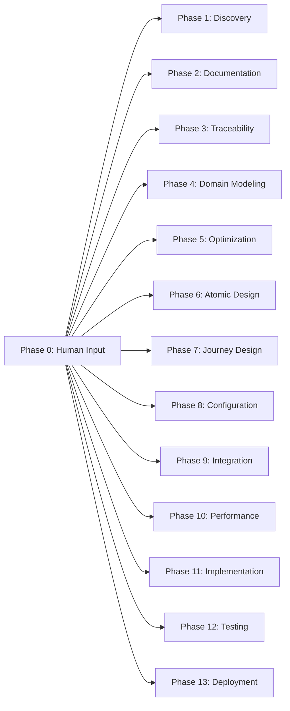

# AI-Driven Legacy Modernization Workflow System
## Comprehensive SOW for MiCustomer 2.0 Migration - Version 9

**Document Version:** 9.0  
**Created Date:** 2025-01-27  
**Author:** AI Expert Team Collaboration (19 Expert Team Members)  
**Purpose:** Platform-agnostic workflow system for modernizing software applications to MiCustomer 2.0 framework with full atomic design hierarchy, T4 Universal Configuration Framework, and T2/T3 orchestration patterns

---

## Table of Contents

1. [Executive Summary](#executive-summary)
2. [Change Log](#change-log)
3. [Phase 0: Human Input and Context Definition](#phase-0-human-input-and-context-definition)
4. [Governance Framework](#governance-framework)
5. [13-Phase Workflow Design](#13-phase-workflow-design)
6. [Inter-Phase Integration](#inter-phase-integration)
7. [Quality Assurance Framework](#quality-assurance-framework)
8. [Success Metrics & KPIs](#success-metrics--kpis)
9. [Resource Requirements](#resource-requirements)
10. [Conclusion](#conclusion)

---

## Executive Summary

This document presents a revolutionary 14-phase AI-driven workflow system (now including Phase 0 for human input collection) designed to systematically modernize software applications to the MiCustomer 2.0 framework. The approach ensures full traceability from source to modern implementation through comprehensive documentation and atomic design principles.

The system leverages 16 specialized AI personas working collaboratively across interconnected phases, each with built-in quality assurance, risk management, and adaptive planning capabilities. The workflow ensures minimal human intervention while maintaining enterprise-grade quality standards. **Version 9 introduces Phase 0 as the critical human input phase that establishes foundational context and strategic direction, feeding into all subsequent AI-driven phases.**

### Key Objectives
- **Human-Driven Foundation**: Phase 0 captures essential human inputs that AI cannot determine independently
- **Complete System Analysis**: Comprehensive documentation of existing system including functional architecture, security posture, and UI/UX patterns
- **Atomic Design Transformation**: Transform architecture to MiCustomer 2.0 atomic design principles with T4 universal configuration framework
- **System-Led Optimization**: Analyze current state and propose improvements across all layers before transformation
- **Traceable Implementation**: Full audit trail from source components to modern implementation with enhanced semantic relationships
- **Security-First Approach**: Integrated security analysis and threat modeling throughout all phases
- **Quality Assurance**: Built-in quality gates with comprehensive exit criteria and validation mechanisms
- **Minimal Human Intervention**: AI-driven execution with intelligent escalation triggers
- **Cross-Phase Governance**: Version 9 introduces Governance Framework to maintain completeness and traceability across all phases

### Expected Outcomes
- **50% Reduction** in modernization timeline through systematic approach
- **90% Automated Processing** with human intervention only for complex edge cases
- **100% Traceability** from source to modern implementation with semantic preservation
- **Zero Data Loss** during migration with comprehensive validation
- **Enterprise-Grade Quality** meeting all regulatory and compliance requirements
- **Zero Security Vulnerabilities** through continuous security validation
- **Maximum Reusability** through strict atomic design hierarchy enforcement
- **Complete Phase Alignment** through governance layer validation
- **Strategic Alignment** through Phase 0 human input guidance

### AI Team Composition
The system utilizes 16 specialized AI personas:

1. **PhD in Computer Science (Distributed Systems)** - State management, concurrency, performance optimization
2. **PhD in Software Engineering (Design Patterns)** - SOLID principles, composition patterns, architectural boundaries
3. **PhD in Human-Computer Interaction** - UI/UX patterns, accessibility, cognitive load
4. **Enterprise Architect (Enterprise Systems)** - Mission-critical systems, regulated environments, audit requirements
5. **Principal Engineer (Multi-tenant SaaS)** - Isolation patterns, security, scalable architectures
6. **Systems Performance Engineer** - Sub-millisecond optimizations, resource management
7. **Domain-Driven Design Expert** - Bounded contexts, ubiquitous language, domain modeling
8. **PhD in BPMN and Process Design** - Business process modeling, workflow patterns, process optimization
9. **PhD in Complex Decision Design and DMN** - Decision modeling notation, decision tables, rule engines
10. **Semantic Relations Expert** - Ontologies, knowledge graphs, semantic modeling
11. **Data Architect** - Data platforms, modeling patterns, information architecture
12. **UI Design Expert** - Design systems, interaction patterns, visual hierarchy
13. **Integration Expert** - Enterprise integration patterns, API design, ESB architectures
14. **Senior Project Manager** - Agile methodologies, risk management, delivery optimization
15. **PhD in AI Automated Systems** - AI workflow automation, ML model integration, autonomous decision-making
16. **Camunda DMN Expert** - Complex decision systems design, DMN implementation, Camunda platform integration

17. **Product Manager Expert** - Product portfolio management, market strategy, value optimization
18. **QA Leader** - Quality assurance strategies, test automation, validation frameworks
19. **CTO** - Technology strategy, innovation leadership, architectural governance

---

## Change Log

### Version 9.0 - Human Input Phase and Planning Governance Integration

#### Major Enhancements

1. **Phase 0 Introduction - Human Input and Context Definition**
   - Added new Phase 0 as the foundational human input collection phase
   - Establishes project vision, objectives, and strategic direction
   - Captures architectural preferences, technology stack requirements, and constraints
   - Defines business context, compliance requirements, and operational guidelines
   - Creates input templates that drive all subsequent AI-driven phases

2. **Governance Framework Integration**
   - Added comprehensive Governance Framework section
   - Establishes standardized requirements for all phase planning elements
   - Defines specifications for AI agent orchestration and artifact generation
   - Creates guidelines for quality assurance and human touchpoints
   - Provides dynamic planning parameters based on Phase 0 inputs

3. **AI Agent and Persona Alignment**
   - Clarified distinction between AI agents (functional roles) and AI personas (expertise profiles)
   - Established clear mappings between agent responsibilities and persona capabilities
   - Defined multi-persona assignments for complex agent roles
   - Ensured consistency across all phases in AI orchestration

4. **Phase Cascade Enhancement**
   - All phases (1-13) now dynamically adapt based on Phase 0 inputs
   - Phase deliverables, documentation, and AI processes tailored to project requirements
   - Maintained existing phase structure while enabling responsive customization
   - Created coherent flow from human inputs through AI execution

5. **Previous V8 Enhancements Maintained**
   - Platform agnostic approach preserved
   - Phase 9/10 resequencing maintained
   - Configuration-driven optimization in Phase 5 retained
   - Performance audit focus in Phase 10 preserved

### Version 9.0 - AI Operational Mandates and Behavioral Controls

#### Major Enhancements

1. **AI Operational Mandates Framework**
   - Added new section "AI Operational Mandates" to the Governance Framework
   - Defines five core mandates that govern all AI agent operations across phases
   - Establishes mandatory playbook generation for every phase
   - Creates proactive human input identification requirements
   - Implements comprehensive intervention documentation standards
   - Enforces playbook validation before phase execution
   - Ensures complete input-to-action traceability through GraphRAG

2. **Enhanced Planning Initiation Standards**
   - Added mandatory phase playbook generation and validation requirement
   - Included human input requirements analysis and documentation checkpoint
   - Required AI operational mandates configuration in agent prompts
   - These additions ensure AI agents operate within defined behavioral boundaries

3. **Phase Governance Template Expansion**
   - Enhanced execution_patterns section with playbook-specific parameters
   - Added mandatory_playbook flag set to true for all phases
   - Included playbook_generation_trigger at phase_initiation
   - Required playbook_validation before execution proceeds
   - Implemented continuous human_input_integration monitoring

4. **Human Input Identification Protocol Enhancement**
   - Added proactive identification triggers for AI analysis
   - Defined five trigger conditions: confidence threshold, missing context, conflicts, regulatory ambiguity, technology choices
   - Established comprehensive documentation requirements with six fields
   - Created clear categorization system with urgency levels and response timelines

5. **Playbook Validation Framework**
   - New validation category specifically for dynamic playbooks
   - Defined five completeness criteria for playbook acceptance
   - Established three-stage validation gate process
   - Created failure handling procedures with gap identification and regeneration

6. **AI Operational Compliance Monitoring**
   - Added new subsection for continuous mandate compliance
   - Established immediate remediation requirements for non-compliance
   - Integrated compliance tracking with existing monitoring dashboards
   - Created clear escalation paths for mandate violations

#### Impact on Existing Phases
- All 14 phases now require mandatory playbook generation
- AI agents must operate under the five operational mandates
- Human input documentation becomes standardized across phases
- Validation gates enhanced with playbook completeness checks

#### Documentation Structure Changes
- Governance Framework expanded with AI Operational Mandates section
- Planning standards checklists updated with three new items
- Validation framework enhanced with playbook-specific criteria
- Continuous improvement section includes operational compliance

#### Backward Compatibility
- Version 9.0 maintains full compatibility with Version 8.0
- Existing projects can adopt mandates at next phase boundary
- No breaking changes to phase structure or dependencies
- Enhanced governance adds to, rather than replaces, existing controls

---

## Phase 0: Human Input and Context Definition

### Phase Overview
Phase 0 represents the critical initial human input phase that establishes the foundational context and strategic direction for the entire modernization project. This phase captures essential information that AI cannot determine independently, serving as the strategic compass for all subsequent AI-driven phases.

### Objectives
- Establish project vision and success criteria
- Define architectural patterns and technology preferences
- Capture business context and regulatory requirements
- Set operational guidelines and constraints
- Create foundational inputs for AI agent configuration

### Planning Mode
**Duration:** 1-2 weeks  
**Human Involvement:** 100% (Primary stakeholders, architects, business leaders)  
**AI Support:** Template generation and validation assistance

### Core Human Input Templates

Phase 0 utilizes the following core human input templates to capture essential project context and requirements:

1. **Project Vision and Objectives Template**
2. **Architectural Patterns and Preferences Template**
3. **Business Context and Requirements Template**
4. **Compliance and Standards Template**
5. **Resource and Scope Constraints Template**

These templates gather information that AI cannot determine independently and serve as the foundation for all subsequent AI-driven phases. Detailed template structures and implementation guidelines are provided in the Phase 0 comprehensive documentation.

### Phase 0 Deliverables

1. **Strategic Vision Document**
   - Consolidated project vision and objectives
   - Success criteria and KPIs
   - Risk assessment and mitigation strategies

2. **Technical Foundation Document**
   - Architecture patterns and preferences
   - Technology stack specifications
   - Integration requirements

3. **Compliance and Constraints Matrix**
   - Regulatory requirements mapping
   - Operational constraints
   - Resource availability matrix

4. **AI Configuration Parameters**
   - Agent behavioral guidelines based on inputs
   - Confidence thresholds for different domains
   - Human intervention triggers

### AI Agent Matrix for Phase 0

| Agent Role | Primary Persona | Secondary Personas | Responsibilities |
|------------|----------------|-------------------|------------------|
| Input Collection Agent | Senior Project Manager | Business Analyst, CTO | Facilitate stakeholder workshops, gather requirements |
| Validation Agent | Enterprise Architect | Domain Expert, Compliance Officer | Validate technical feasibility and compliance |
| Documentation Agent | Technical Writer | Business Analyst | Create comprehensive input documentation |

### Quality Gates
- **Entry Criteria:** Stakeholder availability, initial project charter
- **Exit Criteria:** All templates completed, validated, and approved by stakeholders
- **Success Metrics:** 100% stakeholder alignment, comprehensive input coverage

### Human Intervention
- **Checkpoint 1:** Initial vision and objectives review
- **Checkpoint 2:** Technical preferences validation
- **Checkpoint 3:** Final approval of all Phase 0 deliverables

---

## Governance Framework

### Overview
The Governance Framework serves as the central reference point that defines standardized requirements, specifications, and guidelines for all phase elements including planning, execution, validation, and monitoring. It ensures consistency, quality, and alignment across all phases while allowing dynamic adaptation based on Phase 0 inputs.

### Governance Scope
The framework governs the entire modernization lifecycle:

1. **Planning Governance** - Standards for phase planning, resource allocation, and timeline management
2. **Execution Governance** - Controls for AI agent operations, task execution, and quality assurance
3. **Validation Governance** - Criteria for entry/exit gates, quality checkpoints, and approval processes
4. **Monitoring Governance** - Real-time tracking, performance metrics, and escalation procedures
5. **Risk Governance** - Risk identification, mitigation strategies, and contingency planning
6. **Compliance Governance** - Regulatory adherence, audit trails, and documentation standards
7. **Knowledge Governance** - Information management, traceability, and intellectual property protection

### AI Operational Mandates

The following mandates govern all AI agent operations across every phase:

1. **Mandatory Playbook Generation**
   - Every phase MUST generate a dynamic playbook before execution begins
   - Playbooks translate methodology into phase-specific actionable guidance
   - Generation formula: Phase Definition + Phase 0 Inputs + Previous Outputs + Human Decisions

2. **Proactive Human Input Identification**
   - AI agents MUST analyze each task for human input requirements
   - Trigger analysis when: confidence <80%, context missing, requirements conflict
   - Document need with: category, urgency, context, options, impact

3. **Comprehensive Intervention Documentation**
   - All human interventions MUST be documented with:
     - Category: strategic/technical/operational/compliance/resource
     - Context: detailed explanation of why input needed
     - Decision: actual human decision and rationale
     - Impact: downstream effects on subsequent phases

4. **Playbook Validation Requirement**
   - Playbooks MUST be validated for completeness before phase execution
   - Validation includes: objective coverage, human input integration, success criteria
   - Failed validation triggers regeneration with identified gaps addressed

5. **Input-to-Action Traceability**
   - Maintain complete traceability from human inputs to AI actions
   - Every AI decision must reference originating human input
   - GraphRAG integration tracks relationship evolution

### Core Governance Principles

1. **Adaptive Governance**
   - Phase execution dynamically adjusts based on Phase 0 inputs
   - Governance parameters scale with project complexity
   - Control depth aligns with risk and compliance requirements

2. **Standardized Components**
   - Consistent governance structure across all phases
   - Reusable templates and patterns
   - Unified quality criteria and validation standards

3. **Traceability and Accountability**
   - Every execution decision traces to Phase 0 inputs
   - Clear ownership and responsibility matrices
   - Audit trails for all governance decisions and actions

4. **Evidence-Based Execution**
   - All deliverables trace to source documentation
   - Clear lineage for all transformations
   - Verifiable decision rationale

5. **Progressive Confidence**
   - Conservative start with increasing automation
   - Confidence thresholds guide execution
   - Fail-safe escalation to human expertise

### AI Agent Operational Framework

#### Core AI Agent Catalog
The framework leverages 6 core AI agents:

1. **Discovery Agent** - System exploration and artifact identification (85% confidence minimum)
2. **Validation Agent** - Quality assurance and consistency verification (90% confidence minimum)
3. **Orchestration Agent** - Workflow coordination and resource management (95% confidence minimum)
4. **Documentation Agent** - Artifact creation and maintenance (85% confidence minimum)
5. **Analysis Agent** - Deep technical and business analysis (80% confidence minimum)
6. **Integration Agent** - Cross-system integration and coordination (85% confidence minimum)

#### Agent Collaboration Patterns
```yaml
collaboration_patterns:
  sequential:
    description: "Linear workflows with clear dependencies"
    example: "Discovery → Analysis → Documentation → Validation"
  
  parallel:
    description: "Independent tasks executing simultaneously"
    example: |
      Discovery ─┬→ Analysis ─┬→ Integration
                 └→ Documentation
  
  iterative:
    description: "Complex tasks requiring refinement"
    example: "Analysis ↔ Validation (repeat until confidence threshold met)"
```

#### Confidence Scoring Framework
```
Base Confidence = (Source Quality × Agent Expertise × Validation Score) / Risk Factor

Thresholds:
- Critical Decisions: 95% minimum
- Technical Specifications: 90% minimum
- Documentation: 85% minimum
- Exploratory Analysis: 80% minimum
```

### Governance Standards

#### 1. Phase Governance Template
Every phase must include:
```yaml
phase_governance:
  phase_number: [X]
  phase_name: [Name]
  objectives:
    - objective: [Specific objective]
      alignment: [How it aligns with Phase 0]
  duration:
    baseline: [Standard duration]
    adjusted: [Adjusted based on Phase 0 complexity]
  dependencies:
    prerequisite_phases: [List]
    required_artifacts: [List]
  resource_allocation:
    ai_agents: [Required agents with confidence thresholds]
    human_resources: [Required human involvement]
    tools: [Required tools and platforms]
  execution_patterns:
    planning_mode: [Duration and approach]
    parallel_tracks: [If applicable]
    validation_gates: [Entry, quality, exit]
    mandatory_playbook: true
    playbook_generation_trigger: phase_initiation
    playbook_validation: required_before_execution
    human_input_integration: continuous
  governance_controls:
    quality_assurance: [QA processes and checkpoints]
    risk_management: [Risk mitigation strategies]
    compliance_tracking: [Regulatory and standards compliance]
```

#### 1.1 Planning Initiation Standards
Before any phase planning begins:
- [ ] Previous phase outputs validated and available
- [ ] Phase 0 parameters loaded and understood
- [ ] AI agents configured with appropriate personas
- [ ] Success criteria and constraints defined
- [ ] Risk register updated with phase-specific risks
- [ ] Phase playbook generated based on Phase 0 inputs and validated
- [ ] Human input requirements analyzed and documented
- [ ] AI operational mandates configured in agent prompts

#### 2. AI Agent Orchestration Standards
```yaml
ai_orchestration:
  agent_deployment:
    - agent_role: [Role name]
      primary_persona: [Main AI persona from 16 defined personas]
      secondary_personas: [Supporting personas]
      confidence_threshold: [Based on Phase 0 risk tolerance]
      hallucination_prevention:
        - multi_agent_validation
        - source_anchoring
        - confidence_boundaries
      escalation_triggers:
        - trigger: [Condition]
          action: [Escalation action]
          response_time: [SLA]
  collaboration_patterns:
    - pattern: [Sequential/Parallel/Iterative]
      agents_involved: [List of agents]
      coordination_mechanism: [How they coordinate]
```

#### 3. Artifact Generation Guidelines
```yaml
artifact_standards:
  documentation_depth:
    level: [COMPREHENSIVE/STANDARD/LIGHTWEIGHT]
    rationale: [Based on Phase 0 requirements]
  quality_criteria:
    - criterion: [Quality measure]
      threshold: [Acceptable level]
      validation_method: [How to validate]
  version_control:
    strategy: [Semantic versioning]
    metadata:
      - version_number
      - phase_created
      - author_agent
      - change_summary
      - review_status
  traceability_requirements:
    - source_artifact_links
    - transformation_history
    - validation_chain
    - human_approvals
```

#### 4. Human Touchpoint Specifications
```yaml
human_intervention:
  scheduled_checkpoints:
    - checkpoint: [Name]
      timing: [When in phase]
      participants: [Required participants]
      duration: [Expected duration]
      templates: [Feedback template reference]
  trigger_based:
    - trigger: [Low confidence <80%]
      escalation_time: [4 hours]
      decision_authority: [Technical Expert]
    - trigger: [Validation failure 2+ attempts]
      escalation_time: [2 hours]
      decision_authority: [Quality Lead]
    - trigger: [Critical decision required]
      escalation_time: [1 hour]
      decision_authority: [Solution Architect]
```

### Monitoring and Control Framework

#### Dashboard Specifications
Every phase must implement markdown-based monitoring dashboards:

```markdown
# Phase [X] Execution Dashboard
Generated: [timestamp]
Status: [current status]

## Progress Overview
- [ ] Objective 1: XX%
- [ ] Objective 2: XX%
- [ ] Objective 3: XX%

## AI Agent Status
| Agent | Tasks | Completed | Confidence | Escalations |
|-------|-------|-----------|------------|-------------|
| [Name]| [#]   | [#]       | [%]        | [#]         |

## Risk Indicators
- 🔴 Critical: [List]
- 🟡 Warning: [List]
- 🟢 Normal: [List]

## Human Interventions
- Pending: [#]
- Completed: [#]
- Escalated: [#]
```

#### Performance Metrics
```yaml
metrics:
  efficiency:
    - time_to_completion_vs_estimate
    - agent_utilization_rate
    - automation_percentage
  quality:
    - first_pass_validation_rate
    - defect_density
    - rework_percentage
  value:
    - knowledge_base_enrichment
    - reusable_artifact_creation
    - process_improvement_identification
```

### Knowledge Management Standards

#### GraphRAG Integration

```yaml
knowledge_base:
  entity_types:
    - SystemComponent
    - BusinessConcept
    - TechnicalArtifact
    - OperationalProcess
  relationship_types:
    - DEPENDS_ON
    - TRANSFORMS_TO
    - VALIDATES
    - EVOLVES_FROM
  semantic_properties:
    - confidence_scoring
    - versioning_info
    - traceability_data
    - phase_attribution
  query_patterns:
    - lineage_queries
    - impact_analysis
    - knowledge_evolution
```

### Diagram Standards

#### Required Diagrams per Phase
Every phase must create comprehensive Draw.io diagrams following these standards:

1. **Phase Overview Diagram**
   - Input sources and prerequisites
   - Core process workflow
   - Output artifacts and deliverables
   - Technology stack integration
   - Success metrics visualization
   - Risk points and mitigation

2. **Architecture Diagram**
   - Component architecture
   - Data flow patterns
   - Integration points
   - Tool ecosystem
   - Storage and persistence layers

3. **AI Agent Interaction Diagram**
   - All agent roles and personas
   - Task distribution matrix
   - Collaboration patterns
   - Confidence checkpoints
   - Human intervention triggers
   - Orchestration logic

4. **Artifact Relationships Diagram**
   - Dependency mappings
   - Creation sequences
   - Validation chains
   - Traceability links
   - Version control flow

5. **Execution Sequence Diagram**
   - Task sequencing with timelines
   - Parallel process identification
   - Gate conditions (entry/quality/exit)
   - Validation checkpoints
   - Rollback procedures

6. **Cross-Phase Dependencies Diagram**
   - Inputs from previous phases
   - Outputs to subsequent phases
   - Feedback loops
   - Knowledge base contributions
   - Shared resource utilization

#### Diagram Design Standards
```yaml
diagram_standards:
  visual_consistency:
    - color_coding: 
        ai_agents: blue
        human_tasks: green
        artifacts: yellow
        risks: red
        validations: purple
    - shapes:
        processes: rectangles
        decisions: diamonds
        data: cylinders
        documents: documents
  annotations:
    - confidence_levels: where_applicable
    - decision_points: clearly_marked
    - error_paths: red_dashed_lines
  metadata:
    - version_number: required
    - last_updated: required
    - author: required
    - phase_reference: required
  export_formats:
    - PNG: for_documentation
    - SVG: for_web_display
    - PDF: for_archival
    - Native: for_editing
```

### Governance Application by Phase Type

#### Discovery Phases (1-3)
- Emphasis on completeness over speed
- Higher human validation requirements (multiple checkpoints)
- Conservative confidence thresholds (start at 80%)
- Extensive knowledge capture focus

#### Design Phases (4-8)
- Balance between automation and creativity
- Iterative refinement loops with validation
- Moderate confidence thresholds (85%)
- Pattern library development

#### Implementation Planning Phases (9-13)
- Focus on precision and accuracy
- Minimal human intervention (exception-based)
- High confidence thresholds (90-95%)
- Automated validation preferred

### Quality Assurance Integration

#### Validation Framework
```yaml
validation_requirements:
  automated_validation:
    - syntax_checking
    - schema_compliance
    - completeness_verification
    - cross_reference_validation
  agent_validation:
    - multi_agent_review
    - confidence_scoring
    - source_verification
  human_validation:
    - expert_review_triggers
    - approval_workflows
    - decision_documentation
```

#### Traceability Standards
Every artifact must maintain:
- Forward traceability to derived artifacts
- Backward traceability to source materials
- Cross-reference indexing
- Version history with change rationale

### Prompt Management Integration

#### Prompt Organization
```yaml
prompt_structure:
  /prompts/
    /core/: Base prompts for all phases
    /phase_specific/: Customized per phase
    /templates/: Reusable components
    /performance/: Metrics and optimization
```

#### Prompt Versioning
- Semantic versioning (major.minor.patch)
- Performance metrics per version
- A/B testing capabilities
- Rollback procedures

### Human Input Requirements Framework

#### Human Input Identification Protocol
AI agents must systematically analyze each phase to determine required human inputs:

##### Context Analysis Requirements
```yaml
context_analysis:
  phase_objectives:
    - Analyze phase goals and expected outcomes
    - Identify decisions requiring human judgment
    - Map technical choices needing expertise
  dependency_mapping:
    - Review inputs from previous phases
    - Identify gaps requiring human clarification
    - Determine integration points needing guidance
  risk_assessment:
    - Identify high-risk areas requiring human oversight
    - Determine acceptable automation boundaries
    - Map compliance checkpoints
- Proactive identification triggers:
    confidence_below_threshold: 80%
    missing_context_detected: true
    conflicting_requirements: true
    regulatory_ambiguity: true
    undefined_technology_choice: true
- Documentation requirements:
    category: [strategic/technical/operational/compliance/resource]
    urgency: [critical/high/medium/low]
    context: detailed_explanation
    available_options: list_alternatives
    downstream_impact: effect_analysis
    decision_timeline: response_window
```

##### Input Determination Logic
```yaml
input_determination:
  strategic_inputs:
    triggers:
      - Major architectural decisions
      - Business priority conflicts
      - Resource allocation choices
    collection_timing: Phase planning stage
  
  technical_inputs:
    triggers:
      - Technology stack selections
      - Integration approach decisions
      - Performance target setting
    collection_timing: Early phase execution
  
  operational_inputs:
    triggers:
      - Process workflow definitions
      - Team coordination requirements
      - Timeline adjustments
    collection_timing: Throughout phase
```

#### Template Generation Standards

##### Automated Template Creation
AI agents must generate phase-specific input templates following these standards:

```yaml
template_generation:
  structure_requirements:
    header:
      - Phase name and number
      - Template purpose
      - Completion deadline
      - Required expertise level
    
    instructions:
      - Clear context explanation
      - Why input is needed
      - How it will be used
      - Impact on phase execution
    
    input_sections:
      - Mandatory fields (clearly marked)
      - Optional fields (with defaults)
      - Validation rules
      - Example responses
    
    metadata:
      - Version number
      - Generation timestamp
      - Generating agent ID
      - Confidence level
```

##### Template Categories
```yaml
template_categories:
  strategic_planning:
    - Vision alignment inputs
    - Priority setting templates
    - Risk tolerance definitions
    
  technical_specifications:
    - Architecture preference forms
    - Technology constraint declarations
    - Integration approach selections
    
  operational_parameters:
    - Resource availability assessments
    - Timeline flexibility ranges
    - Quality threshold definitions
    
  compliance_requirements:
    - Regulatory constraint forms
    - Security requirement checklists
    - Audit trail specifications
    
  resource_allocation:
    - Team capability matrices
    - Budget constraint forms
    - Tool availability assessments
```

#### Input Categorization System

##### Category Definitions
```yaml
input_categories:
  strategic:
    description: "High-level decisions affecting overall approach"
    required_when:
      - Phase objectives unclear
      - Multiple valid approaches exist
      - Business priorities conflict
    response_time: 24-48 hours
    approver_level: Senior Leadership
    
  technical:
    description: "Specific technology and implementation choices"
    required_when:
      - Technology stack undefined
      - Integration patterns unclear
      - Performance requirements ambiguous
    response_time: 4-8 hours
    approver_level: Technical Lead
    
  operational:
    description: "Execution approach and resource decisions"
    required_when:
      - Process workflows undefined
      - Resource allocation unclear
      - Timeline constraints flexible
    response_time: 2-4 hours
    approver_level: Project Manager
    
  compliance:
    description: "Regulatory and security requirements"
    required_when:
      - Regulatory environment complex
      - Security standards undefined
      - Audit requirements unclear
    response_time: 8-24 hours
    approver_level: Compliance Officer
    
  resource_based:
    description: "Team, budget, and tool constraints"
    required_when:
      - Team capabilities unknown
      - Budget flexibility exists
      - Tool choices available
    response_time: 4-8 hours
    approver_level: Resource Manager
```

##### Dynamic Category Selection
```yaml
category_selection_logic:
  analyze_phase_context: |
    IF phase involves architecture decisions THEN
      Include strategic category
    IF phase has undefined technical aspects THEN
      Include technical category
    IF phase touches regulated data THEN
      Include compliance category
    IF phase timeline is flexible THEN
      Include operational category
    IF phase resources are negotiable THEN
      Include resource_based category
```

#### Template Standardization Requirements

##### Formatting Standards
```yaml
template_format:
  structure:
    - Use consistent markdown formatting
    - Include clear section headers
    - Provide inline help text
    - Use tables for structured data
    - Include validation rules inline
    
  field_specifications:
    mandatory_fields:
      - Mark with asterisk (*)
      - Include validation rules
      - Provide clear examples
      - Specify data types
    
    optional_fields:
      - Mark with [Optional]
      - Include default values
      - Explain when needed
      - Show impact of omission
    
  example_inclusion:
    - Provide 2-3 examples per section
    - Show both good and bad examples
    - Explain why examples work/fail
    - Include edge cases
```

##### Consistency Requirements
```yaml
consistency_standards:
  naming_conventions:
    - Use phase-specific prefixes
    - Include timestamp in filename
    - Version all templates
    - Use descriptive titles
    
  content_standards:
    - Consistent terminology
    - Aligned with Phase 0 language
    - Clear without jargon
    - Accessible to stakeholders
    
  visual_standards:
    - Consistent formatting
    - Clear visual hierarchy
    - Effective use of whitespace
    - Readable on all devices
```

#### Validation and Quality Assurance

##### Input Validation Framework
```yaml
validation_framework:
  completeness_checks:
    - All mandatory fields completed
    - Dependencies identified
    - Conflicts resolved
    - Assumptions documented
    
  consistency_validation:
    - Cross-field validation
    - Phase 0 alignment check
    - Previous input compatibility
    - Internal logic verification
    
  sufficiency_assessment:
    - Coverage of phase needs
    - Risk area addressing
    - Decision enablement
    - Execution readiness
    
  quality_metrics:
    - Clarity score (1-10)
    - Completeness percentage
    - Consistency rating
    - Actionability index

  playbook_validation:
    completeness_criteria:
      - All phase objectives addressed
      - Human inputs integrated
      - Success metrics defined
      - Risk mitigations included
      - Dependencies mapped
    validation_gates:
      - Automated structure check
      - AI agent content review
      - Human approval required
    failure_handling:
      - Identify specific gaps
      - Regenerate with corrections
      - Re-validate before proceeding
```

##### Validation Workflow
```yaml
validation_workflow:
  automated_checks:
    - Format compliance
    - Mandatory field completion
    - Data type validation
    - Range/constraint checking
    
  ai_agent_review:
    - Semantic consistency
    - Logical completeness
    - Conflict detection
    - Gap identification
    
  human_verification:
    triggers:
      - Low confidence (<80%)
      - Critical decisions
      - Conflicting inputs
      - Unusual patterns
    process:
      - Flag for review
      - Request clarification
      - Document resolution
      - Update knowledge base
```

#### Integration Mechanisms

##### Phase 0 Integration
```yaml
phase_0_integration:
  foundation_alignment:
    - Reference Phase 0 strategic inputs
    - Inherit technology preferences
    - Apply compliance requirements
    - Respect resource constraints
    
  enhancement_patterns:
    - Build upon Phase 0 foundation
    - Add phase-specific details
    - Refine general guidance
    - Resolve ambiguities
    
  conflict_resolution:
    - Phase 0 takes precedence
    - Document deviations
    - Justify exceptions
    - Update knowledge base
```

##### Cross-Phase Integration
```yaml
cross_phase_integration:
  forward_propagation:
    - Pass refined inputs to next phase
    - Update shared knowledge base
    - Document decisions made
    - Flag open questions
    
  backward_compatibility:
    - Validate against prior phases
    - Ensure consistency
    - Resolve conflicts
    - Maintain traceability
    
  knowledge_accumulation:
    - Add to GraphRAG entities
    - Create relationships
    - Update confidence scores
    - Track evolution
```

##### Execution Integration
```yaml
execution_integration:
  planning_incorporation:
    - Inject into phase planning
    - Adjust timelines based on inputs
    - Configure AI agents per guidance
    - Set validation thresholds
    
  runtime_application:
    - Apply during execution
    - Trigger specified checkpoints
    - Enforce stated constraints
    - Monitor compliance
    
  feedback_loop:
    - Track input effectiveness
    - Measure outcome alignment
    - Identify improvement areas
    - Update templates
```

### Continuous Improvement

#### Feedback Loops
1. **Phase Execution Feedback**
   - Performance metrics analysis
   - Agent effectiveness evaluation
   - Human intervention patterns
   - Knowledge quality assessment
   - Human input effectiveness tracking

2. **Optimization Triggers**
   - Success rate < 85%
   - Confidence < threshold
   - Excessive rework (>10%)
   - Timeline deviations >20%
   - Human input quality issues

3. **Update Procedures**
   - Quarterly framework reviews
   - Monthly metrics analysis
   - Continuous prompt optimization
   - Agent configuration tuning
   - Template effectiveness assessment

#### Governance Evolution
The framework evolves through:
- Lessons learned integration
- Technology advancement adoption
- Performance data analysis
- Stakeholder feedback incorporation
- Human input pattern analysis

### AI Operational Compliance
All phases must demonstrate compliance with the five AI Operational Mandates defined in the governance framework. Non-compliance triggers immediate remediation before phase execution can proceed.

---

## 13-Phase Workflow Design

### Phase Overview
The modernization approach consists of 13 interconnected phases (plus Phase 0), each building upon previous phases while maintaining independent deliverables and quality gates. **All phases now dynamically adapt their execution based on Phase 0 inputs.**

```mermaid
graph TD
    subgraph "Phase 0: Human Input Collection"
        P0A[Stakeholder Workshops] --> P0B[Vision Definition]
        P0B --> P0C[Technical Preferences]
        P0C --> P0D[Constraint Mapping]
        P0D --> P0E[AI Configuration]
    end
    
    P0E --> P1A
    
    subgraph "Phase 1: Legacy System Discovery"
        P1A[Planning Mode] --> P1B[Functional Architecture Analysis]
        P1B --> P1C[Business Domain Extraction]
        P1C --> P1D[Security & Access Analysis]
        P1D --> P1E[Technical Debt Assessment]
        P1E --> P1F[Dependency Mapping]
        P1F --> P1G[Knowledge Base Creation]
    end
    
    subgraph "Phase 2: Comprehensive Documentation"
        P2A[Planning Mode] --> P2B[Entity Model Documentation]
        P2B --> P2C[Business Logic Documentation]
        P2C --> P2D[Security & Roles Documentation]
        P2D --> P2E[Integration Documentation]
        P2E --> P2F[UI/UX Pattern Documentation]
        P2F --> P2G[Configuration Documentation]
    end
    
    subgraph "Phase 3: Traceability Matrix Creation"
        P3A[Planning Mode] --> P3B[Component Traceability]
        P3B --> P3C[Business Rule Traceability]
        P3C --> P3D[Data Flow Traceability]
        P3D --> P3E[UI/UX Traceability]
        P3E --> P3F[Security & Access Traceability]
        P3F --> P3G[Cross-Reference Validation]
    end
    
    subgraph "Phase 4: Business Domain Modeling"
        P4A[Planning Mode] --> P4B[Domain Boundary Definition]
        P4B --> P4C[Ubiquitous Language Creation]
        P4C --> P4D[Domain Service Identification]
        P4D --> P4E[Cross-Domain Relationships]
        P4E --> P4F[Impact Analysis]
        P4F --> P4G[Domain Model Validation]
    end
    
    subgraph "Phase 5: Comprehensive System Optimization"
        P5A[Planning Mode] --> P5B[AS-IS State Analysis]
        P5B --> P5C[Configuration Candidate Identification]
        P5C --> P5D[Business Rule Extraction]
        P5D --> P5E[UI State Configuration]
        P5E --> P5F[System Behavior Patterns]
        P5F --> P5G[Integration Point Analysis]
        P5G --> P5H[Performance Optimization]
        P5H --> P5I[Optimization Validation]
    end
    
    subgraph "Phase 6: Atomic Design Mapping"
        P6A[Planning Mode] --> P6B[Optimization Analysis]
        P6B --> P6C[Atom Identification]
        P6C --> P6D[Molecule Composition]
        P6D --> P6E[Organism Assembly]
        P6E --> P6F[Feature Definition]
        P6F --> P6G[Epic Framework Design]
        P6G --> P6H[Module Orchestration]
        P6H --> P6I[TO-BE State Definition]
    end
    
    subgraph "Phase 7: Journey & Persona Design"
        P7A[Planning Mode] --> P7B[Epic Input Validation]
        P7B --> P7C[User Journey Mapping]
        P7C --> P7D[Persona Definition]
        P7D --> P7E[T2 Module Orchestration]
        P7E --> P7F[T3 Implementation Design]
        P7F --> P7G[Journey Validation]
    end
    
    subgraph "Phase 8: Configuration Framework"
        P8A[Planning Mode] --> P8B[T4 Configuration Schema]
        P8B --> P8C[Multi-tenant Configuration]
        P8C --> P8D[Hierarchical Configuration]
        P8D --> P8E[Configuration Validation]
        P8E --> P8F[Configuration Testing]
    end
    
    subgraph "Phase 9: Integration Strategy Design"
        P9A[Planning Mode] --> P9B[Modern Integration Patterns]
        P9B --> P9C[API Design]
        P9C --> P9D[Event Architecture]
        P9D --> P9E[Legacy Integration Bridges]
        P9E --> P9F[Integration Validation]
    end
    
    subgraph "Phase 10: Performance Audit & Requirements"
        P10A[Planning Mode] --> P10B[Performance Audit Setup]
        P10B --> P10C[Atomic Performance Validation]
        P10C --> P10D[Configuration Performance Check]
        P10D --> P10E[Integration Performance Review]
        P10E --> P10F[Optimization Recommendations]
        P10F --> P10G[Performance Certification]
    end
    
    subgraph "Phase 11: Technology Stack Implementation"
        P11A[Planning Mode] --> P11B[Component Development]
        P11B --> P11C[Service Implementation]
        P11C --> P11D[Data Layer Implementation]
        P11D --> P11E[UI Component Development]
        P11E --> P11F[Integration Implementation]
        P11F --> P11G[Unit Testing Implementation]
    end
    
    subgraph "Phase 12: Testing & Validation"
        P12A[Planning Mode] --> P12B[AI-Automated Unit Testing]
        P12B --> P12C[AI-Automated Integration Testing]
        P12C --> P12D[Human-Managed Performance Testing]
        P12D --> P12E[Human-Managed Security Testing]
        P12E --> P12F[Human-Managed UAT]
        P12F --> P12G[Test Validation & Sign-off]
    end
    
    subgraph "Phase 13: Deployment & Go-Live"
        P13A[Planning Mode] --> P13B[Deployment Preparation]
        P13B --> P13C[Production Deployment]
        P13C --> P13D[System Monitoring]
        P13D --> P13E[Performance Optimization]
        P13E --> P13F[Go-Live Support]
    end
    
    P1G --> P2A
    P2G --> P3A
    P3G --> P4A
    P4G --> P5A
    P5I --> P6A
    P6I --> P7A
    P7G --> P8A
    P8F --> P9A
    P9F --> P10A
    P10G --> P11A
    P11G --> P12A
    P12G --> P13A
```



## Phase 1: Legacy System Discovery

#### **Phase Objectives**
- Comprehensively analyze the existing system architecture including functional and technical aspects
- Identify all business domains, integration patterns, security architecture, and technical components
- **Discover configuration patterns and T4 framework candidates**
- **Identify system personas and user types for T3 framework**
- Create foundational knowledge base for subsequent phases with enhanced semantic relationships
- **Prepare initial atomic design component inventory**
- Establish system complexity baseline and modernization scope with security-first approach

#### **Phase 0 Adaptations**
Based on Phase 0 inputs, Phase 1 adjusts:
- **Discovery Depth**: Comprehensive for complex systems, targeted for simpler ones
- **Focus Areas**: Prioritize based on business drivers and constraints
- **Tool Selection**: Use tools compatible with available inputs
- **Documentation Level**: Match Phase 0 documentation requirements
- **Security Emphasis**: Enhanced for regulated industries
- **Performance Baseline**: Detailed for high-traffic systems

#### **Governance Layer**

##### Entry Criteria
- [ ] Access to all system components granted
- [ ] Analysis tools and environments configured
- [ ] AI personas assigned and initialized
- [ ] Previous modernization attempts documented
- [ ] Phase 0 inputs reviewed and incorporated

##### Exit Criteria Validation
- [ ] All system files analyzed and documented
- [ ] Business domains identified with boundaries
- [ ] Security architecture fully documented
- [ ] **Initial atomic component inventory created**
- [ ] Knowledge base validated for AI consumption
- [ ] Risk register populated with mitigation strategies
- [ ] **Atomic design preparation completed for Phase 2**

##### Cross-Phase Validation
- [ ] Output format compatible with Phase 2 requirements
- [ ] Security findings ready for Phase 2 documentation
- [ ] Domain boundaries prepared for Phase 4 refinement
- [ ] Technical debt catalog ready for Phase 5 optimization

##### Governance Agent
- **Lead**: Enterprise Architect
- **Validators**: Data Architect, Security Expert
- **Escalation**: Senior Project Manager

#### **AI Agent Matrix**

| Agent Role | Primary Persona | Supporting Personas | Responsibilities | Confidence Threshold |
|------------|----------------|-------------------|------------------|---------------------|
| Discovery Agent | Enterprise Architect | Systems Architect, Integration Expert | System exploration, architecture mapping, component identification | 85% |
| Analysis Agent | Domain-Driven Design Expert | Business Analyst, Data Architect | Business domain extraction, data relationship mapping | 80% |
| Security Agent | Principal Engineer (SaaS) | Security Expert, Compliance Officer | Security architecture analysis, vulnerability assessment | 90% |
| Documentation Agent | Technical Writer | Data Architect, Knowledge Engineer | Artifact creation, knowledge base population | 85% |
| Validation Agent | Quality Assurance Lead | Enterprise Architect, Domain Expert | Cross-validation, consistency checking | 90% |
| Orchestration Agent | Senior Project Manager | All Personas | Workflow coordination, resource management | 95% |

#### **Human Intervention Requirements**

##### Critical Decision Points
1. **Discovery Scope Validation** (Hour 8)
   - Review and approve discovery approach
   - Confirm system boundaries for analysis
   - Validate resource allocation for parallel tracks

2. **Domain Boundary Review** (Hour 48)
   - Validate identified business domains with stakeholders
   - Confirm domain relationships and dependencies
   - Approve preliminary domain model

3. **Security Assessment Review** (Hour 72)
   - Review security vulnerabilities discovered
   - Prioritize security risks for mitigation
   - Approve security documentation approach

##### Quality Checkpoints
- **Day 3**: Technical architecture completeness review
- **Day 5**: Functional architecture validation with business
- **Day 7**: Integration landscape verification
- **Day 8**: Knowledge base quality assessment

##### Expertise Required
- Business domain knowledge for validation
- Security expertise for vulnerability assessment
- Technical architecture review capabilities
- Integration pattern expertise

##### Escalation Triggers
- Discovery blockers due to missing documentation (escalate within 4 hours)
- Critical security vulnerabilities found (immediate escalation)
- Business domain conflicts requiring clarification (escalate within 8 hours)
- Technical complexity exceeding initial estimates (escalate at 20% variance)

#### **Task List**

| Task ID | Task Description | Owner | Effort | Dependencies |
|---------|------------------|--------|---------|--------------|
| P1.1 | Set up analysis environments and validate access | Senior Project Manager | 4 hours | None |
| P1.2 | Extract and analyze entity models from system | Data Architect | 16 hours | P1.1 |
| P1.3 | Map technical architecture components | Enterprise Architect | 12 hours | P1.1 |
| P1.4 | Analyze functional architecture | Domain-Driven Design Expert | 12 hours | P1.1 |
| P1.5 | Document security architecture and vulnerabilities | Principal Engineer (SaaS) | 12 hours | P1.1 |
| P1.6 | Extract and document integration patterns | Integration Expert | 16 hours | P1.2 |
| P1.7 | Identify business domains and boundaries | Domain-Driven Design Expert | 12 hours | P1.4 |
| P1.8 | Create technical component inventory | Enterprise Architect | 8 hours | P1.3 |
| P1.9 | Build initial semantic relationship model | Data Architect | 8 hours | P1.2, P1.7 |
| P1.10 | Document UI/UX patterns and architecture | UI Design Expert | 8 hours | P1.3 |
| P1.11 | Identify configuration patterns and T4 candidates | Principal Engineer | 8 hours | P1.2-P1.10 |
| P1.12 | Discover and document system personas | HCI PhD | 8 hours | P1.4, P1.7 |
| P1.13 | Create initial atomic component inventory | UI Design Expert | 8 hours | P1.10 |
| P1.14 | Synthesize findings across all tracks | Senior Project Manager | 8 hours | All above |
| P1.15 | Create knowledge base and validate | Data Architect | 8 hours | P1.14 |

**Total Effort**: 148 hours

#### **Monitoring Prompts**

##### Progress Monitoring Questions
- "What percentage of the system files have been analyzed?"
- "How many business domains have been identified and documented?"
- "What is the status of each parallel discovery track?"
- "Are there any blockers preventing analysis completion?"

##### Key Metrics to Track
- File analysis completion rate (target: 100+ files/day)
- Domain identification progress (target: 2-3 domains/day)
- Security vulnerability count and severity
- Integration point documentation (target: 20+ integrations/day)

##### Expected Outputs Validation
- System architecture diagrams (technical and functional views)
- Business domain model with boundaries
- Security vulnerability report with risk ratings
- Integration inventory with complexity assessments
- Knowledge base with semantic relationships

##### Warning Signs to Watch For
- Analysis rate below 80 files/day
- More than 3 high-severity security vulnerabilities
- Circular dependencies between domains
- Missing or incomplete integration documentation
- Knowledge base validation errors exceeding 5%

#### **Planning Mode Process**
1. **Systematic Context Assessment**: 
   - Analyze system size, complexity, and business criticality
   - Map functional architecture alongside technical architecture
   - Identify security boundaries and access control patterns
   - Apply Phase 0 inputs to tailor approach
2. **Logical Resource Allocation**: 
   - Assign specialized AI personas to parallel discovery tracks
   - Prioritize based on risk and business impact
   - Establish clear communication channels between personas
3. **Timeline Optimization**: 
   - Dynamic scheduling based on discovery complexity
   - Parallel track execution where dependencies allow
   - Buffer allocation for undocumented system areas
4. **Risk Pre-Assessment**: 
   - Identify potential discovery challenges including lack of documentation
   - Develop mitigation strategies for code-only analysis scenarios
   - Establish escalation criteria for human intervention

#### **Required Inputs from Previous Phase**
- Phase 0: Human Input Collection
  - Project vision and objectives
  - Technical preferences and constraints
  - Compliance and security requirements
  - Resource availability and scope boundaries

#### **Task Execution Sequence**
1. **System Access Setup** (Day 1)
   - Obtain repository access and credentials
   - Set up analysis environments
   - Validate access to all system components
2. **Parallel Track 1: Technical Architecture** (Days 2-5)
   - System component mapping
   - Technology stack analysis
   - Infrastructure dependencies
3. **Parallel Track 2: Functional Architecture** (Days 2-5)
   - Business process mapping
   - UI/UX architecture analysis
   - User interaction patterns
4. **Parallel Track 3: Security Architecture** (Days 2-5)
   - Authentication/authorization analysis
   - Role-based access control mapping
   - Security vulnerability assessment
5. **Integration and Synthesis** (Days 6-7)
   - Merge findings from all tracks
   - Create unified system view
   - Identify gaps and dependencies
6. **Validation and Documentation** (Days 8-9)
   - Stakeholder review sessions
   - Documentation finalization
   - Knowledge base population

#### **Backlog Structure**
- **Epic 1.1**: System Architecture Analysis (8 stories)
  - Technical architecture mapping
  - Functional architecture documentation
  - UI/UX architecture analysis
- **Epic 1.2**: Business Domain Discovery (10 stories)
  - Domain boundary identification
  - Business process extraction
  - Business rule cataloging
- **Epic 1.3**: Security Architecture Analysis (7 stories)
  - Authentication/authorization mapping
  - Role and permission analysis
  - Security vulnerability assessment
- **Epic 1.4**: Integration Pattern Analysis (6 stories)
  - Integration documentation
  - API contract extraction
  - Integration security analysis
- **Epic 1.5**: Technical Component Inventory (7 stories)
  - Component dependency mapping
  - Technical debt identification
  - Performance baseline establishment
- **Epic 1.6**: Knowledge Base Foundation (4 stories)
  - Semantic model initialization
  - Relationship mapping setup
  - AI-consumable format creation

#### **Acceptance Criteria**
- [ ] Complete system architecture documented with all files analyzed
- [ ] Functional architecture mapped with business process coverage
- [ ] Security architecture documented with all roles and permissions
- [ ] All business domains identified and mapped with relationships
- [ ] Integration patterns cataloged including all external connections
- [ ] Technical components inventoried with dependencies
- [ ] Knowledge base established with AI-consumable format
- [ ] Risk register populated with mitigation strategies

#### **Exit Criteria**
- All acceptance criteria met with 100% verification
- Stakeholder sign-off on functional architecture
- Security team approval on security findings
- Knowledge base validated for AI consumption
- Phase 2 team briefed on findings
- All deliverables stored in version control

#### **Risk Management**
- **High Risk**: No documentation exists, code is the only source of truth
  - *Mitigation*: AI-powered code analysis with pattern recognition, stakeholder interviews, reverse engineering techniques
- **High Risk**: System complexity exceeding analysis capabilities
  - *Mitigation*: Implement parallel analysis tracks with specialized AI personas
- **Medium Risk**: Undocumented business rules and implicit dependencies
  - *Mitigation*: Use pattern recognition and inference algorithms
- **Medium Risk**: Security vulnerabilities in existing system
  - *Mitigation*: Immediate documentation and containment strategies
- **Low Risk**: Technical documentation gaps
  - *Mitigation*: Cross-reference with related system documentation

#### **Clarity Scoring Framework**
- **Technical Clarity Score**:
  - >85%: Proceed with automated analysis
  - 65-84%: Require multi-persona validation
  - <65%: Escalate to human expert review
- **Business Logic Clarity Score**:
  - >80%: Continue with AI extraction
  - 60-79%: Stakeholder validation required
  - <60%: Human business analyst intervention
- **Security Clarity Score**:
  - >90%: Automated security analysis
  - 70-89%: Security team review
  - <70%: Immediate escalation required

#### **Knowledge Base Requirements** (AI-Generated Outputs)
- System architecture repository with searchable metadata including functional views
- Business domain glossary with relationship mappings and security contexts
- Integration pattern catalog with API specifications and security profiles
- Technical component inventory with dependency graphs
- Security architecture documentation with threat models
- Discovery methodology templates and best practices
- **Initial atomic component catalog with reuse potential analysis**
- **Component-to-atomic mapping preparation guidelines**

#### **Architecture Diagram Strategy**
- System overview diagrams showing module relationships (technical and functional views)
- Business domain maps with bounded contexts and security boundaries
- Integration topology diagrams with data flows and security checkpoints
- Security architecture diagrams with access control patterns
- UI/UX architecture diagrams with navigation flows
- Component relationship graphs with dependencies

#### **Priming Implementation**
- Pattern recognition training on architectural patterns
- Business domain context learning from similar systems
- Integration pattern association building
- Security pattern identification and threat modeling
- Technical debt identification enhancement through pattern analysis

#### **Semantic Relationship Preservation**
- Entity-to-domain mappings with business context
- Process-to-integration relationships with security implications
- Component-to-feature associations with user impact
- Security-to-functionality mappings for risk assessment
- Cross-domain semantic links for impact analysis

---

## Phase 2: Comprehensive Documentation

#### **Phase Objectives**
- Create comprehensive documentation of all system components including security and access controls
- **Structure documentation following atomic design hierarchy principles**
- Establish AI-consumable knowledge format for zero-reference implementation
- Document business logic, data models, integration patterns, and security architecture
- **Prepare component documentation for atomic design transformation**
- Ensure complete information preservation from existing system with semantic enrichment
- Treat UI/UX elements as critical deliverables for AI agent planning
- **Create T4 configuration documentation templates**

#### **Phase 0 Adaptations**
Based on Phase 0 inputs, Phase 2 adjusts:
- **Documentation Depth**: Comprehensive for regulated industries, lighter for MVPs
- **Format Standards**: Align with preferred documentation tools and formats
- **Security Focus**: Enhanced for high-compliance environments
- **UI/UX Priority**: Elevated for consumer-facing applications
- **Template Complexity**: Detailed for enterprise, simplified for startups
- **Semantic Richness**: Enhanced for AI-heavy implementations

#### **Governance Layer**

##### Entry Criteria
- [ ] Phase 1 outputs validated and complete
- [ ] Documentation templates approved
- [ ] AI-consumable format specifications defined
- [ ] UI/UX documentation requirements clarified
- [ ] Phase 0 documentation standards incorporated

##### Exit Criteria Validation
- [ ] All entities documented with complete attributes
- [ ] Business logic documented with decision trees
- [ ] Security architecture fully documented
- [ ] UI/UX patterns documented as critical deliverables
- [ ] AI-consumable format validated >95%

##### Cross-Phase Validation
- [ ] Documentation supports Phase 3 traceability creation
- [ ] UI/UX documentation ready for Phase 5 optimization
- [ ] Security documentation enables Phase 8 configuration
- [ ] Business logic clear for Phase 4 domain modeling

##### Governance Agent
- **Lead**: PhD Software Engineering
- **Validators**: Data Architect, UI Design Expert
- **Escalation**: Enterprise Architect

#### **AI Agent Matrix**

| Agent Role | Primary Persona | Supporting Personas | Responsibilities | Confidence Threshold |
|------------|----------------|-------------------|------------------|---------------------|
| Documentation Agent | Data Architect | PhD Software Engineering, Technical Writer | Lead entity model and data flow documentation | 90% |
| Analysis Agent | PhD BPMN | Business Analyst, DMN Expert | Business process and decision logic documentation | 85% |
| Security Agent | Principal Engineer (SaaS) | Security Expert, Compliance Officer | Security architecture and compliance documentation | 95% |
| Integration Agent | Integration Expert | API Designer, Data Architect | Integration patterns and API documentation | 85% |
| Design Agent | UI Design Expert | HCI PhD, Frontend Architect | UI/UX pattern documentation as critical deliverables | 80% |
| Validation Agent | Semantic Relations Expert | All Personas | Semantic relationships and validation | 90% |

#### **Human Intervention Requirements**

##### Critical Decision Points
1. **Documentation Standards Approval** (Hour 8)
   - Review and approve documentation templates
   - Confirm AI-consumable format specifications
   - Validate semantic tagging approach

2. **Business Logic Validation** (Hour 72)
   - Review extracted business rules with stakeholders
   - Validate decision trees and process flows
   - Confirm business terminology accuracy

3. **Security Documentation Review** (Hour 96)
   - Validate security architecture documentation
   - Review permission matrices for completeness
   - Approve compliance documentation

4. **UI/UX Documentation Review** (Hour 120)
   - Validate UI/UX patterns as critical deliverables
   - Review component documentation completeness
   - Approve design system foundations

##### Quality Checkpoints
- **Day 3**: Entity model documentation review
- **Day 5**: Business logic documentation validation
- **Day 7**: Security documentation assessment
- **Day 8**: UI/UX critical deliverable verification
- **Day 9**: Integration documentation verification

##### Expertise Required
- Business process expertise for validation
- Security architecture knowledge
- Data modeling expertise
- Integration pattern experience
- UI/UX design system expertise

##### Escalation Triggers
- Business logic extraction ambiguity (escalate within 4 hours)
- Security documentation gaps (immediate escalation)
- Data model inconsistencies (escalate within 8 hours)
- AI format validation failures (escalate at >5% failure rate)
- UI/UX pattern documentation gaps (escalate within 6 hours)

#### **Task List**

| Task ID | Task Description | Owner | Effort | Dependencies |
|---------|------------------|--------|---------|--------------|
| P2.1 | Create documentation framework and templates | PhD Software Engineering | 8 hours | Phase 1 Complete |
| P2.2 | Document all entity models with attributes | Data Architect | 24 hours | P2.1 |
| P2.3 | Map all entity relationships and constraints | Data Architect | 16 hours | P2.2 |
| P2.4 | Document business processes in BPMN | PhD BPMN | 20 hours | P2.1 |
| P2.5 | Create decision trees and rule documentation | PhD BPMN | 16 hours | P2.4 |
| P2.6 | Document security roles and hierarchies | Principal Engineer (SaaS) | 12 hours | P2.1 |
| P2.7 | Create permission matrices | Principal Engineer (SaaS) | 8 hours | P2.6 |
| P2.8 | Document all integration patterns | Integration Expert | 16 hours | P2.1 |
| P2.9 | Create API specifications | Integration Expert | 12 hours | P2.8 |
| P2.10 | Document UI/UX patterns as critical deliverables | UI Design Expert | 16 hours | P2.1 |
| P2.11 | Build semantic relationship model | Semantic Relations Expert | 16 hours | All above |
| P2.12 | Validate AI consumption format | Data Architect | 8 hours | P2.11 |

**Total Effort**: 172 hours

#### **Monitoring Prompts**

##### Progress Monitoring Questions
- "What percentage of entities have been fully documented?"
- "How many business processes have BPMN diagrams completed?"
- "What is the current AI-consumption validation score?"
- "Are UI/UX patterns documented as critical deliverables?"
- "Are there any documentation gaps identified?"

##### Key Metrics to Track
- Entity documentation completion (target: 50+ entities/day)
- Business process documentation (target: 10+ processes/day)
- API specification completion (target: 15+ APIs/day)
- UI/UX pattern documentation (target: 20+ patterns/day)
- AI format validation score (target: >95%)

##### Expected Outputs Validation
- Complete entity model documentation with security annotations
- BPMN diagrams for all business processes
- Security architecture documentation with RBAC matrices
- API specifications for all integration points
- UI/UX patterns documented as critical deliverables
- Semantic relationship graph

##### Warning Signs to Watch For
- Entity documentation rate below 40/day
- Business logic ambiguity exceeding 10%
- Security documentation gaps
- AI consumption validation below 90%
- Semantic relationship conflicts
- UI/UX patterns not treated as critical deliverables

#### **Planning Mode Process**
1. **Systematic Documentation Strategy**: 
   - Define comprehensive documentation standards with security sections
   - Establish AI-consumable formats with semantic metadata
   - Create documentation templates for consistency
   - Ensure UI/UX elements are critical deliverables
   - Apply Phase 0 documentation requirements
2. **Logical Structure Design**: 
   - Organize documentation hierarchy by domain and security context
   - Design cross-referencing system for traceability
   - Plan version control and change tracking
   - Structure UI/UX documentation for AI consumption
3. **AI Optimization Framework**: 
   - Ensure all documentation supports automated processing
   - Include semantic tags and relationships
   - Design for machine learning consumption
   - Enable UI/UX pattern recognition
4. **Completeness Validation Planning**: 
   - Define coverage metrics and validation criteria
   - Plan iterative review cycles
   - Establish quality gates
   - Verify UI/UX documentation completeness

#### **Required Inputs from Previous Phase**
- Phase 0: Documentation standards and format preferences
- Phase 1: Complete system architecture documentation
- Phase 1: Functional architecture diagrams
- Phase 1: Security vulnerability report
- Phase 1: Technical debt register
- Phase 1: Data model documentation
- Phase 1: Integration landscape map
- Phase 1: Risk assessment matrix

#### **Task Execution Sequence**
1. **Documentation Framework Setup** (Day 1)
   - Template creation and standardization
   - AI format specification
   - Repository structure setup
   - UI/UX documentation standards
2. **Entity Model Documentation** (Days 2-4)
   - Complete attribute definitions
   - Relationship mapping
   - Security annotations
3. **Business Logic Documentation** (Days 4-6)
   - Process flow documentation
   - Decision tree creation
   - Rule engine documentation
4. **Security Documentation** (Days 6-7)
   - Role definitions and hierarchies
   - Permission matrices
   - Access control patterns
5. **Integration Documentation** (Days 7-8)
   - API specifications
   - Protocol documentation
   - Security requirements
6. **UI/UX Documentation** (Days 8-9)
   - Interaction patterns as critical deliverables
   - Navigation flows
   - Accessibility requirements
   - Component catalog
7. **Validation and Finalization** (Days 10-11)
   - Completeness verification
   - AI consumption testing
   - Final quality checks

#### **Backlog Structure**
- **Epic 2.1**: Entity Model Documentation (12 stories)
  - Core entity documentation
  - Relationship mapping
  - Security context addition
  - **Atomic component preparation**
- **Epic 2.2**: Business Logic Documentation (15 stories)
  - Process flow extraction
  - Decision logic documentation
  - Business rule cataloging
  - **Rule atomicity analysis**
- **Epic 2.3**: Security & Access Documentation (10 stories)
  - Role hierarchy documentation
  - Permission matrix creation
  - Security policy documentation
  - **T4 security configuration templates**
- **Epic 2.4**: Integration Documentation (8 stories)
  - API contract documentation
  - Protocol specifications
  - Security requirements
  - **Integration atom identification**
- **Epic 2.5**: UI/UX Pattern Documentation (10 stories)
  - Interaction pattern catalog (critical deliverable)
  - Navigation documentation
  - Accessibility standards
  - Component library documentation
  - **Atomic UI component structure**
- **Epic 2.6**: Configuration Documentation (5 stories)
  - Configuration parameters
  - Environment-specific settings
  - Security configurations
  - **T4 hierarchy mapping**
- **Epic 2.7**: Atomic Design Templates (6 stories)
  - Atom documentation templates
  - Molecule composition patterns
  - Organism assembly guidelines
  - Feature orchestration documentation

#### **Acceptance Criteria**
- [ ] All entity models documented with complete attribute definitions and security context
- [ ] Business logic documented with decision trees and process flows
- [ ] Security architecture documented with roles, permissions, and access patterns
- [ ] Integration patterns documented with API specifications and security requirements
- [ ] UI/UX patterns documented as critical deliverables with interaction models
- [ ] Configuration patterns documented with parameter definitions
- [ ] AI-consumable format validated for automated processing
- [ ] Semantic relationships established across all documentation

#### **Exit Criteria**
- 100% documentation coverage verified through automated checks
- AI consumption validation passed with >95% accuracy
- Security documentation approved by security team
- Stakeholder sign-off on business logic documentation
- UI/UX documentation validated as comprehensive critical deliverables
- All deliverables versioned and stored in repository
- Phase 3 team briefed on documentation structure

#### **Risk Management**
- **High Risk**: Business logic extraction complexity
  - *Mitigation*: Multiple validation cycles with domain experts
- **High Risk**: Security documentation incomplete
  - *Mitigation*: Security expert embedded in documentation team
- **Medium Risk**: AI format validation challenges
  - *Mitigation*: Iterative testing and format refinement
- **Medium Risk**: UI/UX patterns not documented properly
  - *Mitigation*: Design system expert review and validation
- **Low Risk**: Integration specification gaps
  - *Mitigation*: Cross-reference with Phase 1 integration map

#### **Clarity Scoring Framework**
- **Documentation Completeness**:
  - >95%: Ready for Phase 3
  - 85-94%: Minor gaps to address
  - <85%: Major revision required
- **AI Consumability Score**:
  - >95%: Fully automated processing enabled
  - 90-94%: Minor manual interventions
  - <90%: Format redesign needed
- **Semantic Relationship Coverage**:
  - >90%: Rich semantic model
  - 80-89%: Adequate coverage
  - <80%: Additional modeling required

### **Knowledge Base Requirements** (AI-Generated Outputs)
- Comprehensive entity documentation repository
- Business process library with BPMN diagrams
- Security architecture reference model
- API specification catalog
- UI/UX pattern library (critical deliverables)
- Configuration template repository
- Semantic relationship graph
- **Atomic design component catalog preparation**

### **Architecture Diagram Strategy**
- Entity relationship diagrams with security contexts
- Process flow diagrams with decision points
- Security architecture diagrams with access patterns
- Integration architecture with API landscape
- UI/UX pattern hierarchy diagrams
- Configuration hierarchy visualization

### **Priming Implementation**
- Documentation standard templates preloaded
- Entity extraction patterns established
- Business process mining algorithms configured
- Security pattern recognition enabled
- UI/UX pattern classification prepared

### **Semantic Relationship Preservation**
- Entity-to-process mappings
- Security-to-functionality relationships
- API-to-business capability links
- UI/UX-to-user journey connections
- Configuration-to-behavior associations

## Phase 3: Traceability Matrix Creation

### **Phase Objectives**
- Establish complete traceability from existing components to business requirements including UI/UX and security
- Create comprehensive cross-reference matrices for all system elements with semantic relationships
- Enable impact analysis and change tracking capabilities across all dimensions
- Ensure audit trail compliance for regulated environments with security traceability
- **Establish configuration governance traceability for T4 framework**
- **Map configuration impact paths across all system layers**

### Phase 0 Adaptations
Based on Phase 0 inputs, Phase 3 adjusts:
- **Traceability Granularity**: Fine-grained for regulated environments, coarse for rapid development
- **Audit Requirements**: Enhanced for compliance needs, simplified for startups
- **Semantic Depth**: Increased for complex business domains
- **Tool Integration**: Align with preferred ALM tools
- **Compliance Focus**: Comprehensive for regulated industries
- **Automation Level**: High for mature organizations, manual for smaller teams

### **Governance Layer**

#### Entry Criteria
- [ ] Phase 2 documentation complete and validated
- [ ] Traceability framework approved
- [ ] Matrix structure defined
- [ ] Compliance requirements identified

#### Exit Criteria Validation
- [ ] Complete component traceability matrix created
- [ ] Business rule traceability verified
- [ ] Data flow traceability documented
- [ ] UI/UX traceability complete
- [ ] Security traceability validated
- [ ] Audit compliance confirmed

#### Cross-Phase Validation
- [ ] Traceability supports Phase 4 domain modeling
- [ ] Security mappings ready for Phase 8 configuration
- [ ] UI/UX traceability enables Phase 5 optimization
- [ ] Component mappings support Phase 6 atomic design

#### Governance Agent
- **Lead**: Enterprise Architect
- **Validators**: Senior Project Manager, Semantic Relations Expert
- **Escalation**: Executive Stakeholder

### AI Agent Matrix

| Agent Role | Primary Persona | Secondary Personas | Responsibilities |
|------------|----------------|-------------------|------------------|
| Traceability Lead Agent | Enterprise Architect | Senior Project Manager, Semantic Relations Expert | Lead traceability framework design, ensure audit compliance, create impact analysis frameworks |
| Data Lineage Agent | Data Architect | PhD Software Engineering, Semantic Relations Expert | Create data lineage and entity traceability, map data flows, track transformations |
| Component Mapping Agent | PhD Software Engineering | Enterprise Architect, Data Architect | Map components to requirements, track dependencies, version control integration |
| Semantic Relationship Agent | Semantic Relations Expert | Enterprise Architect, UI Design Expert | Create semantic links, preserve meaning across transformations, ontology mapping |
| UI/UX Traceability Agent | UI Design Expert | PhD HCI, Semantic Relations Expert | Map UI components to requirements, track navigation flows, user interaction patterns |
| Security Traceability Agent | Principal Engineer (Multi-tenant SaaS) | Enterprise Architect, Data Architect | Map security requirements to implementations, track permission flows, audit trails |

### **Human Intervention Requirements**

#### Critical Decision Points
1. **Traceability Framework Approval** (Hour 8)
   - Review and approve matrix structure
   - Confirm traceability granularity levels
   - Validate compliance requirements coverage

2. **Business Rule Validation** (Hour 48)
   - Verify business rule to requirement mappings
   - Confirm rule transformation accuracy
   - Approve exception handling approach

3. **Audit Compliance Review** (Hour 72)
   - Validate audit trail completeness
   - Review regulatory compliance coverage
   - Approve traceability reporting formats

#### Quality Checkpoints
- **Day 2**: Component traceability review
- **Day 4**: Business rule traceability validation
- **Day 6**: Security traceability assessment
- **Day 7**: Complete matrix integration review

#### Expertise Required
- Regulatory compliance knowledge
- Business rule validation expertise
- Security audit experience
- Data governance understanding

#### Escalation Triggers
- Missing traceability links (escalate within 2 hours)
- Compliance gaps identified (immediate escalation)
- Circular dependencies detected (escalate within 4 hours)
- Matrix validation failures exceeding 5%

### **Task List**

| Task ID | Task Description | Owner | Effort | Dependencies |
|---------|------------------|--------|---------|-------------|
| P3.1 | Design traceability framework and matrix structure | Enterprise Architect | 8 hours | Phase 2 Complete |
| P3.2 | Set up traceability tools and repositories | Enterprise Architect | 4 hours | P3.1 |
| P3.3 | Create component-to-requirement mappings | PhD Software Engineering | 16 hours | P3.2 |
| P3.4 | Map business rules to requirements | PhD Software Engineering | 16 hours | P3.2 |
| P3.5 | Document data lineage and transformations | Data Architect | 20 hours | P3.2 |
| P3.6 | Create UI/UX element traceability | UI Design Expert | 16 hours | P3.2 |
| P3.7 | Map security requirements and controls | Principal Engineer (SaaS) | 16 hours | P3.2 |
| P3.8 | Create atomic design traceability dimension | UI Design Expert | 12 hours | P3.3 |
| P3.9 | Add persona-to-component mappings | Product Manager Expert | 8 hours | P3.6, P3.8 |
| P3.10 | Build semantic relationship links | Semantic Relations Expert | 12 hours | All above |
| P3.11 | Create configuration impact traceability | Principal Engineer | 12 hours | P3.5-P3.7 |
| P3.12 | Map T4 governance touchpoints | Enterprise Architect | 8 hours | P3.9 |
| P3.13 | Validate matrix completeness | Enterprise Architect | 8 hours | P3.8 |
| P3.14 | Generate audit compliance reports | Enterprise Architect | 4 hours | P3.9 |

**Total Effort**: 160 hours

### **Monitoring Prompts**

#### Progress Monitoring Questions
- "What percentage of components have complete traceability?"
- "How many business rules are fully mapped to requirements?"
- "What is the current traceability validation score?"
- "Are there any circular dependencies detected?"

#### Key Metrics to Track
- Component mapping completion (target: 100+ components/day)
- Business rule mapping (target: 50+ rules/day)
- Data lineage documentation (target: 30+ flows/day)
- Matrix validation score (target: >98%)

#### Expected Outputs Validation
- Complete component traceability matrix
- Business rule to requirement mappings
- End-to-end data lineage documentation
- UI/UX element traceability
- Security requirement mappings
- Audit compliance reports

#### Warning Signs to Watch For
- Traceability gaps exceeding 2%
- Circular dependencies in matrices
- Missing audit trail elements
- Validation scores below 95%
- Semantic relationship conflicts

### **Planning Mode Process**
1. **Systematic Traceability Strategy**: 
   - Define comprehensive traceability scope including all system aspects
   - Design multi-dimensional matrix structure
   - Plan automated generation approaches
   - Incorporate Phase 0 compliance requirements
2. **Logical Matrix Design**: 
   - Create hierarchical traceability levels
   - Design bidirectional relationship tracking
   - Establish semantic link categories
3. **Validation Framework Planning**: 
   - Define completeness criteria for each dimension
   - Plan automated validation algorithms
   - Design exception handling processes
4. **Audit Trail Architecture**: 
   - Ensure regulatory compliance coverage
   - Design change tracking mechanisms
   - Plan audit report generation

### **Required Inputs from Previous Phase**
- Phase 0: Compliance and audit requirements
- Phase 2: Complete system documentation
- Phase 2: Knowledge graph database
- Phase 2: Semantic relationship maps
- Phase 2: Security annotation layer
- Phase 2: Validation reports

### **Task Execution Sequence**
1. **Traceability Framework Design** (Day 1)
   - Matrix structure definition
   - Relationship type categorization
   - Tool setup and configuration
2. **Component Traceability** (Days 2-3)
   - Code-to-requirement mapping
   - Component dependency tracking
   - Version history linking
3. **Business Rule Traceability** (Days 3-4)
   - Rule-to-requirement mapping
   - Decision logic tracking
   - Process flow linking
4. **Data Flow Traceability** (Days 4-5)
   - Entity lifecycle tracking
   - Data transformation mapping
   - Integration flow documentation
5. **UI/UX Traceability** (Days 5-6)
   - Screen-to-requirement mapping
   - Navigation flow tracking
   - User interaction patterns
6. **Security Traceability** (Days 6-7)
   - Role-to-function mapping
   - Permission inheritance tracking
   - Access control flow
7. **Validation and Integration** (Days 7-8)
   - Cross-matrix validation
   - Completeness verification
   - Audit trail testing

### **Backlog Structure**
- **Epic 3.1**: Component Traceability Matrix (8 stories)
  - Source code mapping
  - Component relationships
  - Version tracking
- **Epic 3.2**: Business Rule Traceability (10 stories)
  - Rule extraction and mapping
  - Decision flow tracking
  - Process relationships
- **Epic 3.3**: Data Flow Traceability (7 stories)
  - Entity lifecycle mapping
  - Data transformation tracking
  - Quality rules mapping
- **Epic 3.4**: UI/UX Traceability (8 stories)
  - Screen inventory and mapping
  - Navigation flow documentation
  - Interaction pattern tracking
- **Epic 3.5**: Security & Access Traceability (9 stories)
  - Role hierarchy mapping
  - Permission inheritance
  - Access flow documentation
- **Epic 3.6**: Cross-Reference Validation (4 stories)
  - Matrix completeness checks
  - Relationship validation
  - Audit trail verification

### **Acceptance Criteria**
- [ ] Complete component traceability matrix with bidirectional relationships
- [ ] Business rule traceability linking rules to requirements
- [ ] Data flow traceability covering all data transformations
- [ ] UI/UX traceability mapping all user interfaces to requirements
- [ ] Security traceability documenting all access control patterns
- [ ] Integration traceability mapping all external dependencies
- [ ] Automated validation of traceability completeness
- [ ] Audit trail compliance verification
- [ ] Semantic relationships validated across all matrices

### **Exit Criteria**
- All traceability matrices complete with 100% coverage
- Bidirectional relationships verified through automated testing
- Audit compliance validated by compliance team
- Semantic relationships graph generated and validated
- Impact analysis tools operational
- Change tracking system activated
- Phase 4 team briefed on traceability framework

### **Risk Management**
- **High Risk**: No documentation exists, code is the only source of truth
  - *Mitigation*: Advanced AI code analysis, pattern matching, stakeholder interviews for requirement reconstruction
- **High Risk**: Incomplete traceability affecting audit compliance
  - *Mitigation*: Implement comprehensive validation algorithms and compliance checks
- **Medium Risk**: Cross-reference complexity management
  - *Mitigation*: Use automated relationship discovery and validation
- **Medium Risk**: UI/UX traceability gaps
  - *Mitigation*: Screen recording analysis and user journey reconstruction
- **Low Risk**: Traceability maintenance overhead
  - *Mitigation*: Automated maintenance with change detection

### **Clarity Scoring Framework**
- **Traceability Completeness Score**:
  - >95%: Audit-ready state
  - 85-94%: Minor gap filling required
  - <85%: Major traceability work needed
- **Semantic Relationship Score**:
  - >90%: Rich semantic network
  - 75-89%: Additional relationships needed
  - <75%: Semantic enhancement required
- **Compliance Readiness Score**:
  - >98%: Fully compliant
  - 95-97%: Minor adjustments needed
  - <95%: Compliance review required

### **Knowledge Base Requirements** (AI-Generated Outputs)
- Traceability methodology guidelines and best practices
- Cross-reference matrix templates with validation rules
- Audit trail compliance standards and requirements
- Impact analysis frameworks and procedures
- Change tracking systems and protocols
- Semantic relationship patterns and templates

### **Architecture Diagram Strategy**
- Traceability relationship diagrams showing all connections with semantic categories
- Impact analysis visualization with heat maps and dependency chains
- Cross-reference matrix representations with filtering capabilities
- Audit trail flow diagrams with approval gates and compliance checkpoints
- Change impact visualization with affected component highlighting
- Security traceability diagrams with inheritance patterns

### **Priming Implementation**
- Traceability pattern recognition and classification
- Cross-reference relationship learning and inference
- Impact analysis enhancement through pattern analysis
- Audit trail pattern understanding and compliance
- Semantic relationship extraction and enhancement

### **Semantic Relationship Preservation**
- Requirement-to-implementation semantic links
- Process-to-data relationships with context
- UI-to-business logic connections
- Security-to-function mappings
- Cross-domain impact pathways
- Change propagation patterns

## Phase 4: Business Domain Modeling

### **Phase Objectives**
- Transform system modules into proper Domain-Driven Design bounded contexts
- Establish ubiquitous language for each business domain
- Design domain services and aggregates optimized for MiCustomer 2.0
- Create domain model with clear boundaries and relationships
- **Map domains to future Epic boundaries and prepare Epic framework foundation**
- **Define T4 configuration boundaries aligned with domain boundaries**
- **Assign personas to domains for T3 implementation preparation**
- Analyze optimization impact on downstream components

### Phase 0 Adaptations
Based on Phase 0 inputs, Phase 4 adjusts:
- **DDD Depth**: Full DDD for complex domains, simplified for straightforward apps
- **Bounded Context Strategy**: Align with team structure preferences
- **Event Modeling**: Enhanced for event-driven architectures
- **Language Standards**: Match industry terminology requirements

### **Governance Layer**

#### Entry Criteria
- [ ] Phase 3 traceability matrices complete
- [ ] Business stakeholders available for validation
- [ ] Domain modeling tools configured
- [ ] DDD expertise confirmed

#### Exit Criteria Validation
- [ ] All domain boundaries defined and validated
- [ ] Ubiquitous language documented per domain
- [ ] Domain services catalog complete
- [ ] Cross-domain contracts finalized
- [ ] Impact analysis reviewed

#### Cross-Phase Validation
- [ ] Domains align with Phase 1 business architecture
- [ ] Domain models enable Phase 6 atomic design
- [ ] Service boundaries support Phase 5 optimization
- [ ] Domain language consistent with Phase 2 documentation

#### Governance Agent
- **Lead**: Domain-Driven Design Expert
- **Validators**: Enterprise Architect, Senior Project Manager
- **Escalation**: Business Domain Owner

### AI Agent Matrix

| Agent Role | Primary Persona | Secondary Personas | Responsibilities |
|------------|----------------|-------------------|------------------|
| Domain Modeling Agent | Domain-Driven Design Expert | Data Architect, Enterprise Architect | Lead domain modeling, define boundaries, establish ubiquitous language, design aggregates |
| Data Transformation Agent | Data Architect | Domain-Driven Design Expert, PhD Software Engineering | Transform entity models to domain aggregates, design boundaries, optimize data models |
| Integration Design Agent | PhD Software Engineering | Enterprise Architect, Integration Expert | Design anti-corruption layers, manage domain interfaces, ensure proper isolation |
| Business Alignment Agent | Enterprise Architect | Domain-Driven Design Expert, Senior Project Manager | Validate domains against business capabilities, ensure strategic alignment |
| Semantic Mapping Agent | Semantic Relations Expert | Data Architect, Domain-Driven Design Expert | Map semantic relationships between domains, preserve business meaning |
| Coordination Agent | Senior Project Manager | Enterprise Architect, Product Manager Expert | Facilitate domain workshops, manage validations, coordinate approvals |

### **Human Intervention Requirements**

#### Critical Decision Points
1. **Domain Boundary Validation** (Hour 48)
   - Review proposed domain boundaries with business
   - Validate bounded context definitions
   - Approve domain separation strategy

2. **Ubiquitous Language Approval** (Hour 80)
   - Review domain terminology with stakeholders
   - Validate business term accuracy
   - Approve domain glossaries

3. **Cross-Domain Contract Review** (Hour 120)
   - Validate integration contracts between domains
   - Review anti-corruption layer designs
   - Approve shared kernel definitions

#### Quality Checkpoints
- **Day 3**: Initial domain boundary review
- **Day 5**: Ubiquitous language validation
- **Day 7**: Domain service design review
- **Day 9**: Complete domain model assessment

#### Expertise Required
- Business domain expertise
- DDD strategic design knowledge
- Integration architecture experience
- Business capability modeling

#### Escalation Triggers
- Domain boundary conflicts (escalate within 4 hours)
- Business terminology disputes (escalate within 8 hours)
- Cross-domain dependency issues (escalate within 6 hours)
- Aggregate design complexity exceeding thresholds

### **Task List**

| Task ID | Task Description | Owner | Effort | Dependencies |
|---------|------------------|--------|---------|-------------|
| P4.1 | Analyze traceability matrices for domain patterns | Domain-Driven Design Expert | 8 hours | Phase 3 Complete |
| P4.2 | Define initial domain boundary hypotheses | Domain-Driven Design Expert | 12 hours | P4.1 |
| P4.3 | Conduct domain discovery workshops | Senior Project Manager | 8 hours | P4.2 |
| P4.4 | Finalize bounded context definitions | Domain-Driven Design Expert | 16 hours | P4.3 |
| P4.5 | Create domain context maps | Domain-Driven Design Expert | 12 hours | P4.4 |
| P4.6 | Extract and document ubiquitous language | Domain-Driven Design Expert | 16 hours | P4.4 |
| P4.7 | Design domain aggregates and entities | Data Architect | 20 hours | P4.5 |
| P4.8 | Identify and design domain services | Domain-Driven Design Expert | 16 hours | P4.7 |
| P4.9 | Map cross-domain relationships | Semantic Relations Expert | 12 hours | P4.8 |
| P4.10 | Perform optimization impact analysis | Enterprise Architect | 12 hours | P4.9 |
| P4.11 | Map domains to Epic boundaries | Domain-Driven Design Expert | 16 hours | P4.4 |
| P4.12 | Define T4 configuration boundaries per domain | Principal Engineer | 12 hours | P4.11 |
| P4.13 | Assign personas to domains | Product Manager Expert | 8 hours | P4.11 |
| P4.14 | Create Epic preparation framework | Enterprise Architect | 12 hours | P4.11-P4.13 |
| P4.15 | Validate complete domain model | Domain-Driven Design Expert | 8 hours | P4.10 |

**Total Effort**: 188 hours

### **Monitoring Prompts**

#### Progress Monitoring Questions
- "How many domain boundaries have been defined and validated?"
- "What percentage of the ubiquitous language has been documented?"
- "How many domain services have been identified?"
- "What is the status of cross-domain contract definitions?"

#### Key Metrics to Track
- Domain boundary definition rate (target: 2-3 domains/day)
- Ubiquitous language terms documented (target: 50+ terms/domain)
- Aggregate design completion (target: 5+ aggregates/domain)
- Cross-domain contracts defined (target: all interfaces/day)

#### Expected Outputs Validation
- Complete domain model with bounded contexts
- Ubiquitous language glossaries per domain
- Domain service catalog
- Aggregate and entity designs
- Cross-domain interaction contracts
- Impact analysis reports

#### Warning Signs to Watch For
- Overlapping domain boundaries
- Missing or ambiguous ubiquitous language
- Circular dependencies between domains
- Aggregate boundaries too large (>7 entities)
- Missing anti-corruption layers

### **Planning Mode Process**
1. **Systematic Domain Analysis**: 
   - Review traceability matrices for domain patterns
   - Identify natural domain boundaries from system analysis
   - Map business capabilities to domains
2. **Logical Boundary Definition**: 
   - Apply DDD principles systematically
   - Define clear interface contracts
   - Plan domain interaction patterns
3. **Language Standardization**: 
   - Extract domain-specific terminology
   - Create glossaries with stakeholder validation
   - Establish naming conventions
4. **Impact Analysis Planning**: 
   - Design downstream impact assessment
   - Plan configuration impact evaluation
   - Define optimization boundaries

### **Required Inputs from Previous Phase**
- Complete traceability matrices (Phase 3)
- Component relationships (Phase 3)
- Business rule mappings (Phase 3)
- Data flow documentation (Phase 3)
- Security access patterns (Phase 3)

### **Task Execution Sequence**
1. **Domain Discovery** (Days 1-2)
   - Analyze traceability for domain patterns
   - Initial domain boundary hypothesis
   - Stakeholder validation sessions
2. **Bounded Context Definition** (Days 3-4)
   - Finalize domain boundaries
   - Define context maps
   - Establish anti-corruption layers
3. **Ubiquitous Language Creation** (Days 4-5)
   - Extract domain terminology
   - Create domain glossaries
   - Validate with business experts
4. **Domain Service Design** (Days 5-7)
   - Identify domain services
   - Design aggregates and entities
   - Define value objects
5. **Cross-Domain Analysis** (Days 7-8)
   - Map domain interactions
   - Define integration contracts
   - Identify shared kernels
6. **Impact Analysis** (Days 8-9)
   - Assess optimization impacts
   - Document downstream effects
   - Configuration impact evaluation
7. **Validation and Documentation** (Days 9-10)
   - Domain model validation
   - Stakeholder approval
   - Documentation finalization

### **Backlog Structure**
- **Epic 4.1**: Domain Boundary Definition (6 stories)
  - Boundary identification
  - Context mapping
  - Interface definition
- **Epic 4.2**: Ubiquitous Language Creation (4 stories)
  - Terminology extraction
  - Glossary creation
  - Validation processes
- **Epic 4.3**: Domain Service Identification (8 stories)
  - Service categorization
  - Aggregate design
  - Entity modeling
- **Epic 4.4**: Cross-Domain Relationships (7 stories)
  - Interaction mapping
  - Contract definition
  - Shared kernel identification
- **Epic 4.5**: Impact Analysis (6 stories)
  - Downstream impact assessment
  - Configuration impact analysis
  - Optimization evaluation
- **Epic 4.6**: Domain Model Validation (3 stories)
  - Model verification
  - Stakeholder approval
  - Documentation update

### **Acceptance Criteria**
- [ ] Clear domain boundaries defined with explicit interfaces
- [ ] Ubiquitous language established for each domain
- [ ] Domain services and aggregates properly designed
- [ ] Cross-domain relationships minimized and well-defined
- [ ] Impact analysis completed for all optimization scenarios
- [ ] Configuration impact on atomic components documented
- [ ] Domain model validated against business requirements
- [ ] Domain isolation verified and tested

### **Exit Criteria**
- All domains modeled with clear boundaries
- Ubiquitous language approved by business stakeholders
- Domain services catalog complete
- Cross-domain contracts finalized
- Impact analysis reviewed and approved
- Phase 5 team briefed on optimization requirements

### **Domain-to-Epic Mapping Framework**

#### Mapping Principles
1. **One Domain, Multiple Epics**: Each domain may spawn multiple Epics
2. **Epic Boundaries**: Epics should not cross domain boundaries without explicit interfaces
3. **Configuration Alignment**: T4 boundaries follow domain boundaries for isolation

#### Domain-Epic Relationship Matrix
```
Domain              | Potential Epics                        | Primary Personas
--------------------|----------------------------------------|------------------
Customer Domain     | Customer Onboarding, Self-Service     | Residential, Commercial
Billing Domain      | Invoice Management, Payment Processing | All Customers
Service Domain      | Work Order, Field Service             | Field Tech, CSR
Asset Domain        | Asset Tracking, Maintenance           | Operations, Field
Integration Domain  | API Gateway, Legacy Bridge            | System, External
```

#### T4 Configuration Boundaries
Each domain maintains its own T4 configuration namespace:
- `{tenant}.{domain}.{epic}.{feature}.config`
- Enables domain-level configuration isolation
- Supports multi-tenant domain variations

#### Persona-Domain Assignment
| Persona Type | Primary Domains | Secondary Domains |
|--------------|-----------------|-------------------|
| Residential Customer | Customer, Billing | Service |
| Commercial Customer | Customer, Billing, Asset | Service, Integration |
| Field Technician | Service, Asset | Customer |
| Customer Service Rep | Customer, Service, Billing | All |
| System Administrator | All Domains | - |

### **Risk Management**
- **High Risk**: Incorrect domain boundaries affecting system cohesion
  - *Mitigation*: Iterative domain boundary refinement with stakeholder validation
- **Medium Risk**: Cross-domain dependency complexity
  - *Mitigation*: Minimize dependencies through careful interface design
- **Medium Risk**: Optimization impact on system integrity
  - *Mitigation*: Comprehensive impact analysis with rollback strategies
- **Low Risk**: Ubiquitous language adoption challenges
  - *Mitigation*: Comprehensive glossaries and training materials

### **Clarity Scoring Framework**
- **Domain Boundary Clarity**:
  - >90%: Clear, well-defined boundaries
  - 75-89%: Minor refinements needed
  - <75%: Significant boundary work required
- **Language Consistency Score**:
  - >85%: Consistent ubiquitous language
  - 70-84%: Some terminology conflicts
  - <70%: Major language alignment needed
- **Impact Analysis Completeness**:
  - >95%: Comprehensive impact understanding
  - 85-94%: Some gaps in impact analysis
  - <85%: Additional analysis required

### **Knowledge Base Requirements** (AI-Generated Outputs)
- Domain-driven design methodology and best practices
- Bounded context pattern library with examples
- Ubiquitous language dictionaries and glossaries
- Domain service design patterns and templates
- Cross-domain relationship models and constraints
- Impact analysis frameworks and documentation

### **Architecture Diagram Strategy**
- Domain boundary maps with context definitions
- Bounded context diagrams with interface specifications
- Domain service architecture with interaction patterns
- Cross-domain relationship models with communication protocols
- Aggregate design diagrams with lifecycle management
- Impact flow diagrams showing optimization effects

### **Priming Implementation**
- Domain pattern recognition and boundary identification
- Bounded context understanding and design
- Domain service design enhancement
- Cross-domain relationship optimization
- Impact analysis pattern learning

### **Semantic Relationship Preservation**
- Domain-to-domain semantic mappings
- Service-to-entity relationships
- Aggregate-to-business capability links
- Cross-domain dependency semantics
- Configuration-to-domain impacts
- Optimization effect pathways

---

## Phase 5: Comprehensive System Optimization

### **Phase Objectives**
- Analyze AS-IS state of the system across all layers (data, business logic, UI/UX)
- Propose TO-BE optimizations without changing business logic or requirements
- Identify configuration candidates aligned with T4 framework concepts
- Extract business rules, UI states, and system behaviors for externalization
- Optimize entities, data models, relationships, code structure, and UI/UX components
- Ensure logical component grouping, especially for admin-facing features
- Create clear linkage between pre-optimization and post-optimization states
- Design configuration schemas aligned with T4 Universal Configuration Framework
- Ensure optimization sets foundation for atomic design mapping in Phase 6

### Phase 0 Adaptations
Based on Phase 0 inputs, Phase 5 adjusts:
- **Optimization Depth**: Aggressive for greenfield, conservative for brownfield
- **Configuration Strategy**: Align with multi-tenancy requirements
- **Performance Targets**: Match SLA requirements from Phase 0
- **Innovation Level**: Based on risk tolerance settings

### **Governance Layer**

#### Entry Criteria
- [ ] Phase 4 domain model complete and validated
- [ ] Optimization tools and frameworks ready
- [ ] Business logic preservation criteria defined
- [ ] T4 Universal Configuration Framework understood

#### Exit Criteria Validation
- [ ] AS-IS state fully documented across all layers
- [ ] TO-BE optimization proposals complete
- [ ] All configuration candidates identified and categorized
- [ ] Business rules extracted without logic alteration
- [ ] UI/UX components optimized and grouped logically
- [ ] Data models and relationships optimization documented
- [ ] AS-IS to TO-BE linkage clearly established
- [ ] T4-aligned configuration schemas designed
- [ ] Business logic preservation verified

#### Cross-Phase Validation
- [ ] Configuration candidates ready for Phase 8 implementation
- [ ] Optimizations provide foundation for Phase 6 atomic design
- [ ] Business logic preserved per Phase 2 documentation
- [ ] UI/UX optimizations align with Phase 7 journeys

#### Governance Agent
- **Lead**: PhD Software Engineering
- **Validators**: Enterprise Architect, Principal Engineer
- **Escalation**: Technical Review Board

### AI Agent Matrix

| Agent Role | Primary Persona | Secondary Personas | Responsibilities |
|------------|----------------|-------------------|------------------|
| Optimization Lead Agent | PhD Software Engineering | Principal Engineer, Enterprise Architect | Lead system optimization, identify configuration candidates, design optimization strategies aligned with T4 |
| Configuration Design Agent | Principal Engineer | PhD Software Engineering, Data Architect | Design configuration architecture, create schemas, design externalization patterns, ensure scalability |
| Data Optimization Agent | Data Architect | PhD Software Engineering, Enterprise Architect | Identify data structure optimization opportunities, improve data access patterns |
| UI Configuration Agent | UI Design Expert | PhD HCI, Principal Engineer | Extract UI states, identify dynamic behaviors, design configuration patterns |
| Business Logic Validation Agent | Enterprise Architect | PhD Software Engineering, Camunda DMN Expert | Validate optimizations maintain business integrity, ensure logic preservation |
| Decision Logic Agent | Camunda DMN Expert | PhD Complex Decision Design, Enterprise Architect | Convert business rules to configurable formats, design decision tables |

### **Configuration Candidate Categories (T4 Aligned)**

#### **T4 Configuration Cascade Hierarchy**
```
Platform Defaults (Global)
    ↓ (Override)
Tenant Configuration (Organization)
    ↓ (Override)
Module Configuration (Business Domain)
    ↓ (Override)
Epic Configuration (Strategic Initiative)
    ↓ (Override)
Feature Configuration (Business Capability)
    ↓ (Override)
Persona Configuration (User Type)
    ↓ (Override)
Environment Configuration (Dev/Test/Prod)
```

**Resolution Performance Target**: <50ms (95th percentile)

#### 1. **Platform-Level Configuration**
- Environment-specific settings
- Multi-tenant isolation parameters
- Feature flags and toggles
- Performance tuning parameters

#### 2. **Tenant-Level Configuration**
- Business rules and workflows
- UI/UX customizations
- Data validation rules
- Integration endpoints

#### 3. **Application-Level Configuration**
- Cross-functional settings
- Shared business rules
- Global UI/UX themes
- System-wide performance settings

#### 4. **Component-Level Configuration**
- Component-specific settings
- UI component behaviors
- Business logic variations
- Data access patterns

#### 5. **Rule-Level Configuration**
- Business rule parameters
- Validation thresholds
- Decision table entries
- Calculation formulas

#### 6. **Security Configuration**
- Authentication mechanisms and providers
- Authorization rules and policies
- Access control lists (ACL)
- Data encryption settings
- API security configurations
- Session management parameters
- Audit trail requirements
- Compliance-specific settings

#### 7. **Persona-Based Configuration**
- Persona access permissions
- Feature availability per persona type
- UI/UX variations by persona
- Workflow routing based on persona
- Data visibility rules per persona
- Persona-specific business rules
- Dashboard configurations per persona
- Notification preferences by persona type

### **Human Intervention Requirements**

#### Critical Decision Points
1. **AS-IS State Review** (Hour 16)
   - Review AS-IS documentation completeness
   - Validate all layers are covered
   - Approve current state analysis

2. **TO-BE Optimization Approval** (Hour 32)
   - Review TO-BE optimization proposals
   - Validate business logic preservation
   - Approve AS-IS to TO-BE mapping

3. **Configuration Strategy Approval** (Hour 48)
   - Review identified configuration candidates
   - Validate T4 alignment approach
   - Approve configuration architecture

4. **Business Rule Validation** (Hour 64)
   - Review extracted business rules
   - Validate no logic changes
   - Approve configuration schemas

5. **Final Optimization Review** (Hour 80)
   - Review complete optimization package
   - Validate AS-IS to TO-BE linkage
   - Approve implementation approach

#### Quality Checkpoints
- **Day 1**: AS-IS documentation progress review
- **Day 2**: TO-BE optimization proposals review
- **Day 3**: AS-IS to TO-BE mapping validation
- **Day 4**: Configuration candidate review
- **Day 5**: Business rule extraction validation
- **Day 6**: UI/UX component grouping assessment
- **Day 7**: Complete optimization package review

#### Expertise Required
- AS-IS system analysis expertise
- TO-BE optimization design skills
- T4 framework expertise
- Configuration management knowledge
- Security architecture and configuration
- Persona/role-based access control design
- Business rule validation
- UI/UX optimization and grouping
- Data model optimization
- System behavior analysis
- AS-IS to TO-BE transformation mapping

#### Escalation Triggers
- Business logic alteration detected (immediate escalation)
- Configuration complexity exceeding thresholds (escalate within 4 hours)
- T4 alignment issues (escalate within 6 hours)
- Missing configuration categories (escalate within 8 hours)

### **Task List**

| Task ID | Task Description | Owner | Effort | Dependencies |
|---------|------------------|--------|---------|-------------|
| P5.1 | Document AS-IS state across all layers | PhD Software Engineering | 16 hours | Phase 4 Complete |
| P5.2 | Analyze entities and data models | Data Architect | 12 hours | P5.1 |
| P5.3 | Extract business rule configurations | Camunda DMN Expert | 16 hours | P5.1 |
| P5.4 | Analyze UI/UX components and grouping | UI Design Expert | 12 hours | P5.1 |
| P5.5 | Identify T4 configuration candidates | Principal Engineer | 12 hours | P5.1 |
| P5.6 | Design TO-BE optimization proposals | PhD Software Engineering | 16 hours | P5.2-P5.5 |
| P5.7 | Create AS-IS to TO-BE linkage map | Enterprise Architect | 12 hours | P5.6 |
| P5.8 | Design T4-aligned configuration schemas | Principal Engineer | 16 hours | P5.5-P5.6 |
| P5.9 | Optimize component grouping | UI Design Expert | 8 hours | P5.4, P5.6 |
| P5.10 | Extract security configurations | Principal Engineer | 12 hours | P5.1 |
| P5.11 | Identify persona-based configurations | Enterprise Architect | 12 hours | P5.1 |
| P5.12 | Create optimization catalog | Principal Engineer | 12 hours | P5.6-P5.8, P5.10-P5.11 |
| P5.13 | Validate business logic preservation | Enterprise Architect | 8 hours | All above |
| P5.14 | Document complete optimization approach | PhD Software Engineering | 8 hours | P5.13 |

**Total Effort**: 172 hours

### **Monitoring Prompts**

#### Progress Monitoring Questions
- "What percentage of AS-IS analysis is complete across all layers?"
- "How many TO-BE optimization proposals have been created?"
- "What is the status of AS-IS to TO-BE linkage mapping?"
- "How many configuration candidates have been identified?"
- "How many security configurations have been extracted?"
- "How many persona-based configurations have been identified?"
- "What is the progress on component grouping optimization?"
- "Are all T4 hierarchy levels addressed?"
- "Is business logic preservation validated?"

#### Key Metrics to Track
- AS-IS documentation completeness (target: 100% all layers)
- TO-BE optimization proposals (target: 20+ per layer)
- AS-IS to TO-BE linkage coverage (target: 100%)
- Configuration candidate identification rate (target: 100+ candidates/day)
- Business rule extraction (target: 50+ rules/day)
- Security configuration identification (target: 30+ settings/day)
- Persona-based configuration extraction (target: 20+ per persona type)
- Component grouping optimization (target: 90% logical grouping)
- UI state mapping (target: 30+ states/day)
- T4 hierarchy coverage (target: 100% of levels)
- Business logic preservation (target: 100%)

#### Expected Outputs Validation
- AS-IS state documentation (all layers)
- TO-BE optimization proposals document
- AS-IS to TO-BE linkage mapping
- Configuration candidate catalog (all T4 levels)
- Business rule extraction documentation
- Security configuration catalog
- Persona-based configuration matrix
- UI/UX component grouping recommendations
- Data model optimization proposals
- System behavior configurations
- T4-aligned configuration schemas
- Complete optimization recommendations
- Business logic preservation report

#### Warning Signs to Watch For
- Business logic alteration risks
- Configuration complexity explosion
- T4 hierarchy violations
- Performance degradation possibilities
- Over-optimization complexity

### **Planning Mode Process**
1. **AS-IS State Analysis**: 
   - Document current system state across all layers
   - Analyze entities, data models, and relationships
   - Map existing UI/UX components and patterns
   - Identify business logic and rules
   - Document current performance characteristics
2. **TO-BE Optimization Design**: 
   - Propose optimizations without changing business logic
   - Design improved data model structures
   - Plan UI/UX component grouping (especially admin features)
   - Identify configuration opportunities by T4 levels
   - Create AS-IS to TO-BE linkage mapping
3. **Configuration Extraction**: 
   - Extract platform-level settings
   - Identify tenant-specific configurations
   - Map application and component variations
   - Document rule-level configurations
   - Convert business rules to configurable formats
4. **Schema Design**: 
   - Create T4-aligned schemas
   - Design hierarchical configuration with cascade
   - Plan migration approach
   - Ensure optimization preservation

### **Required Inputs from Previous Phase**
- Domain model with boundaries (Phase 4)
- Ubiquitous language dictionaries (Phase 4)
- Domain service catalog (Phase 4)
- Cross-domain contracts (Phase 4)
- Impact analysis (Phase 4)

### **Task Execution Sequence**
1. **AS-IS State Documentation** (Days 1-2)
   - Document current system across all layers
   - Analyze data models and entities
   - Map UI/UX components and flows
   - Extract business rules and logic
   - Identify system behavior patterns
2. **TO-BE Optimization Design** (Days 2-3)
   - Design data model optimizations
   - Plan UI/UX component grouping
   - Propose code structure improvements
   - Create AS-IS to TO-BE mapping
   - Ensure business logic preservation
3. **Configuration Identification** (Days 3-5)
   - Extract platform-level configurations
   - Identify tenant-specific settings
   - Map application and component configurations
   - Extract security configurations and policies
   - Identify persona-based configuration needs
   - Document rule-level variations
   - Convert business rules to configurable formats
4. **Schema Design** (Days 5-6)
   - Create T4-aligned schemas
   - Design configuration hierarchy
   - Define cascade patterns
   - Map configurations to optimizations
5. **Optimization Implementation** (Days 6-7)
   - Create detailed optimization recommendations
   - Document component grouping strategies
   - Finalize configuration catalog
   - Validate business logic preservation
6. **Validation** (Days 7-8)
   - Verify AS-IS to TO-BE linkage
   - Validate T4 alignment
   - Test optimization impact
   - Confirm business logic unchanged

### **Backlog Structure**
- **Epic 5.1**: AS-IS State Analysis (12 stories)
  - Document current system state
  - Analyze data models and entities
  - Map UI/UX components
  - Extract business logic
  - Document system behaviors
- **Epic 5.2**: TO-BE Optimization Design (10 stories)
  - Design data optimizations
  - Plan component grouping
  - Create AS-IS to TO-BE mapping
  - Validate business logic preservation
- **Epic 5.3**: Configuration Analysis (10 stories)
  - Domain optimization analysis
  - T4 hierarchy mapping
  - Pattern recognition
  - Configuration candidate identification
- **Epic 5.4**: Business Rule Extraction (12 stories)
  - Rule identification
  - Logic extraction
  - T4 configuration mapping
  - Rule externalization design
- **Epic 5.5**: UI State Configuration (8 stories)
  - State identification
  - Behavior mapping
  - Configuration design
  - Component grouping optimization
- **Epic 5.6**: System Behavior Patterns (6 stories)
  - Pattern extraction
  - Configuration schemas
  - T4 alignment
  - Performance optimization
- **Epic 5.7**: Security Configuration Analysis (8 stories)
  - Authentication mechanism extraction
  - Authorization rule identification
  - Access control mapping
  - Security policy documentation
- **Epic 5.8**: Persona-Based Configuration (7 stories)
  - Persona permission mapping
  - Feature availability analysis
  - UI/UX persona variations
  - Workflow routing by persona
- **Epic 5.9**: Validation Framework (5 stories)
  - AS-IS to TO-BE validation
  - Business logic verification
  - T4 compliance testing

### **Acceptance Criteria**
- [ ] AS-IS state fully documented across all layers
- [ ] TO-BE optimization proposals created for all layers
- [ ] AS-IS to TO-BE linkage mapping complete
- [ ] All configuration candidates identified across T4 hierarchy
- [ ] Business rules extracted and documented without logic changes
- [ ] Security configurations identified and cataloged
- [ ] Persona-based configurations mapped and documented
- [ ] UI states mapped to configuration schemas
- [ ] UI/UX components logically grouped (especially admin features)
- [ ] System behaviors externalized
- [ ] Data model optimizations documented
- [ ] T4-aligned configuration schemas created
- [ ] Optimization recommendations documented
- [ ] Business logic verified as unchanged
- [ ] Complete configuration catalog delivered
- [ ] Foundation set for Phase 6 atomic design

### **Exit Criteria**
- AS-IS state documentation complete for all layers
- TO-BE optimization proposals approved
- AS-IS to TO-BE linkage mapping validated
- All configuration candidates cataloged by T4 level
- Business rules extraction complete without logic changes
- UI/UX component grouping optimized
- UI state configurations defined
- System behavior patterns documented
- Data model optimizations finalized
- T4 schema alignment verified
- Business logic preservation confirmed
- Optimization recommendations approved
- Phase 6 team briefed on optimization insights and AS-IS to TO-BE transformation

### **Risk Management**
- **High Risk**: Business logic alteration during optimization
  - *Mitigation*: Continuous validation, comprehensive testing
- **High Risk**: Missing configuration candidates
  - *Mitigation*: Systematic analysis across all T4 levels
- **Medium Risk**: Configuration complexity
  - *Mitigation*: T4 hierarchical design, clear schemas
- **Low Risk**: Performance impact from externalization
  - *Mitigation*: Performance testing, caching strategies

### **Clarity Scoring Framework**
- **Configuration Coverage**:
  - >95%: Comprehensive identification
  - 85-94%: Good coverage
  - <85%: Additional analysis needed
- **Business Logic Preservation**:
  - 100%: No logic changes
  - <100%: Immediate review required
- **T4 Alignment**:
  - >95%: Excellent alignment
  - 85-94%: Minor adjustments needed
  - <85%: Realignment required

### **Knowledge Base Requirements** (AI-Generated Outputs)
- T4 Universal Configuration Framework patterns
- Configuration extraction techniques
- Business rule documentation templates
- UI state configuration guidelines
- System behavior catalogs
- Optimization best practices

### **Architecture Diagram Strategy**
- AS-IS system architecture diagrams (all layers)
- TO-BE optimization architecture proposals
- AS-IS to TO-BE transformation mappings
- T4 configuration hierarchy diagrams
- Business rule flow visualizations
- UI state transition maps
- UI/UX component grouping diagrams
- Data model optimization visualizations
- System behavior patterns
- Configuration cascade visualizations
- Optimization impact diagrams

### **Priming Implementation**
- T4 framework expertise and patterns
- Configuration pattern recognition
- Business rule extraction algorithms
- UI state identification techniques
- System behavior analysis
- Optimization pattern learning

### **Semantic Relationship Preservation**
- Component-to-atomic level mappings
- Module-to-domain relationships
- Epic-to-business value connections
- Feature-to-Epic hierarchies
- Atom-to-Molecule-to-Organism compositions
- Configuration-to-atomic integration points
- AS-IS to TO-BE component evolution

---

## Phase 6: Atomic Design Mapping

### **Phase Objectives**
- Map optimized components from Phase 5 to MiCustomer 2.0 atomic design hierarchy
- Define comprehensive atomic structure: Atoms, Molecules, Organisms, Features, Epics, and Modules
- Create Epic framework with five categories (Strategic, Operational, Compliance, Innovation, Customer Experience) and cross-dependencies
- Ensure maximum reusability through strict hierarchy enforcement
- Create atomic design library leveraging Phase 5 optimization insights
- Establish AS-IS to TO-BE transformation mapping with configuration integration

### Phase 0 Adaptations
Based on Phase 0 inputs, Phase 6 adjusts:
- **Atomic Granularity**: Fine for design systems, coarse for rapid development
- **T4 Implementation**: Full for multi-tenant, simplified for single-tenant
- **Component Strategy**: Align with frontend framework preferences
- **Reusability Goals**: Based on product portfolio scope

### **Governance Layer**

#### Entry Criteria
- [ ] Phase 5 optimization complete with configuration candidates identified
- [ ] Atomic design framework established
- [ ] T4 configuration integration points from Phase 5 understood
- [ ] Reuse metrics and targets defined

#### Exit Criteria Validation
- [ ] Complete atomic hierarchy designed
- [ ] All optimized components mapped to atomic levels
- [ ] Reuse targets achieved (>80% atoms, >70% molecules, >60% organisms)
- [ ] T4 configuration points integrated into atomic design
- [ ] AS-IS to TO-BE mapping complete with Phase 5 optimizations

#### Cross-Phase Validation
- [ ] Atomic design leverages Phase 5 optimization insights
- [ ] Configuration points from Phase 5 integrated into atomic hierarchy
- [ ] Epic framework enables Phase 7 journey design
- [ ] Module structure supports Phase 9 integration

#### Governance Agent
- **Lead**: PhD Software Engineering
- **Validators**: UI Design Expert, Domain-Driven Design Expert
- **Escalation**: Architecture Review Board

### AI Agent Matrix

| Agent Role | Primary Persona | Secondary Personas | Responsibilities |
|------------|----------------|-------------------|------------------|
| Atomic Design Lead Agent | PhD Software Engineering | UI Design Expert, Domain-Driven Design Expert | Lead atomic design pattern implementation, map components to hierarchy, enforce reusability |
| UI Component Design Agent | UI Design Expert | PhD HCI, PhD Software Engineering | Design atomic UI components (atoms, molecules, organisms), ensure visual consistency |
| Performance Validation Agent | Systems Performance Engineer | PhD Software Engineering, Data Architect | Ensure atomic components meet performance targets, validate composition overhead |
| Data Pattern Agent | Data Architect | PhD Software Engineering, Domain-Driven Design Expert | Create data patterns for atomic components, ensure data reusability |
| Module Alignment Agent | Domain-Driven Design Expert | Enterprise Architect, PhD Software Engineering | Map atomic structure to domain boundaries, ensure module coherence |
| UX Optimization Agent | PhD HCI | UI Design Expert, Systems Performance Engineer | Validate atomic design supports optimal UX, ensure accessibility |

### **Human Intervention Requirements**

#### Critical Decision Points
1. **Atomic Hierarchy Design Approval** (Hour 16)
   - Review atomic structure design (Atoms → Molecules → Organisms)
   - Validate component boundaries and relationships
   - Approve reusability approach

2. **Epic Framework Approval** (Hour 48)
   - Review Epic boundaries and definitions
   - Validate business value propositions
   - Approve T2 JM compatibility

3. **Module Structure Validation** (Hour 80)
   - Review complete atomic hierarchy
   - Validate reusability targets achievement
   - Approve final atomic design library

#### Quality Checkpoints
- **Day 2**: Atomic component inventory review
- **Day 3**: Reusability assessment
- **Day 4**: Epic boundary validation
- **Day 5**: Feature composition review
- **Day 6**: Module structure assessment
- **Day 7**: Complete atomic library validation

#### Expertise Required
- Atomic design principles expertise
- Component composition patterns
- Epic framework design
- T2 Journey Mapping knowledge
- Reusability pattern expertise
- Module architecture design

#### Escalation Triggers
- Reusability targets not achievable (immediate escalation)
- Epic boundaries unclear or overlapping (escalate within 2 hours)
- Atomic hierarchy violations detected (escalate within 4 hours)
- T2 JM incompatibility identified (escalate within 6 hours)
- Module coupling exceeds thresholds (escalate within 8 hours)

### **Task List**

| Task ID | Task Description | Owner | Effort | Dependencies |
|---------|------------------|--------|---------|-------------|
| P6.1 | Analyze optimized components for atomic mapping | PhD Software Engineering | 8 hours | Phase 5 Complete |
| P6.2 | Define Module boundaries from domain structure | Domain-Driven Design Expert | 12 hours | P6.1 |
| P6.3 | Define Epic framework from domain boundaries | Domain-Driven Design Expert | 16 hours | P6.2 |
| P6.4 | Design Epic business value propositions | Domain-Driven Design Expert | 12 hours | P6.3 |
| P6.5 | Map Features to Epics with reuse validation | PhD Software Engineering | 16 hours | P6.4 |
| P6.6 | Design Organisms with molecule reuse | UI Design Expert | 20 hours | P6.5 |
| P6.7 | Create Molecules with atom reuse | UI Design Expert | 20 hours | P6.6 |
| P6.8 | Define Atoms with uniqueness validation | UI Design Expert | 16 hours | P6.7 |
| P6.9 | Map data models to atomic patterns | Data Architect | 12 hours | P6.1 |
| P6.10 | Validate atomic component performance | Systems Performance Engineer | 12 hours | P6.8 |
| P6.11 | Integrate Phase 5 configuration points | Principal Engineer | 8 hours | P6.5-P6.8 |
| P6.12 | Validate reuse metrics across hierarchy | PhD Software Engineering | 12 hours | P6.10 |
| P6.13 | Eliminate redundancy at each level | PhD Software Engineering | 16 hours | P6.12 |
| P6.14 | Create AS-IS to TO-BE mapping docs | Enterprise Architect | 8 hours | P6.13 |
| P6.15 | Verify T2 JM compatibility | Domain-Driven Design Expert | 8 hours | P6.13 |
| P6.16 | Publish atomic design library | PhD Software Engineering | 8 hours | All above |

**Total Effort**: 192 hours

### **Monitoring Prompts**

#### Progress Monitoring Questions
- "What percentage of components have been mapped to atomic levels?"
- "How many Modules, Epics, and Features have been defined?"
- "What is the current reusability percentage at each atomic level?"
- "Are all domain boundaries properly mapped to Modules?"
- "Is the atomic hierarchy complete and validated?"
- "How many redundant components have been eliminated?"
- "Is T2 JM compatibility verified for all Epics?"

#### Key Metrics to Track
- Component mapping progress (target: 100% coverage)
- Reusability metrics (target: >80% atoms, >70% molecules, >60% organisms)
- Module definition completeness (target: 100% domain coverage)
- Epic business value clarity (target: 100% defined)
- Redundancy elimination (target: <5% duplication)
- Atomic hierarchy levels (target: 6 complete levels)
- Performance validation (target: 100% components validated)

#### Expected Outputs Validation
- Complete atomic design library
- Module boundary documentation
- Epic framework with business value propositions
- Feature-to-Epic mapping matrix
- Organism/Molecule/Atom catalog
- AS-IS to TO-BE transformation mapping
- Reusability metrics report
- T2 JM compatibility validation
- Phase 5 configuration integration documentation

#### Warning Signs to Watch For
- Low reusability percentages at any atomic level
- Unclear Epic boundaries or overlapping business value
- Module coupling exceeding thresholds
- Missing components in atomic mapping
- Performance constraints not achievable
- T2 JM incompatibility issues
- Redundancy not decreasing across iterations

### **Planning Mode Process**
1. **Component Analysis**: 
   - Review Phase 5 optimized components
   - Identify atomic mapping candidates
   - Analyze domain boundaries for Module definition
2. **Hierarchy Design**: 
   - Define Module boundaries from domains
   - Create Epic framework with five categories
   - Map Features to Epics
   - Design reusable Organisms, Molecules, and Atoms
3. **Reusability Optimization**: 
   - Identify redundant components
   - Maximize reuse at each level
   - Validate performance constraints
   - Ensure T2 JM compatibility
4. **Library Creation**: 
   - Document atomic design patterns
   - Create AS-IS to TO-BE mappings
   - Integrate Phase 5 configuration points
   - Publish comprehensive atomic library

### **Required Inputs from Previous Phase**
- Optimized components from Phase 5
- AS-IS to TO-BE optimization proposals (Phase 5)
- Configuration candidates catalog (Phase 5)
- Domain boundaries from Phase 4
- UI/UX component grouping recommendations (Phase 5)
- Data model optimization proposals (Phase 5)

### **Task Execution Sequence**
1. **Module Definition** (Days 1-2)
   - Analyze domain boundaries
   - Define Module structure
   - Map optimized components
2. **Epic Framework Design** (Days 2-3)
   - Create Epic boundaries
   - Define business value propositions
   - Ensure domain alignment
3. **Feature Mapping** (Days 3-4)
   - Map Features to Epics
   - Validate business alignment
   - Check reusability potential
4. **Atomic Component Design** (Days 4-6)
   - Design Organisms with reuse
   - Create Molecules from atoms
   - Define unique Atoms
   - Map data models to patterns
5. **Integration & Validation** (Days 6-7)
   - Integrate Phase 5 configurations
   - Validate performance constraints
   - Check reuse metrics
   - Verify T2 JM compatibility
6. **Library Publication** (Days 7-8)
   - Eliminate redundancies
   - Document AS-IS to TO-BE
   - Publish atomic library

### **Backlog Structure**
- **Epic 6.1**: Module Architecture (8 stories)
  - Module boundary definition
  - Domain alignment validation
  - Inter-module relationships
- **Epic 6.2**: Epic Framework Design (10 stories)
  - Epic boundary creation
  - Business value definition
  - T2 JM alignment
- **Epic 6.3**: Feature Mapping (8 stories)
  - Feature identification
  - Epic assignment
  - Reusability analysis
- **Epic 6.4**: Organism Design (10 stories)
  - Organism patterns
  - Molecule composition
  - Reuse validation
- **Epic 6.5**: Molecule & Atom Creation (12 stories)
  - Molecule patterns
  - Atom uniqueness
  - Performance validation
- **Epic 6.6**: Integration & Publishing (6 stories)
  - Configuration integration
  - AS-IS to TO-BE docs
  - Library publication

### **Acceptance Criteria**
- [ ] All optimized components mapped to atomic hierarchy
- [ ] Module boundaries clearly defined from domains
- [ ] Epic framework established with business value
- [ ] Features mapped to Epics with validation
- [ ] Organisms designed with molecule reuse
- [ ] Molecules created from reusable atoms
- [ ] Atoms defined with uniqueness validation
- [ ] Reuse metrics achieved (>80% atoms, >70% molecules, >60% organisms)
- [ ] Phase 5 configurations integrated into design
- [ ] Performance constraints validated
- [ ] T2 JM compatibility verified
- [ ] AS-IS to TO-BE mapping documented
- [ ] Complete atomic design library published

### **Exit Criteria**
- Complete atomic hierarchy designed and validated
- All components mapped to appropriate atomic levels
- Reusability targets achieved at all levels
- Module boundaries aligned with domain structure
- Epic framework compatible with T2 JM
- Performance validation complete
- Redundancy eliminated (<5% duplication)
- AS-IS to TO-BE transformation documented
- Atomic design library published and accessible
- Phase 7 team briefed on Epic framework
- Phase 8 team briefed on configuration integration points

### **Epic Categories**

#### 1. **Strategic Epics**
- Drive major business transformation
- Align with long-term strategy
- 8-12 features typical
- 12-24 month timeline
- Example: Digital Transformation

#### 2. **Operational Epics**
- Optimize operational efficiency
- Process improvement focus
- 5-8 features typical
- 6-12 month timeline
- Example: Field Service Optimization

#### 3. **Compliance Epics**
- Ensure regulatory compliance
- Risk management focus
- 3-6 features typical
- Compliance deadline driven
- Example: NERC CIP Compliance

#### 4. **Innovation Epics**
- Introduce new capabilities
- Technology exploration
- 6-10 features typical
- 9-18 month timeline
- Example: AI-Powered Analytics

#### 5. **Customer Experience Epics**
- Enhance customer satisfaction
- Customer-centric focus
- 4-8 features typical
- 6-12 month timeline
- Example: Omnichannel Engagement

### **Epic Framework Approval Process**

#### Approval Gates
1. **Business Alignment Gate**: Epic aligns with strategic objectives
2. **Technical Feasibility Gate**: Architecture supports Epic requirements
3. **Resource Availability Gate**: Teams and budget allocated
4. **Risk Assessment Gate**: Acceptable risk profile
5. **Value Validation Gate**: ROI and metrics defined

#### Approval Workflow
```
Epic Proposal → Business Review → Technical Review → Resource Planning
     ↓                                                      ↓
  Rejected ← Risk Assessment ← Value Analysis ← Approval Committee
                                                           ↓
                                                    Epic Approved
```

#### Module Orchestration Details
- **Module Boundaries**: Each Epic must operate within module boundaries
- **Cross-Module Epics**: Require explicit interface definitions
- **Module Dependencies**: Documented in Epic charter
- **Performance Allocation**: Module gets portion of Epic's 5000ms budget

### **Cross-Epic Dependencies and Orchestration**

#### Dependency Types
1. **Sequential Dependencies**: Epic B requires Epic A completion
2. **Parallel Dependencies**: Epics can execute simultaneously
3. **Conditional Dependencies**: Epic execution based on outcomes
4. **Resource Dependencies**: Shared resources across Epics
5. **Data Dependencies**: Shared data models and flows

#### Orchestration Patterns
- **Milestone Synchronization**: Epics coordinate at key milestones
- **Event-Driven Coordination**: Events trigger Epic interactions
- **Shared State Management**: Common state across Epics
- **Resource Pool Management**: Shared resource allocation
- **Dependency Resolution**: Automated dependency management

#### Management Framework
```
Epic Dependency Matrix:
┌─────────────┬──────────────┬──────────────┬──────────────┐
│    Epic     │ Depends On   │ Enables      │ Conflicts    │
├─────────────┼──────────────┼──────────────┼──────────────┤
│ Strategic-1 │ None         │ Operational-1│ None         │
│ Operational-1│ Strategic-1  │ Customer-1   │ Compliance-1 │
│ Compliance-1│ None         │ All          │ Innovation-1 │
│ Innovation-1│ Strategic-1  │ Customer-2   │ Compliance-1 │
│ Customer-1  │ Operational-1│ None         │ None         │
└─────────────┴──────────────┴──────────────┴──────────────┘
```

### **Risk Management**
- **High Risk**: Low reusability affecting development efficiency
  - *Mitigation*: Iterative refinement, strict hierarchy enforcement
- **High Risk**: Epic boundaries misaligned with business value
  - *Mitigation*: Stakeholder validation, T2 JM alignment checks
- **Medium Risk**: Module coupling exceeding thresholds
  - *Mitigation*: Domain boundary analysis, dependency management
- **Medium Risk**: Performance constraints not achievable
  - *Mitigation*: Early validation, optimization patterns
- **Low Risk**: Configuration integration complexity
  - *Mitigation*: Clear mapping documentation, phased integration

### **Clarity Scoring Framework**
- **Atomic Mapping Completeness**:
  - >95%: All components mapped
  - 85-94%: Minor gaps identified
  - <85%: Significant mapping work needed
- **Reusability Achievement**:
  - >Target%: Excellent reuse
  - Target-10%: Acceptable reuse
  - <Target-10%: Reuse improvement needed
- **Epic Business Value Clarity**:
  - >90%: Clear value propositions
  - 75-89%: Some refinement needed
  - <75%: Major Epic redesign required

### **Knowledge Base Requirements** (AI-Generated Outputs)
- Atomic design principles and patterns
- Module architecture guidelines
- Epic framework templates
- Feature mapping methodologies
- Reusability pattern catalog
- Performance validation criteria
- T2 JM compatibility guidelines
- AS-IS to TO-BE transformation templates

### **Architecture Diagram Strategy**
- Complete atomic hierarchy visualization (6 levels)
- Module boundary and relationship diagrams
- Epic framework with business value mapping
- Feature-to-Epic assignment matrix
- Organism/Molecule/Atom composition diagrams
- Reusability metrics dashboards
- AS-IS to TO-BE transformation flows
- T2 JM compatibility mappings

### **Priming Implementation**
- Atomic design pattern expertise
- Component composition algorithms
- Reusability analysis techniques
- Module boundary identification
- Epic value proposition frameworks
- Performance constraint validation
- T2 JM alignment patterns
- Redundancy elimination strategies

### **Semantic Relationship Preservation**
- Module-to-domain semantic mappings
- Epic-to-business value relationships
- Feature-to-Epic hierarchical connections
- Organism-to-UI pattern links with composition rules
- Molecule-to-interaction mappings with reuse metrics
- Atom-to-data relationships with uniqueness validation
- Cross-level composition dependencies
- Reuse relationship graphs across hierarchy
- AS-IS component to TO-BE atomic mappings
- Performance constraints across atomic levels
- T2 JM compatibility relationships

---

## Phase 7: Journey & Persona Design

### **Phase Objectives**
- Define user journeys and personas for MiCustomer 2.0 system using atomic framework input
- Design T2 module orchestration based on Module/Epic structure from Phase 6
- Create comprehensive journey maps and user experience flows
- Establish persona-specific feature variations and optimizations

### Phase 0 Adaptations
Based on Phase 0 inputs, Phase 7 adjusts:
- **Persona Detail**: Comprehensive for B2C, role-based for B2B
- **Journey Complexity**: Match user base diversity
- **Accessibility Focus**: Based on compliance requirements
- **Internationalization**: Based on market scope

### **T2/T3 Framework Overview**

#### **T2 - Module Orchestration Framework**
T2 represents the business process layer that orchestrates multiple Epics to deliver end-to-end business capabilities:
- Spans across organizational boundaries
- Orchestrates 3-8 Epics
- Represents complete business processes
- Performance budget: <30,000ms (30 seconds)
- Examples: Complete customer onboarding, End-to-end billing cycle

#### **T3 - Persona Implementation Framework**
T3 provides persona-specific implementations that customize T2 processes for different user types:
- Defines persona-specific workflows
- Customizes UI/UX per persona
- Manages persona-based permissions
- Optimizes journeys for user needs
- Examples: Residential customer, Commercial customer, Field technician, Customer service rep

### **Governance Layer**

#### Entry Criteria
- [ ] Phase 6 atomic design complete and validated
- [ ] User research data available
- [ ] T2 module framework defined
- [ ] Journey mapping tools ready

#### Exit Criteria Validation
- [ ] All journeys mapped to atomic framework
- [ ] Personas defined with characteristics
- [ ] T2 orchestration design complete
- [ ] T3 implementation patterns defined
- [ ] Journey validation complete

#### Cross-Phase Validation
- [ ] Journeys align with Phase 6 atomic structure
- [ ] T2 modules support Phase 8 configuration
- [ ] Personas enable Phase 11 implementation
- [ ] Journey flows validated against Phase 2 documentation

#### Governance Agent
- **Lead**: PhD HCI
- **Validators**: UI Design Expert, Domain-Driven Design Expert
- **Escalation**: Product Owner

### AI Agent Matrix

| Agent Role | Primary Persona | Secondary Personas | Responsibilities |
|------------|----------------|-------------------|------------------|
| Journey Mapping Lead Agent | PhD HCI | UI Design Expert, Domain-Driven Design Expert | Lead user journey mapping, define personas, map experiences to atomic components, validate usability |
| Persona Design Agent | UI Design Expert | PhD HCI, PhD Software Engineering | Design persona-specific interfaces, create UI variations, optimize user flows, ensure consistency |
| T2/T3 Framework Agent | PhD Software Engineering | Domain-Driven Design Expert, Enterprise Architect | Design T2 orchestration patterns, implement T3 variations, ensure atomic integration |
| Journey Alignment Agent | Domain-Driven Design Expert | PhD HCI, Enterprise Architect | Map journeys to Module/Epic boundaries, ensure domain consistency, validate business alignment |
| Orchestration Logic Agent | Camunda DMN Expert | PhD Complex Decision Design, PhD Software Engineering | Design decision flows, create journey routing logic, implement adaptive behaviors |
| Validation Coordination Agent | Senior Project Manager | PhD HCI, Product Manager Expert | Organize user testing, manage stakeholder reviews, track journey completeness |

### **Human Intervention Requirements**

#### Critical Decision Points
1. **Atomic Framework Validation** (Hour 8)
   - Verify atomic framework completeness from Phase 6
   - Identify any gaps or adjustments needed
   - Approve for journey mapping

2. **Persona Definition Review** (Hour 48)
   - Validate persona categories with business
   - Review persona characteristics and needs
   - Approve persona-based variations

3. **Journey Flow Approval** (Hour 96)
   - Review complete journey maps
   - Validate T2 orchestration design
   - Approve user experience flows

#### Quality Checkpoints
- **Day 1**: Atomic framework assessment
- **Day 3**: Initial journey mapping review
- **Day 5**: T2 module design validation
- **Day 8**: Complete journey validation

#### Expertise Required
- User experience research expertise
- Journey mapping skills
- Persona development knowledge
- T2/T3 framework understanding

#### Escalation Triggers
- Atomic framework gaps affecting journeys (immediate escalation)
- Persona validation conflicts (escalate within 4 hours)
- Journey complexity exceeding targets (escalate within 6 hours)
- T2 orchestration issues (escalate within 8 hours)

### **Task List**

| Task ID | Task Description | Owner | Effort | Dependencies |
|---------|------------------|--------|---------|-------------|
| P7.1 | Validate atomic framework from Phase 6 | Domain-Driven Design Expert | 8 hours | Phase 6 Complete |
| P7.2 | Extract and analyze user flows | PhD HCI | 12 hours | P7.1 |
| P7.3 | Map user journeys to atomic boundaries | PhD HCI | 16 hours | P7.2 |
| P7.4 | Define persona categories and characteristics | PhD HCI | 12 hours | P7.3 |
| P7.5 | Design T2 module orchestration | PhD Software Engineering | 20 hours | P7.3 |
| P7.6 | Create persona-specific UI variations | UI Design Expert | 16 hours | P7.4 |
| P7.7 | Design T3 implementation patterns | PhD Software Engineering | 16 hours | P7.6 |
| P7.8 | Create journey decision flows | Camunda DMN Expert | 12 hours | P7.5 |
| P7.9 | Validate journeys with stakeholders | Senior Project Manager | 8 hours | P7.8 |
| P7.10 | Optimize journey performance | PhD HCI | 8 hours | P7.9 |

**Total Effort**: 128 hours

### **Monitoring Prompts**

#### Progress Monitoring Questions
- "What percentage of user journeys have been mapped to atomic components?"
- "How many personas have been fully defined and validated?"
- "What is the status of T2 module orchestration design?"
- "Are there any atomic framework gaps affecting journey mapping?"

#### Key Metrics to Track
- Journey mapping completion (target: all major journeys)
- Persona definition coverage (target: 4-6 primary personas)
- T2 module design progress (target: all Module orchestrations)
- Journey validation score (target: >90%)

#### Expected Outputs Validation
- Complete journey maps aligned with atomic structure
- Persona definitions with characteristics
- T2 orchestration design documents
- T3 implementation patterns
- Journey decision flows
- Validation reports

#### Warning Signs to Watch For
- Atomic framework incompatibilities
- Journey complexity exceeding thresholds
- Persona overlap or conflicts
- T2 orchestration performance issues
- Missing journey scenarios

### **Planning Mode Process**
1. **Atomic Framework Validation**: 
   - Verify atomic structure from Phase 6
   - Map Modules/Epics to potential user journeys
   - Identify journey orchestration patterns
2. **Systematic Journey Analysis**: 
   - Extract user journeys from existing system
   - Align with atomic boundaries
   - Identify persona categories
3. **T2 Module Planning**: 
   - Design Module-based orchestration
   - Plan journey-to-Epic mappings
   - Define module interfaces
4. **Persona Optimization Strategy**: 
   - Define persona-specific optimizations
   - Plan feature variations
   - Design adaptive interfaces

### **Required Inputs from Previous Phase**
- Complete atomic design library (Phase 6)
- Module boundary documentation (Phase 6)
- Epic framework with business value propositions (Phase 6)
- Feature-to-Epic mapping matrix (Phase 6)
- Domain boundaries and business context (Phase 4)
- Business process documentation (Phase 2)

### **Task Execution Sequence**
1. **Atomic Input Validation** (Day 1)
   - Review atomic framework completeness
   - Verify T2 compatibility
   - Identify gaps or issues
2. **User Journey Extraction** (Days 2-3)
   - Analyze user flows
   - Map to atomic boundaries
   - Identify journey patterns
3. **Persona Definition** (Days 3-4)
   - Categorize user types
   - Define persona characteristics
   - Map personas to journeys
4. **T2 Module Design** (Days 5-7)
   - Design Module orchestration
   - Create module interfaces
   - Define journey flows
5. **T3 Implementation Planning** (Days 7-8)
   - Design persona variations
   - Plan adaptive features
   - Optimize for personas
6. **Journey Validation** (Days 9-10)
   - Stakeholder reviews
   - Usability validation
   - Performance verification

### **Backlog Structure**
- **Epic 7.1**: Atomic Framework Integration (4 stories)
  - Framework validation and gaps
  - T2 compatibility verification
  - Framework adjustments
- **Epic 7.2**: User Journey Mapping (8 stories)
  - Journey extraction
  - Atomic alignment
  - Flow optimization
- **Epic 7.3**: Persona Definition and Validation (6 stories)
  - Persona categorization
  - Characteristic definition
  - Validation criteria
- **Epic 7.4**: T2 Module Orchestration Design (10 stories)
  - Module-based orchestration
  - Module interface design
  - Journey flow implementation
- **Epic 7.5**: T3 Implementation Design (12 stories)
  - Persona-specific features
  - Adaptive interfaces
  - Optimization patterns
- **Epic 7.6**: Journey Validation and Testing (5 stories)
  - Usability testing
  - Performance validation
  - Stakeholder approval

### **Acceptance Criteria**
- [ ] Atomic framework from Phase 6 validated and integrated
- [ ] Complete user journey maps aligned with atomic boundaries
- [ ] Persona definitions with specific needs and behaviors
- [ ] T2 module orchestration designed around Modules/Epics
- [ ] T3 persona implementations with maximized reusability
- [ ] Journey flows validated with stakeholders
- [ ] Persona-specific optimizations verified
- [ ] Camunda decision flows for journey orchestration

### **Exit Criteria**
- All journeys mapped to atomic framework
- Personas defined and validated
- T2 orchestration design complete
- T3 implementation patterns defined
- Stakeholder approval on journeys
- Performance targets confirmed
- Phase 8 team briefed on persona requirements

### **Risk Management**
- **High Risk**: Atomic framework incomplete or incompatible
  - *Mitigation*: Early validation with Phase 6 team collaboration
- **High Risk**: Persona misalignment affecting user adoption
  - *Mitigation*: Comprehensive user research and validation
- **Medium Risk**: Journey complexity management
  - *Mitigation*: Iterative journey simplification and optimization
- **Low Risk**: T2/T3 framework implementation challenges
  - *Mitigation*: Clear framework guidelines and examples

### **Clarity Scoring Framework**
- **Atomic Integration Score**:
  - >95%: Seamless atomic integration
  - 85-94%: Minor adjustments needed
  - <85%: Significant rework required
- **Journey Completeness**:
  - >90%: All journeys mapped
  - 75-89%: Some gaps identified
  - <75%: Major journey work needed
- **Persona Validation Score**:
  - >85%: Well-validated personas
  - 70-84%: Additional validation needed
  - <70%: Persona redesign required

### **Knowledge Base Requirements** (AI-Generated Outputs)
- User journey mapping methodology and tools
- Persona definition templates and validation criteria
- T2/T3 framework patterns and implementation guides
- Module orchestration patterns and best practices
- User experience design guidelines
- Journey validation criteria and testing procedures

### **Architecture Diagram Strategy**
- User journey flow diagrams with atomic touchpoints
- Persona interaction maps with behavior patterns
- T2 module orchestration diagrams with Module/Epic relationships
- T3 implementation architectures with reusability patterns
- Journey validation flows with feedback loops
- Camunda decision flow diagrams

### **Priming Implementation**
- User journey pattern recognition and optimization
- Persona behavior understanding and modeling
- T2/T3 framework comprehension and application
- Module orchestration pattern learning
- User experience optimization enhancement

### **Semantic Relationship Preservation**
- Journey-to-Module semantic mappings
- Persona-to-Feature relationships
- T2-to-journey orchestration patterns
- T3-to-persona optimization links
- Experience-to-outcome correlations
- Decision-to-journey flow mappings

---

## Phase 8: Configuration Framework

### **Phase Objectives**
- Design T4 universal configuration framework for multi-tenant architecture
- Implement hierarchical configuration with inheritance and override patterns
- Create configuration schema with validation and governance
- Establish configuration management and deployment processes
- Incorporate Phase 5 configuration candidates into framework design

### Phase 0 Adaptations
Based on Phase 0 inputs, Phase 8 adjusts:
- **Multi-tenancy Depth**: Full isolation vs shared resources
- **Configuration Complexity**: Based on customization requirements
- **Validation Rigor**: Match compliance needs
- **Performance Impact**: Based on scalability requirements

### **Configuration Implementation from Phase 5**

#### Integration Requirements
- Import all configuration candidates identified in Phase 5:
  - Hardcoded values and constants
  - Business rules and validation logic
  - UI states and behaviors
  - System behavior configurations
  - Atomic-specific configuration patterns

#### Configuration Schema Design
- Create schemas for each configuration category
- Map business rules to configuration points
- Implement UI state configuration interfaces
- Design system behavior configuration patterns
- Align with T4 hierarchical framework

#### Validation and Testing
- Validate all Phase 5 candidates are implemented
- Test configuration scenarios and edge cases
- Ensure configuration covers all identified rules
- Verify UI states are configurable
- Confirm system behaviors are externalized

### **T4 Framework Implementation Details**

#### Configuration Resolution Pipeline
```
1. Request Context Analysis (<5ms)
   ├─ Tenant identification
   ├─ Persona classification
   └─ Environment detection

2. Configuration Assembly (<20ms)
   ├─ Platform defaults load
   ├─ Cascade override apply
   └─ Cache check/update

3. Validation & Delivery (<25ms)
   ├─ Schema validation
   ├─ Permission check
   └─ Response formatting

Total: <50ms (95th percentile)
```

#### Multi-Tenant Isolation Architecture
- **Data Isolation**: Separate schemas per tenant
- **Configuration Isolation**: Tenant-specific namespaces
- **Cache Isolation**: Partitioned cache strategies
- **Audit Isolation**: Separate audit streams
- **Performance Isolation**: Resource quotas per tenant

#### Configuration Change Management
- **Version Control**: Git-based configuration history
- **Change Approval**: Workflow-based approvals
- **Rollback Capability**: Instant configuration rollback
- **A/B Testing**: Percentage-based rollouts
- **Audit Trail**: Complete change history

### **Persona-Specific Configuration Examples**

#### Residential Customer Configuration
```json
{
  "tenant": "utility-corp",
  "persona": "residential",
  "features": {
    "billing": {
      "autopay": true,
      "budgetBilling": true,
      "paperless": true
    },
    "selfService": {
      "viewUsage": true,
      "reportOutage": true,
      "updateProfile": true
    }
  },
  "ui": {
    "theme": "simplified",
    "language": "en",
    "accessibility": "high-contrast"
  },
  "limits": {
    "apiCallsPerHour": 100,
    "maxAccounts": 1
  }
}
```

#### Field Technician Configuration
```json
{
  "tenant": "utility-corp",
  "persona": "field-tech",
  "features": {
    "workOrder": {
      "create": false,
      "update": true,
      "complete": true,
      "reassign": true
    },
    "asset": {
      "view": true,
      "update": true,
      "replace": true
    }
  },
  "mobile": {
    "offlineMode": true,
    "syncInterval": 300,
    "mapIntegration": true
  }
}
```

### **Cross-Epic Configuration Coordination**

#### Configuration Dependencies
```
Epic: Customer Onboarding
  ├── Requires: Billing.accountSetup = enabled
  ├── Requires: Integration.creditCheck = configured
  └── Provides: Customer.profile = initialized

Epic: Self-Service Portal  
  ├── Requires: Customer.profile = initialized
  ├── Requires: Billing.viewAccess = enabled
  └── Provides: Portal.features = configured
```

#### Phase 5 Configuration Candidates Reference
Building on Phase 5 identification:
- **Platform-Level**: Multi-tenant settings identified in Phase 5
- **Tenant-Level**: Business rules extracted in Phase 5
- **Epic-Level**: Cross-cutting concerns from Phase 5 analysis
- **Feature-Level**: Component configurations from Phase 5
- **Persona-Level**: UI/UX variations identified in Phase 5

### **Governance Layer**

#### Entry Criteria
- [ ] Phase 7 journey requirements complete
- [ ] Phase 5 configuration candidates documented
- [ ] Multi-tenant requirements defined
- [ ] Configuration strategy approved

#### Exit Criteria Validation
- [ ] T4 configuration schema complete
- [ ] All Phase 5 candidates implemented
- [ ] Multi-tenant isolation verified
- [ ] Hierarchical inheritance tested
- [ ] Governance framework operational

#### Cross-Phase Validation
- [ ] Configuration supports Phase 7 personas
- [ ] All Phase 5 candidates addressed
- [ ] Framework enables Phase 10 performance
- [ ] Configuration ready for Phase 11 implementation

#### Governance Agent
- **Lead**: Principal Engineer (Multi-tenant SaaS)
- **Validators**: Data Architect, Enterprise Architect
- **Escalation**: Configuration Review Board

### AI Agent Matrix

| Agent Role | Primary Persona | Secondary Personas | Responsibilities |
|------------|----------------|-------------------|------------------|
| Configuration Architecture Agent | Principal Engineer (Multi-tenant SaaS) | Data Architect, Enterprise Architect | Lead multi-tenant configuration architecture, design isolation patterns, create tenant hierarchies |
| Configuration Data Agent | Data Architect | Principal Engineer, PhD Software Engineering | Design configuration schemas, create storage strategies, implement versioning, optimize access |
| Configuration Pattern Agent | PhD Software Engineering | Principal Engineer, Enterprise Architect | Design inheritance patterns, implement override mechanisms, create resolution algorithms |
| Governance Agent | Enterprise Architect | Principal Engineer, Senior Project Manager | Define governance processes, ensure compliance, create audit trails |
| Performance Optimization Agent | Systems Performance Engineer | Data Architect, PhD Software Engineering | Design caching strategies, optimize resolution paths, implement lazy loading |
| Decision Logic Agent | Camunda DMN Expert | PhD Complex Decision Design, PhD Software Engineering | Create decision models for configuration selection, implement dynamic rules |

### **Human Intervention Requirements**

#### Critical Decision Points
1. **Configuration Architecture Approval** (Hour 16)
   - Review multi-tenant isolation design
   - Validate security boundaries
   - Approve hierarchical structure

2. **Phase 5 Integration Review** (Hour 32)
   - Validate all configuration candidates addressed
   - Review configuration mappings
   - Approve implementation approach

3. **Schema Design Review** (Hour 48)
   - Validate configuration data models
   - Review inheritance patterns
   - Approve validation rules

4. **Governance Framework Approval** (Hour 80)
   - Review governance processes
   - Validate compliance requirements
   - Approve audit mechanisms

#### Quality Checkpoints
- **Day 2**: Configuration requirements review
- **Day 3**: Phase 5 candidate implementation
- **Day 4**: Schema design validation
- **Day 6**: Multi-tenant architecture assessment
- **Day 9**: Complete framework review

#### Expertise Required
- Multi-tenant architecture expertise
- Configuration management experience
- Security architecture knowledge
- Performance optimization skills

#### Escalation Triggers
- Security isolation concerns (immediate escalation)
- Phase 5 candidates missing (escalate within 2 hours)
- Performance degradation risks (escalate within 2 hours)
- Schema complexity issues (escalate within 4 hours)
- Governance gaps identified (escalate within 6 hours)

### **Task List**

| Task ID | Task Description | Owner | Effort | Dependencies |
|---------|------------------|--------|---------|-------------|
| P8.1 | Analyze configuration requirements from all phases | Principal Engineer | 12 hours | Phase 7 Complete |
| P8.2 | Import Phase 5 configuration candidates | Principal Engineer | 16 hours | P8.1 |
| P8.3 | Design T4 configuration schema | Data Architect | 16 hours | P8.2 |
| P8.4 | Create multi-tenant isolation patterns | Principal Engineer | 20 hours | P8.3 |
| P8.5 | Design hierarchical inheritance framework | PhD Software Engineering | 16 hours | P8.3 |
| P8.6 | Implement configuration validation rules | PhD Software Engineering | 12 hours | P8.5 |
| P8.7 | Map configurations to atomic components | Camunda DMN Expert | 16 hours | P8.2 |
| P8.8 | Design configuration caching strategy | Systems Performance Engineer | 12 hours | P8.5 |
| P8.9 | Create configuration decision models | Camunda DMN Expert | 12 hours | P8.5 |
| P8.10 | Build configuration management tools | Data Architect | 16 hours | P8.6 |
| P8.11 | Implement governance framework | Enterprise Architect | 12 hours | P8.10 |
| P8.12 | Performance test configuration system | Systems Performance Engineer | 8 hours | All above |

**Total Effort**: 168 hours

### **Monitoring Prompts**

#### Progress Monitoring Questions
- "What percentage of Phase 5 configuration candidates are implemented?"
- "What percentage of configuration schemas have been designed?"
- "Is the multi-tenant isolation pattern complete?"
- "What is the current configuration resolution performance?"
- "Are there any governance gaps identified?"

#### Key Metrics to Track
- Phase 5 candidate implementation (target: 100%)
- Schema completion rate (target: 100%)
- Isolation pattern validation (target: 100% secure)
- Configuration resolution time (target: <50ms)
- Cache hit rate (target: >90%)

#### Expected Outputs Validation
- Complete T4 configuration schema
- All Phase 5 candidates implemented
- Multi-tenant isolation architecture
- Hierarchical inheritance framework
- Configuration validation engine
- Management tools and UI
- Performance optimization implementation

#### Warning Signs to Watch For
- Missing Phase 5 configuration candidates
- Configuration complexity exceeding maintainability
- Performance degradation with scale
- Security isolation vulnerabilities
- Governance process gaps
- Cache invalidation issues

### **Planning Mode Process**
1. **Systematic Configuration Analysis**: 
   - Review atomic and journey requirements
   - Import all Phase 5 configuration candidates
   - Identify additional configuration points
   - Plan multi-tenant isolation
2. **Phase 5 Integration Planning**: 
   - Map configuration candidates to schemas
   - Design atomic configuration integration
   - Plan UI state configurations
   - Define system behavior parameters
3. **Hierarchical Design Strategy**: 
   - Design inheritance patterns
   - Plan override mechanisms
   - Define configuration scopes
4. **Validation Framework Planning**: 
   - Design schema validation rules
   - Plan configuration testing
   - Define governance processes
5. **Performance Optimization Planning**: 
   - Design caching strategies
   - Plan configuration resolution
   - Define performance targets

### **Required Inputs from Previous Phase**
- User journey definitions (Phase 7)
- Persona requirements (Phase 7)
- T2/T3 design patterns (Phase 7)
- Configuration candidates from Phase 5
- Atomic design hierarchy (Phase 6)
- Optimization recommendations (Phase 5)

### **Task Execution Sequence**
1. **Configuration Requirements Analysis** (Days 1-2)
   - Extract configuration needs
   - Import Phase 5 candidates
   - Identify tenant variations
   - Define configuration categories
2. **Phase 5 Integration** (Days 2-3)
   - Map all configuration candidates
   - Integrate with atomic structure
   - Configure UI states
   - Setup system behaviors
3. **T4 Schema Design** (Days 3-4)
   - Create configuration models
   - Define data structures
   - Design validation rules
4. **Multi-tenant Architecture** (Days 5-6)
   - Design isolation patterns
   - Create tenant hierarchies
   - Define security boundaries
5. **Hierarchical Framework** (Days 6-7)
   - Implement inheritance rules
   - Design override mechanisms
   - Create resolution algorithms
6. **Validation Implementation** (Days 8-9)
   - Build validation engine
   - Create test frameworks
   - Implement governance
7. **Performance Optimization** (Days 9-10)
   - Implement caching layers
   - Optimize resolution paths
   - Performance testing

### **Backlog Structure**
- **Epic 8.1**: Phase 5 Configuration Integration (10 stories)
  - Import configuration candidates
  - Map to atomic components
  - Configure UI states
  - System behavior configuration
- **Epic 8.2**: T4 Configuration Schema Design (8 stories)
  - Schema definition
  - Data model creation
  - Validation rules
- **Epic 8.3**: Multi-tenant Configuration Architecture (10 stories)
  - Isolation patterns
  - Tenant management
  - Security implementation
- **Epic 8.4**: Hierarchical Configuration Framework (7 stories)
  - Inheritance design
  - Override mechanisms
  - Resolution algorithms
- **Epic 8.5**: Configuration Validation and Testing (6 stories)
  - Validation engine
  - Test automation
  - Governance processes
- **Epic 8.6**: Configuration Management Tools (4 stories)
  - Management UI
  - Deployment tools
  - Monitoring systems

### **Acceptance Criteria**
- [ ] T4 configuration schema designed and validated
- [ ] All Phase 5 configuration candidates implemented
- [ ] Multi-tenant configuration with complete isolation
- [ ] Hierarchical configuration with inheritance rules
- [ ] Configuration validation with automated testing
- [ ] Configuration management tools and deployment processes
- [ ] Performance optimization with <50ms resolution time
- [ ] Camunda DMN models for configuration decisions

### **Exit Criteria**
- Configuration schema approved and documented
- All Phase 5 candidates successfully integrated
- Multi-tenant isolation verified
- Inheritance rules tested and validated
- Performance benchmarks achieved
- Management tools operational
- Governance processes established
- Phase 9 team briefed on configuration framework

### **Risk Management**
- **High Risk**: Missing Phase 5 configuration candidates
  - *Mitigation*: Systematic validation against Phase 5 outputs, traceability matrix
- **High Risk**: Configuration complexity affecting system maintainability
  - *Mitigation*: Simplified configuration models with clear inheritance rules
- **Medium Risk**: Multi-tenant isolation challenges
  - *Mitigation*: Comprehensive isolation testing and validation
- **Low Risk**: Configuration deployment automation
  - *Mitigation*: Automated deployment with rollback capabilities

### **Clarity Scoring Framework**
- **Phase 5 Integration Completeness**:
  - 100%: All candidates implemented
  - <100%: Immediate review required
- **Schema Completeness**:
  - >90%: Comprehensive schema
  - 75-89%: Some gaps identified
  - <75%: Major schema work needed
- **Isolation Effectiveness**:
  - >95%: Complete tenant isolation
  - 85-94%: Minor isolation issues
  - <85%: Significant isolation work
- **Performance Achievement**:
  - >95%: All targets met
  - 85-94%: Minor optimizations needed
  - <85%: Major performance work

### **Knowledge Base Requirements** (AI-Generated Outputs)
- Configuration framework patterns and best practices
- Phase 5 integration documentation
- Multi-tenant architecture guidelines and security requirements
- Validation criteria and automated testing procedures
- Configuration management best practices and tools
- Performance optimization techniques and caching strategies

### **Architecture Diagram Strategy**
- Configuration hierarchy diagrams with inheritance patterns
- Phase 5 candidate mapping visualizations
- Multi-tenant isolation models with security boundaries
- Configuration validation flows with automated testing
- Deployment architecture diagrams with rollback procedures
- Performance optimization patterns with caching strategies
- Camunda DMN decision models for configuration

### **Priming Implementation**
- Configuration pattern recognition and optimization
- Phase 5 candidate integration expertise
- Multi-tenant architecture understanding and implementation
- Validation framework comprehension and automation
- Performance optimization enhancement

### **Semantic Relationship Preservation**
- Configuration-to-atomic relationships
- Phase 5 candidate-to-configuration mappings
- Tenant-to-persona mappings
- Configuration-to-feature dependencies
- Override-to-business rule links
- Performance-to-user experience impacts

---

## Phase 9: Integration Strategy Design

### **Phase Objectives**
- Design modern integration architecture for the new system
- Implement API-first architecture with REST and event-driven patterns
- Create integration patterns aligned with atomic design
- Establish integration governance, monitoring, and security frameworks

### Phase 0 Adaptations
Based on Phase 0 inputs, Phase 9 adjusts:
- **API Style**: REST vs GraphQL vs gRPC based on preferences
- **Event Strategy**: Kafka vs Service Bus based on stack
- **Integration Patterns**: Sync vs async based on requirements
- **Legacy Approach**: Strangler fig vs big bang based on risk

### **Governance Layer**

#### Entry Criteria
- [ ] Phase 8 configuration framework complete
- [ ] Integration requirements documented
- [ ] Security requirements defined
- [ ] API standards established

#### Exit Criteria Validation
- [ ] Modern integration architecture complete
- [ ] API specifications finalized
- [ ] Event-driven patterns documented
- [ ] Security framework validated
- [ ] Integration governance established

#### Cross-Phase Validation
- [ ] Integration supports Phase 11 implementation
- [ ] APIs align with Phase 6 atomic design
- [ ] Events support Phase 7 journeys
- [ ] Performance enables Phase 10 validation

#### Governance Agent
- **Lead**: Integration Expert
- **Validators**: Enterprise Architect, Principal Engineer
- **Escalation**: Integration Architecture Board

### AI Agent Matrix

| Agent Role | Primary Persona | Secondary Personas | Responsibilities |
|------------|----------------|-------------------|------------------|
| Integration Architecture Agent | Integration Expert | Enterprise Architect, PhD Software Engineering | Lead modern integration architecture design, create API-first patterns, design event architecture |
| Data Transformation Agent | Data Architect | Integration Expert, PhD Software Engineering | Design integration data models, create transformation patterns, optimize data flow |
| Pattern Implementation Agent | PhD Software Engineering | Integration Expert, Principal Engineer | Implement design patterns, create frameworks, ensure code quality |
| Governance & Compliance Agent | Enterprise Architect | Integration Expert, Senior Project Manager | Define standards, ensure compliance, create governance framework |
| Performance Optimization Agent | Systems Performance Engineer | Integration Expert, Data Architect | Optimize latency, ensure reliability, implement monitoring |
| Security Integration Agent | Principal Engineer (Multi-tenant SaaS) | Integration Expert, Enterprise Architect | Design tenant isolation, implement security, ensure data privacy |

### **Human Intervention Requirements**

#### Critical Decision Points
1. **Integration Architecture Approval** (Hour 16)
   - Review API-first design approach
   - Validate event-driven architecture
   - Approve legacy bridge strategy

2. **Security Framework Review** (Hour 48)
   - Validate authentication patterns
   - Review authorization design
   - Approve encryption standards

3. **Legacy Compatibility Validation** (Hour 80)
   - Review bridge architecture
   - Validate backward compatibility
   - Approve migration approach

#### Quality Checkpoints
- **Day 2**: Integration requirements review
- **Day 4**: API architecture validation
- **Day 6**: Legacy bridge assessment
- **Day 9**: Complete integration review

#### Expertise Required
- API design expertise
- Event-driven architecture knowledge
- Legacy system integration experience
- Security architecture skills

#### Escalation Triggers
- API design conflicts (escalate within 4 hours)
- Legacy compatibility issues (escalate within 6 hours)
- Security vulnerabilities identified (immediate escalation)
- Performance degradation risks (escalate within 2 hours)

### **Task List**

| Task ID | Task Description | Owner | Effort | Dependencies |
|---------|------------------|--------|---------|-------------|
| P9.1 | Analyze current integration landscape | Integration Expert | 12 hours | Phase 8 Complete |
| P9.2 | Design RESTful API architecture | Integration Expert | 16 hours | P9.1 |
| P9.3 | Create event-driven architecture | Integration Expert | 20 hours | P9.1 |
| P9.4 | Design legacy integration bridges | Integration Expert | 16 hours | P9.2 |
| P9.5 | Create data transformation patterns | Data Architect | 16 hours | P9.2 |
| P9.6 | Implement security framework | Principal Engineer (SaaS) | 12 hours | P9.2 |
| P9.7 | Design API governance framework | Enterprise Architect | 12 hours | P9.2 |
| P9.8 | Create integration monitoring strategy | Systems Performance Engineer | 8 hours | P9.3 |
| P9.9 | Validate integration patterns | PhD Software Engineering | 12 hours | All above |
| P9.10 | Document integration architecture | Integration Expert | 8 hours | P9.9 |

**Total Effort**: 132 hours

### **Monitoring Prompts**

#### Progress Monitoring Questions
- "What percentage of APIs have been designed and documented?"
- "Is the event-driven architecture fully specified?"
- "Are all legacy integration points mapped?"
- "What is the status of security framework implementation?"

#### Key Metrics to Track
- API design completion (target: 100%)
- Event pattern coverage (target: all business events)
- Legacy bridge completion (target: all integration points)
- Security implementation (target: 100% coverage)

#### Expected Outputs Validation
- Complete API architecture documentation
- Event-driven architecture design
- Legacy integration bridge specifications
- Security framework implementation
- Integration governance framework
- Monitoring and alerting strategy

#### Warning Signs to Watch For
- API design complexity exceeding maintainability
- Event pattern proliferation
- Legacy bridge performance issues
- Security vulnerabilities
- Governance process gaps

### **Planning Mode Process**
1. **Integration Landscape Analysis**: 
   - Review legacy integration patterns
   - Identify modernization opportunities
   - Plan API-first approach
2. **Modern Architecture Planning**: 
   - Design RESTful API structure
   - Plan event-driven components
   - Define microservices boundaries
3. **Legacy Bridge Strategy**: 
   - Design compatibility layers
   - Plan phased migration
   - Define fallback mechanisms
4. **Governance Framework Design**: 
   - API governance standards
   - Security policies
   - Monitoring approach

### **Required Inputs from Previous Phase**
- Configuration framework (Phase 8)
- Atomic design library (Phase 6)
- User journeys and personas (Phase 7)
- Domain boundaries (Phase 4)
- Security requirements (Phase 3)
- Integration documentation (Phase 2)

### **Task Execution Sequence**
1. **Integration Requirements Analysis** (Days 1-2)
   - Current state assessment
   - Future state definition
   - Gap analysis
2. **API Architecture Design** (Days 3-4)
   - RESTful API design
   - GraphQL considerations
   - API gateway pattern
3. **Event Architecture Design** (Days 4-5)
   - Event sourcing patterns
   - Message queue integration
   - Event store planning
4. **Legacy Bridge Design** (Days 6-7)
   - Adapter patterns
   - Translation layers
   - Compatibility testing
5. **Security Implementation** (Days 7-8)
   - Authentication design
   - Authorization patterns
   - Encryption standards
6. **Governance Framework** (Days 9-10)
   - API standards
   - Monitoring setup
   - Documentation standards

### **Backlog Structure**
- **Epic 9.1**: Modern Integration Pattern Design (10 stories)
  - Pattern selection
  - Architecture design
  - Technology choices
- **Epic 9.2**: API Architecture and Design (8 stories)
  - API structure
  - Endpoint design
  - Documentation
- **Epic 9.3**: Event-Driven Architecture Implementation (9 stories)
  - Event patterns
  - Message queue setup
  - Message design
- **Epic 9.4**: Legacy Integration Bridges (7 stories)
  - Adapter development
  - Translation layers
  - Testing frameworks
- **Epic 9.5**: Integration Governance and Monitoring (6 stories)
  - Standards definition
  - Monitoring setup
  - Security implementation

### **Acceptance Criteria**
- [ ] Modern integration architecture with API-first design
- [ ] REST APIs with comprehensive documentation and testing
- [ ] Event-driven architecture with message queue integration
- [ ] Legacy integration bridges with backward compatibility
- [ ] Integration governance with automated monitoring
- [ ] Security framework with authentication and authorization
- [ ] Architecture diagrams distributed across relevant phases

### **Exit Criteria**
- Integration architecture approved
- API specifications finalized
- Event patterns documented
- Legacy bridges tested
- Security validated
- Governance operational
- Phase 10 team briefed

### **Persona-Based API Patterns**

#### API Access Matrix
| Persona Type | API Access Level | Rate Limits | Special Permissions |
|--------------|------------------|-------------|---------------------|
| Residential Customer | Basic | 100/hour | Self-service only |
| Commercial Customer | Enhanced | 1000/hour | Multi-account access |
| Field Technician | Operational | 5000/hour | Work order APIs |
| Customer Service Rep | Support | 10000/hour | Customer data access |
| System Admin | Full | Unlimited | All APIs |

#### Persona-Specific Endpoints
```
/api/v2/{persona}/dashboard
/api/v2/{persona}/actions
/api/v2/{persona}/data
/api/v2/{persona}/workflows
```

#### Authentication & Authorization
- **Persona-based JWT claims**: Role, permissions, tenant
- **API Gateway filtering**: Route based on persona
- **Rate limiting by persona**: Configurable limits
- **Data filtering**: Automatic based on persona permissions

#### API Versioning Strategy
- **Persona-stable contracts**: APIs versioned per persona
- **Backward compatibility**: 2 version support minimum
- **Deprecation notices**: 90-day warning period
- **Migration tools**: Automated API migration support

### **T4 Configuration for Integrations**

#### Integration Configuration Schema
```typescript
interface IntegrationConfig {
  epic: string;
  endpoints: {
    [key: string]: {
      url: string;
      auth: AuthConfig;
      retry: RetryConfig;
      timeout: number;
      cache: CacheConfig;
    }
  };
  transforms: {
    request: TransformRule[];
    response: TransformRule[];
  };
  monitoring: {
    metrics: string[];
    alerts: AlertConfig[];
  };
}
```

#### Epic-Level Integration Orchestration
```
Epic: Payment Processing
├── Integration: Payment Gateway
│   ├── Config: T4.integration.payment.gateway
│   ├── Events: payment.initiated, payment.completed
│   └── Fallback: Alternative gateway
├── Integration: Credit Check Service  
│   ├── Config: T4.integration.credit.check
│   ├── Cache: 24 hour TTL
│   └── Fallback: Manual review queue
└── Integration: Notification Service
    ├── Config: T4.integration.notification
    ├── Templates: Per persona
    └── Channels: Email, SMS, Push
```

#### Configuration-Driven Integration Patterns
1. **Endpoint Resolution**: T4 determines actual endpoints per environment
2. **Authentication**: Credentials and methods configured, not coded
3. **Retry Logic**: Policies defined in T4, implemented generically
4. **Circuit Breakers**: Thresholds and recovery in configuration
5. **Data Mapping**: Transform rules in T4, engine in code

### **Risk Management**
- **High Risk**: Integration complexity affecting system reliability
  - *Mitigation*: Comprehensive integration testing and validation
- **Medium Risk**: Legacy system compatibility challenges
  - *Mitigation*: Thorough compatibility testing and bridge validation
- **Low Risk**: API governance implementation
  - *Mitigation*: Established API governance frameworks and tools

### **Clarity Scoring Framework**
- **Architecture Completeness**:
  - >90%: Comprehensive design
  - 75-89%: Some gaps exist
  - <75%: Major design work needed
- **API Design Quality**:
  - >85%: Well-designed APIs
  - 70-84%: Some improvements needed
  - <70%: Significant API work
- **Legacy Compatibility**:
  - >95%: Full compatibility
  - 85-94%: Minor issues
  - <85%: Major compatibility work

### **Modern Integration Architecture**

#### API Gateway Configuration
- **Rate limiting**: Per-tenant, per-API limits
- **Authentication**: OAuth 2.0, API keys, JWT
- **Request routing**: Path-based and header-based
- **Response caching**: CDN integration
- **API versioning**: URL and header versioning

#### Microservices Communication
- **Service mesh**: Istio/Linkerd patterns
- **Circuit breakers**: Resilience patterns
- **Service discovery**: Dynamic registration
- **Load balancing**: Client-side and server-side
- **Distributed tracing**: OpenTelemetry integration

#### Message Queue Architecture
- **Queue design**: Topic-based organization
- **Message schemas**: Avro/Protobuf definitions
- **Dead letter queues**: Error handling
- **Message ordering**: FIFO guarantees
- **Replay capability**: Event sourcing support

### **Knowledge Base Requirements** (AI-Generated Outputs)
- Modern integration patterns and API design principles
- Event-driven architecture guidelines
- Legacy integration bridge patterns and compatibility strategies
- Integration governance frameworks and security requirements
- Monitoring and alerting systems for integration health

### **Architecture Diagram Strategy**
- Integration architecture diagrams with API specifications
- Event-driven architecture models
- Legacy bridge architecture with compatibility layers
- Integration governance flows with approval processes
- Security architecture with authentication and authorization

### **Priming Implementation**
- Modern integration best practices expertise
- API-first design principles understanding
- Event-driven architecture patterns knowledge
- Security framework implementation skills
- Monitoring and observability setup experience

### **Semantic Relationship Preservation**
- API-to-domain mappings
- Event-to-process relationships
- Integration-to-data flow links
- Legacy-to-modern mappings
- Security-to-integration correlations

---

## Phase 10: Performance Audit & Requirements Definition

### **Phase Objectives**
- Conduct design-time performance audit of all atomic design artifacts
- Review and validate performance budgets from Phases 6-9
- Identify optimization opportunities without implementation
- Define detailed performance requirements for Phase 11
- Ensure atomic hierarchy performance cascade compliance
- Validate T4 configuration performance impact
- Create performance certification criteria

### Phase 0 Adaptations
Based on Phase 0 inputs, Phase 10 adjusts:
- **Performance Targets**: Based on SLA requirements
- **Audit Depth**: Comprehensive for high-traffic systems
- **Optimization Aggressiveness**: Based on performance criticality
- **Scalability Focus**: Based on growth projections

### **Governance Layer**

#### Entry Criteria
- [ ] Phase 9 integration architecture complete
- [ ] Atomic models from Phase 6 documented
- [ ] Configuration framework from Phase 8 finalized
- [ ] Integration patterns from Phase 9 established
- [ ] Performance budgets defined

#### Exit Criteria Validation
- [ ] Performance audit report complete
- [ ] All atomic levels meet performance budgets
- [ ] Optimization recommendations documented
- [ ] Scalability validation completed
- [ ] Performance baseline established

#### Cross-Phase Validation
- [ ] Phase 6 atomic models validated for performance
- [ ] Phase 7 personas meet response time requirements
- [ ] Phase 7 journeys execute within budgets
- [ ] Phase 8 configuration performs efficiently
- [ ] Phase 9 integrations meet SLA requirements

#### Governance Agent
- **Lead**: Systems Performance Engineer
- **Validators**: Principal Engineer, Enterprise Architect
- **Escalation**: Performance Review Board

### AI Agent Matrix

| Agent Role | Primary Persona | Secondary Personas | Responsibilities |
|------------|----------------|-------------------|------------------|
| Performance Audit Lead Agent | Systems Performance Engineer | Principal Engineer, Enterprise Architect | Lead architectural performance review, analyze design implications, establish requirements |
| Scalability Validation Agent | Principal Engineer (Multi-tenant SaaS) | Systems Performance Engineer, PhD Computer Science | Validate tenant isolation performance, review scalability, assess resource utilization |
| Distributed Systems Agent | PhD in Computer Science (Distributed Systems) | Systems Performance Engineer, Principal Engineer | Review concurrency patterns, evaluate state management, predict network bottlenecks |
| Architecture Validation Agent | Enterprise Architect | Systems Performance Engineer, Principal Engineer | Ensure enterprise-scale readiness, review cross-system impacts, approve strategies |
| Data Performance Agent | Data Architect | Systems Performance Engineer, PhD Computer Science | Evaluate data model efficiency, review access patterns, predict query complexity |
| UI Performance Agent | UI Design Expert | Systems Performance Engineer, PhD HCI | Review component hierarchy impact, evaluate rendering complexity, assess asset loading |

### **Human Intervention Requirements**

#### Critical Decision Points
1. **Performance Budget Approval** (Hour 16)
   - Review proposed performance budgets
   - Validate atomic level targets
   - Approve baseline metrics

2. **Optimization Priority Review** (Hour 48)
   - Review identified optimization opportunities
   - Prioritize based on business impact
   - Approve optimization roadmap

3. **Scalability Validation** (Hour 80)
   - Review scalability test results
   - Validate growth projections
   - Approve capacity planning

#### Quality Checkpoints
- **Day 2**: Initial performance audit review
- **Day 4**: Atomic performance validation
- **Day 6**: Configuration performance assessment
- **Day 8**: Integration performance review
- **Day 10**: Complete audit report review

#### Expertise Required
- Performance audit and analysis
- Atomic architecture understanding
- Multi-tenant performance optimization
- Scalability assessment
- Monitoring and observability

#### Escalation Triggers
- Performance budget violations (immediate escalation)
- Scalability concerns identified (escalate within 2 hours)
- Atomic performance degradation (escalate within 4 hours)
- Configuration performance issues (escalate within 6 hours)

### **Task List**

| Task ID | Task Description | Owner | Effort | Dependencies |
|---------|------------------|--------|---------|-------------|
| P10.1 | Establish performance review criteria | Systems Performance Engineer | 8 hours | Phase 9 Complete |
| P10.2 | Analyze atomic component design performance | Systems Performance Engineer | 16 hours | P10.1 |
| P10.3 | Review configuration architecture performance | Principal Engineer | 12 hours | P10.1 |
| P10.4 | Evaluate integration design performance | Integration Expert | 12 hours | P10.1 |
| P10.5 | Perform architectural scalability analysis | PhD Distributed Systems | 16 hours | P10.2-P10.4 |
| P10.6 | Model multi-tenant performance impact | Principal Engineer | 12 hours | P10.3 |
| P10.7 | Document design optimization recommendations | Systems Performance Engineer | 12 hours | P10.2-P10.6 |
| P10.8 | Define performance requirements baseline | Systems Performance Engineer | 8 hours | P10.7 |
| P10.9 | Approve performance budget allocation | Enterprise Architect | 8 hours | P10.8 |
| P10.10 | Document architectural review findings | Systems Performance Engineer | 8 hours | All above |

**Total Effort**: 112 hours

### **Monitoring Prompts**

#### Progress Monitoring Questions
- "What percentage of atomic designs have been reviewed?"
- "Which performance requirements have been defined?"
- "How many design optimization opportunities have been identified?"
- "What is the status of architectural scalability analysis?"

#### Key Metrics to Track
- Atomic design review coverage (target: 100%)
- Performance requirements definition (target: 100%)
- Design optimization opportunities identified (target: document all)
- Architectural scalability analysis completion (target: all scenarios)

#### Expected Outputs Validation
- Complete architectural performance review report
- Atomic level performance predictions
- Configuration architecture analysis
- Integration design assessment
- Scalability projection results
- Design optimization recommendations
- Performance requirements documentation

#### Warning Signs to Watch For
- Multiple performance risks at same atomic level
- Architectural scalability limitations
- Configuration complexity impacts
- Integration design bottlenecks
- Multi-tenant architecture overhead

### **Planning Mode Process**
1. **Performance Review Planning**: 
   - Define performance criteria for each atomic level
   - Establish review methodology
   - Set up analysis framework
2. **Systematic Design Analysis**: 
   - Review each atomic level architecture
   - Analyze configuration design impact
   - Evaluate integration patterns
3. **Scalability Modeling**: 
   - Create theoretical load models
   - Project growth scenarios
   - Identify potential bottlenecks
4. **Optimization Strategy**: 
   - Prioritize design improvements
   - Create performance requirements roadmap
   - Define implementation constraints

### **Required Inputs from Previous Phase**
- Integration architecture (Phase 9)
- Configuration framework (Phase 8)
- User journeys and personas (Phase 7)
- Atomic design library (Phase 6)
- Performance requirements (Phase 3)

### **Task Execution Sequence**
1. **Review Framework Setup** (Day 1)
   - Define analysis criteria
   - Establish review process
   - Create evaluation templates
2. **Atomic Design Review** (Days 2-4)
   - Analyze each atomic level
   - Calculate theoretical performance
   - Identify risk areas
3. **Configuration Architecture Review** (Days 4-5)
   - Analyze T4 resolution impact
   - Evaluate caching strategies
   - Assess complexity overhead
4. **Integration Design Review** (Days 5-6)
   - Analyze API design patterns
   - Calculate expected latency
   - Project throughput capacity
5. **Scalability Analysis** (Days 7-8)
   - Create load projections
   - Model growth scenarios
   - Identify design limits
6. **Documentation** (Days 9-10)
   - Create review report
   - Document requirements
   - Define recommendations

### **Backlog Structure**
- **Epic 10.1**: Review Framework Setup (4 stories)
  - Criteria definition
  - Process establishment
  - Template creation
- **Epic 10.2**: Atomic Design Performance Review (10 stories)
  - Architecture analysis
  - Performance calculations
  - Risk identification
- **Epic 10.3**: Configuration Architecture Review (6 stories)
  - T4 impact analysis
  - Caching strategy review
  - Complexity assessment
- **Epic 10.4**: Integration Design Review (6 stories)
  - API pattern analysis
  - Latency projections
  - Capacity planning
- **Epic 10.5**: Scalability Analysis (8 stories)
  - Load modeling
  - Growth projections
  - Bottleneck prediction
- **Epic 10.6**: Documentation and Requirements (4 stories)
  - Report creation
  - Requirements definition
  - Recommendation documentation

### **Acceptance Criteria**
- [ ] All atomic designs reviewed for performance implications
- [ ] Configuration architecture analyzed for T4 framework impact
- [ ] Integration design assessed for performance requirements
- [ ] Scalability analyzed for 10x growth projection
- [ ] Performance requirements established for all levels
- [ ] Design optimization opportunities documented and prioritized
- [ ] Multi-tenant architecture impact within acceptable projections

### **Exit Criteria**
- Architectural performance review report approved
- All atomic levels have defined performance requirements
- Design optimization recommendations documented
- Scalability analysis completed
- Performance requirements baseline established
- Implementation constraints documented
- Phase 11 team briefed on performance requirements

### **Risk Management**
- **High Risk**: Performance budget violations across multiple components
  - *Mitigation*: Early identification and prioritized optimization
- **Medium Risk**: Scalability limitations discovered
  - *Mitigation*: Architecture review and scaling strategy adjustment
- **Low Risk**: Configuration performance overhead
  - *Mitigation*: Caching optimization and hierarchy review

### **Clarity Scoring Framework**
- **Performance Compliance**:
  - >95%: Excellent performance
  - 85-94%: Acceptable with optimizations
  - <85%: Major performance work required
- **Scalability Readiness**:
  - >10x: Highly scalable
  - 5-10x: Scalable with planning
  - <5x: Scalability concerns
- **Audit Completeness**:
  - 100%: All components audited
  - <100%: Gaps in coverage

### **Knowledge Base Requirements** (AI-Generated Outputs)
- Performance review methodologies and best practices
- Atomic architecture performance analysis patterns
- Multi-tenant design performance strategies
- Scalability modeling techniques
- Performance requirement definition patterns
- Design optimization frameworks

### **Architecture Diagram Strategy**
- Performance review flow diagrams
- Atomic level design hierarchy analysis
- Configuration architecture impact diagrams
- Integration pattern performance models
- Scalability projection visualizations
- Performance requirement architecture

### **Priming Implementation**
- Performance review expertise
- Atomic architecture analysis patterns
- Multi-tenant design evaluation
- Scalability modeling techniques
- Performance requirement best practices

### **Semantic Relationship Preservation**
- Design-to-performance requirement mappings
- Requirement-to-user experience correlations
- Optimization-to-implementation value links
- Scalability-to-growth projections
- Baseline-to-implementation relationships

---

## Phase 11: Technology Stack Implementation

### **Phase Objectives**
- Implement modern system using selected technology stack
- Develop atomic components, services, and integrations based on previous phases
- Create comprehensive data layer with appropriate technologies
- Build responsive UI components using modern frameworks
- Implement unit testing and establish continuous integration practices

### Phase 0 Adaptations
Based on Phase 0 inputs, Phase 11 adjusts:
- **Technology Choices**: Based on stack preferences
- **Implementation Patterns**: Based on team expertise
- **Code Standards**: Based on organizational guidelines
- **Testing Depth**: Based on quality requirements

### **Governance Layer**

##### Entry Criteria
- [ ] Phase 10 performance requirements defined
- [ ] Development environment ready
- [ ] Technology stack confirmed
- [ ] CI/CD pipeline configured

##### Exit Criteria Validation
- [ ] All components implemented
- [ ] Service layer functional
- [ ] Data layer optimized
- [ ] UI components complete
- [ ] Integrations tested
- [ ] Unit test coverage >80%

##### Cross-Phase Validation
- [ ] Implementation follows Phase 6 atomic design
- [ ] APIs match Phase 9 specifications
- [ ] Performance meets Phase 10 requirements
- [ ] Configuration uses Phase 8 framework

#### Governance Agent
- **Lead**: PhD Software Engineering
- **Validators**: Data Architect, UI Design Expert
- **Escalation**: Technical Lead

### **AI Agent Matrix**

| Sub-Phase | Lead Agent | Primary Persona | Supporting Personas | Confidence Threshold |
|-----------|------------|-----------------|-------------------|---------------------|
| Component Development | Implementation Agent | PhD Software Engineering | UI Design Expert, Principal Engineer | 85% |
| Service Implementation | Implementation Agent | PhD Software Engineering | Integration Expert, Camunda DMN Expert | 85% |
| Data Implementation | Implementation Agent | Data Architect | Systems Performance Engineer | 90% |
| UI Development | Implementation Agent | UI Design Expert | PhD HCI | 85% |
| Integration Implementation | Implementation Agent | Integration Expert | PhD Software Engineering | 85% |
| Unit Testing | Quality Agent | PhD Software Engineering | QA Leader | 90% |

### **Human Intervention Requirements**
- **Code Reviews**: Human developers review critical component implementations
- **Architecture Validation**: Human architects validate technology decisions
- **Performance Testing**: Human team conducts load testing and optimization
- **Security Audit**: Human security team reviews implementation for vulnerabilities
- **User Experience Testing**: Human UX team validates UI components
- **Production Readiness**: Human ops team validates deployment readiness

### **Task List**

| Task ID | Task Description | Owner | Effort | Dependencies |
|---------|------------------|--------|-----------|-------------|
| P11.1 | Configure development environments | PhD Software Engineering | 8 hours | Phase 10 Complete |
| P11.2 | Set up CI/CD pipelines | PhD Software Engineering | 8 hours | P11.1 |
| P11.3 | Establish coding standards | PhD Software Engineering | 4 hours | P11.1 |
| P11.4 | Create project structure | PhD Software Engineering | 4 hours | P11.1 |
| P11.5 | Design PostgreSQL schemas | Data Architect | 12 hours | P11.4 |
| P11.6 | Implement Drizzle ORM models | Data Architect | 16 hours | P11.5 |
| P11.7 | Configure Redis caching | Data Architect | 8 hours | P11.5 |
| P11.8 | Integrate Elasticsearch capabilities | Data Architect | 12 hours | P11.5 |
| P11.9 | Implement business logic services | PhD Software Engineering | 20 hours | P11.6 |
| P11.10 | Create TRPC API endpoints | Integration Expert | 16 hours | P11.9 |
| P11.11 | Integrate Camunda workflows | Camunda DMN Expert | 20 hours | P11.9 |
| P11.12 | Build service documentation | PhD Software Engineering | 8 hours | P11.10 |
| P11.13 | Implement React atomic components | UI Design Expert | 24 hours | P11.4 |
| P11.14 | Develop Next.js pages | UI Design Expert | 16 hours | P11.13 |
| P11.15 | Implement Zustand state management | UI Design Expert | 12 hours | P11.13 |
| P11.16 | Create Storybook documentation | UI Design Expert | 12 hours | P11.13 |
| P11.17 | Implement external API integrations | Integration Expert | 16 hours | P11.10 |
| P11.18 | Configure Kafka event streaming | Integration Expert | 12 hours | P11.10 |
| P11.19 | Build legacy system bridges | Integration Expert | 16 hours | P11.10 |
| P11.20 | Create integration tests | Integration Expert | 12 hours | P11.17-P11.19 |
| P11.21 | Set up unit test framework | PhD Software Engineering | 8 hours | P11.9 |
| P11.22 | Generate unit tests | PhD Software Engineering | 16 hours | P11.21 |
| P11.23 | Implement CI/CD test integration | PhD Software Engineering | 8 hours | P11.22 |

**Total Effort**: 280 hours

### **Monitoring Prompts**
- **Development Progress**: "Track story completion rates, code commit frequency, and PR merge times. Alert if velocity drops below planned capacity or PR backlog exceeds 5 days."
- **Code Quality Metrics**: "Monitor code coverage, cyclomatic complexity, and technical debt. Alert if coverage drops below 80% or complexity exceeds thresholds."
- **Build Pipeline Health**: "Track build success rates, test execution times, and deployment frequency. Alert on build failures or test suite slowdowns."
- **Component Performance**: "Monitor component render times, bundle sizes, and memory usage. Alert if any component exceeds performance budgets."
- **Integration Stability**: "Track API response times, error rates, and data consistency. Alert on integration failures or performance degradation."

### **Planning Mode Process**
1. **Implementation Strategy Planning**: 
   - Define development approach based on atomic design
   - Prioritize Epic and Feature implementation
   - Plan iterative delivery cycles
2. **Technology Stack Validation**: 
   - Confirm all technology choices
   - Set up development environments
   - Establish coding standards
3. **Component Development Planning**: 
   - Map atomic design to code structure
   - Plan reusable component library
   - Define testing strategies
4. **Integration Planning**: 
   - API implementation approach with TRPC
   - Camunda workflow integration
   - Kafka event streaming setup

### **Required Inputs from Previous Phase**
- Performance requirements (Phase 10)
- Integration architecture (Phase 9)
- Atomic design library with reuse metrics (Phase 6)
- Epic framework (Phase 6)
- Configuration framework (Phase 8)

### **Task Execution Sequence**
1. **Development Environment Setup** (Days 1-2)
   - Technology stack configuration
   - CI/CD pipeline setup
   - Development standards
2. **Data Layer Implementation** (Days 3-5)
   - Database schema creation
   - Drizzle ORM configuration
   - Cache setup
   - Search integration
3. **Service Layer Development** (Days 5-8)
   - Business logic implementation
   - TRPC API development
   - Camunda workflow integration
4. **UI Component Development** (Days 8-12)
   - React atomic components
   - Next.js implementation
   - Zustand state management
   - Storybook documentation
5. **Integration Implementation** (Days 12-14)
   - External API integration
   - Kafka event streaming
   - Legacy bridges
6. **Unit Testing Implementation** (Days 14-15)
   - Test framework setup
   - Test coverage
   - Automated testing

### **Backlog Structure**
- **Epic 11.1**: Component Development (20 stories)
  - Atomic components
  - Reusable patterns
  - Component library
- **Epic 11.2**: Service Implementation (15 stories)
  - Business services
  - TRPC API endpoints
  - Camunda workflows
- **Epic 11.3**: Data Layer Implementation (12 stories)
  - Database design
  - Drizzle ORM setup
  - Cache implementation
  - Search integration
- **Epic 11.4**: UI Component Development (18 stories)
  - React components
  - Next.js pages
  - Zustand stores
  - Design system
- **Epic 11.5**: Integration Implementation (10 stories)
  - API integrations
  - Kafka event streaming
  - Legacy bridges
- **Epic 11.6**: Unit Testing Framework (8 stories)
  - Test setup
  - Coverage targets
  - CI integration

### **Acceptance Criteria**
- [ ] All atomic components implemented per design specifications
- [ ] Service layer with comprehensive TRPC API coverage
- [ ] Data layer with optimized database performance
- [ ] React UI components with responsive design and accessibility
- [ ] Integration layer with Kafka event streaming
- [ ] Camunda platform integrated for workflow orchestration
- [ ] Unit test coverage >80% for critical paths
- [ ] Performance targets met across all components

### **Exit Criteria**
- All components implemented and tested
- Service layer fully functional with TRPC
- Data layer optimized with Drizzle ORM
- React UI components meet design standards
- Integrations tested end-to-end
- Camunda workflows operational
- Unit test suite passing
- Performance benchmarks achieved
- Phase 12 team onboarded

### **Risk Management**
- **High Risk**: Implementation complexity affecting delivery timeline
  - *Mitigation*: Iterative development with continuous integration
- **Medium Risk**: Technology integration challenges
  - *Mitigation*: Comprehensive testing and validation frameworks
- **Low Risk**: Component reusability optimization
  - *Mitigation*: Clear component design guidelines and testing

### **Clarity Scoring Framework**
- **Implementation Completeness**:
  - >95%: Full implementation
  - 85-94%: Minor gaps
  - <85%: Significant work needed
- **Test Coverage**:
  - >80%: Excellent coverage
  - 60-79%: Acceptable coverage
  - <60%: Insufficient testing
- **Performance Achievement**:
  - >90%: All targets met
  - 75-89%: Most targets met
  - <75%: Performance issues

### **Knowledge Base Requirements** (AI-Generated Outputs)
- Technology stack documentation
- Component development guidelines and coding standards
- Service implementation patterns
- Data layer design best practices
- UI development standards
- Unit testing best practices and coverage requirements

### **Technology Stack Requirements**

The technology stack for implementation is defined in Phase 0 based on organizational preferences, team expertise, and project requirements. Phase 11 implements using the technology choices specified in the Phase 0 Technical Foundation Document.

**Common Technology Stack Examples**:
- **Frontend Technologies**: 
  - UI libraries (e.g., React, Vue, Angular)
  - Micro-frontend frameworks (e.g., Next.js, Nuxt)
  - State management (e.g., Zustand, Redux, MobX)
  - Documentation tools (e.g., Storybook, Docusaurus)
- **Backend Technologies**: 
  - Application frameworks (e.g., NextJS, Express, Spring Boot)
  - API frameworks (e.g., TRPC, GraphQL, REST)
  - Event streaming (e.g., Kafka, RabbitMQ, AWS EventBridge)
  - Workflow orchestration (e.g., Camunda, Temporal, Airflow)
- **Data Technologies**: 
  - Primary databases (e.g., PostgreSQL, MySQL, Oracle)
  - Caching solutions (e.g., Redis, Memcached)
  - Search platforms (e.g., Elasticsearch, Solr)
  - ORMs (e.g., Drizzle, Prisma, TypeORM)
  - Semantic/Vector databases (e.g., ChromaDB, Pinecone, Weaviate)

**Note**: The actual technology choices are inputs from Phase 0 and should align with the Technical Foundation Document established during the human input phase.


### **T4 Configuration Implementation Details**

#### Configuration Service Architecture
```typescript
// Core T4 Configuration Service
class T4ConfigurationService {
  private cache: Redis;
  private store: PostgreSQL;
  private cascade: CascadeResolver;
  
  async resolveConfig(context: ConfigContext): Promise<Config> {
    const key = this.buildKey(context);
    
    // Check cache first (<5ms)
    const cached = await this.cache.get(key);
    if (cached) return cached;
    
    // Resolve through cascade (<45ms)
    const config = await this.cascade.resolve([
      context.platform,
      context.tenant,
      context.module,
      context.epic,
      context.feature,
      context.persona,
      context.environment
    ]);
    
    // Cache and return
    await this.cache.set(key, config, TTL);
    return config;
  }
}
```

#### Persona-Specific Implementation Patterns
```typescript
// Persona-aware component factory
class PersonaComponentFactory {
  createComponent(type: string, persona: PersonaType): Component {
    const config = this.t4Service.resolveConfig({
      feature: type,
      persona: persona
    });
    
    // Return persona-optimized component
    switch(persona) {
      case 'residential':
        return new SimplifiedComponent(config);
      case 'commercial':
        return new AdvancedComponent(config);
      case 'field-tech':
        return new MobileOptimizedComponent(config);
      default:
        return new StandardComponent(config);
    }
  }
}
```

#### Implementation Guidelines
1. **Configuration First**: Every component checks T4 before initialization
2. **Persona Awareness**: Components adapt based on persona context
3. **Performance Budget**: Configuration resolution counted in component budget
4. **Cache Strategy**: Aggressive caching with smart invalidation
5. **Fallback Handling**: Default configs when T4 unavailable

### **Architecture Diagram Strategy**
- Component architecture diagrams with implementation details
- Service implementation models with TRPC API specifications
- Data layer design with Drizzle ORM patterns
- UI component hierarchies with Zustand state flows
- Integration implementation with Kafka event streams
- Camunda workflow diagrams with decision models

### **Priming Implementation**
- Technology stack understanding
- TRPC pattern recognition and implementation
- Drizzle ORM best practices
- Kafka streaming patterns
- Camunda platform expertise

### **Semantic Relationship Preservation**
- Component-to-Epic mappings
- Service-to-domain relationships
- Data-to-entity correlations with Drizzle
- UI-to-journey links with Zustand
- Integration-to-process mappings with Kafka
- Workflow-to-business rule connections with Camunda

## Phase 12: Testing & Validation

#### **Phase Objectives**
- Implement comprehensive testing strategy across all system layers
- Perform AI-automated unit and integration testing
- Execute human-managed performance, security, and user acceptance testing
- Validate system against original requirements and acceptance criteria
- Ensure quality gates and compliance requirements are met

#### Phase 0 Adaptations
Based on Phase 0 inputs, Phase 12 adjusts:
- **Testing Coverage**: Based on risk tolerance
- **Automation Level**: Based on CI/CD maturity
- **Performance Testing**: Based on scalability needs
- **Security Testing**: Based on compliance requirements

#### **Governance Layer**

##### Entry Criteria
- [ ] Phase 11 implementation complete
- [ ] Test environments configured
- [ ] Test data prepared
- [ ] Testing tools ready

##### Exit Criteria Validation
- [ ] Unit test coverage >95%
- [ ] Integration tests passing
- [ ] Performance targets met
- [ ] Security vulnerabilities addressed
- [ ] UAT sign-off received

##### Cross-Phase Validation
- [ ] Tests validate Phase 1 requirements
- [ ] Performance meets Phase 10 targets
- [ ] Security aligns with Phase 3 traceability
- [ ] Functionality matches Phase 2 documentation

##### Governance Agent
- **Lead**: PhD Software Engineering
- **Validators**: Enterprise Architect, Senior Project Manager
- **Escalation**: Quality Assurance Board

#### **AI Agent Matrix**

| Sub-Phase | Lead Agent | Primary Persona | Supporting Personas | Confidence Threshold |
|-----------|------------|-----------------|-------------------|---------------------|
| AI-Automated Unit Testing | Test Agent | PhD Software Engineering | PhD AI Automated Systems | 95% |
| AI-Automated Integration Testing | Test Agent | PhD Software Engineering | Integration Expert | 90% |
| Human-Managed Performance Testing | Performance Agent | Systems Performance Engineer | Data Architect | 90% |
| Human-Managed Security Testing | Security Agent | Enterprise Architect | Security Expert | 95% |
| Human-Managed UAT | Validation Agent | Senior Project Manager | Business Analysts | 85% |
| Configuration Testing | Test Agent | Principal Engineer | PhD Software Engineering | 90% |

#### **Human Intervention Requirements**
- **Test Strategy Review**: Human QA leads review overall testing approach
- **Edge Case Definition**: Human testers identify critical edge cases for AI tests
- **Performance Testing**: Human team executes load and stress testing
- **Security Testing**: Human security experts conduct penetration testing
- **UAT Coordination**: Human team manages user acceptance testing
- **Final Sign-off**: Human stakeholders provide testing approval

#### **Task List**

| Task ID | Task Description | Owner | Effort | Dependencies |
|---------|------------------|--------|-----------|-------------|
| P12.1 | Configure AI test generation tools | PhD Software Engineering | 4 hours | Phase 11 Complete |
| P12.2 | Set up automated test execution | PhD Software Engineering | 4 hours | P12.1 |
| P12.3 | Create test reporting dashboards | PhD Software Engineering | 4 hours | P12.1 |
| P12.4 | Establish coverage metrics | PhD Software Engineering | 4 hours | P12.1 |
| P12.5 | Generate unit tests for all components | PhD AI Automated Systems | 16 hours | P12.1 |
| P12.6 | Optimize test coverage | PhD AI Automated Systems | 8 hours | P12.5 |
| P12.7 | Implement self-healing tests | PhD AI Automated Systems | 8 hours | P12.5 |
| P12.8 | Create mock frameworks | PhD Software Engineering | 8 hours | P12.5 |
| P12.9 | Generate end-to-end test scenarios | PhD AI Automated Systems | 12 hours | P12.5 |
| P12.10 | Test API integrations with TRPC | Integration Expert | 8 hours | P12.9 |
| P12.11 | Validate workflow execution | Camunda DMN Expert | 8 hours | P12.9 |
| P12.12 | Test data flows | Data Architect | 8 hours | P12.9 |
| P12.13 | Design load test scenarios | Systems Performance Engineer | 8 hours | P12.1 |
| P12.14 | Execute stress testing | Systems Performance Engineer | 12 hours | P12.13 |
| P12.15 | Analyze performance bottlenecks | Systems Performance Engineer | 8 hours | P12.14 |
| P12.16 | Validate optimization results | Systems Performance Engineer | 8 hours | P12.15 |
| P12.17 | Conduct vulnerability scanning | Security Expert | 8 hours | P12.1 |
| P12.18 | Perform penetration testing | Security Expert | 16 hours | P12.17 |
| P12.19 | Validate compliance requirements | Enterprise Architect | 8 hours | P12.18 |
| P12.20 | Test security controls | Security Expert | 8 hours | P12.18 |
| P12.21 | Coordinate with stakeholders | Senior Project Manager | 8 hours | P12.1 |
| P12.22 | Design T4 configuration test scenarios | Principal Engineer | 12 hours | P12.1 |
| P12.23 | Test configuration cascade behavior | PhD Software Engineering | 16 hours | P12.22 |
| P12.24 | Validate persona-based configurations | PhD HCI | 12 hours | P12.22 |
| P12.25 | Test Epic-level configurations | Enterprise Architect | 8 hours | P12.22 |
| P12.26 | Execute user scenarios | Business Team | 16 hours | P12.21 |
| P12.27 | Gather feedback | Senior Project Manager | 8 hours | P12.22 |
| P12.28 | Obtain sign-offs | Senior Project Manager | 4 hours | P12.23 |

**Total Effort**: 268 hours

#### **Monitoring Prompts**
- **Test Execution Tracking**: "Monitor test suite execution times, pass/fail rates, and flaky test patterns. Alert if test success rate drops below 95% or execution time exceeds SLA."
- **Coverage Monitoring**: "Track code coverage metrics, untested code paths, and coverage trends. Alert if coverage drops below 95% for critical components."
- **Performance Test Results**: "Monitor load test metrics including response times, throughput, and error rates. Generate reports comparing results to baseline performance."
- **Security Scan Results**: "Track vulnerability findings, severity levels, and remediation status. Alert on critical or high severity findings requiring immediate attention."
- **UAT Progress**: "Monitor UAT scenario completion, issue discovery rates, and stakeholder feedback. Generate daily status reports for test coordination."

#### **Planning Mode Process**
1. **Test Strategy Design**: 
   - Define AI-automated vs human-managed boundaries
   - Plan comprehensive test coverage
   - Establish quality gates
2. **Automated Test Planning**: 
   - AI-driven test generation approach
   - Continuous testing integration
   - Self-healing test design
3. **Human-Managed Test Planning**: 
   - Performance test scenarios
   - Security test procedures
   - UAT coordination
4. **Validation Framework**: 
   - Requirements traceability
   - Acceptance criteria mapping
   - Compliance verification

#### **Required Inputs from Previous Phase**
- Implemented system components (Phase 11)
- Unit test framework (Phase 11)
- Performance benchmarks (Phase 10)
- Security requirements (Phase 1-3)
- Acceptance criteria (All phases)

#### **Task Execution Sequence**
1. **Test Framework Enhancement** (Day 1)
   - AI test generation setup
   - Test automation tools
   - Human test planning
2. **AI-Automated Unit Testing** (Days 2-4)
   - Test generation
   - Execution automation
   - Coverage analysis
3. **AI-Automated Integration Testing** (Days 4-6)
   - End-to-end test creation
   - API testing with TRPC
   - Workflow validation
4. **Human-Managed Performance Testing** (Days 6-8)
   - Load test design
   - Stress testing
   - Performance analysis
5. **Human-Managed Security Testing** (Days 8-10)
   - Penetration testing
   - Vulnerability assessment
   - Compliance validation
6. **Human-Managed UAT** (Days 10-12)
   - User scenario testing
   - Stakeholder validation
   - Sign-off process
7. **Test Validation & Sign-off** (Days 12-13)
   - Results compilation
   - Issue resolution
   - Final approval

#### **Backlog Structure**
- **Epic 12.1**: AI-Automated Unit Testing (15 stories)
  - Test generation algorithms
  - Coverage optimization
  - Continuous execution
- **Epic 12.2**: AI-Automated Integration Testing (12 stories)
  - Scenario generation
  - API test automation
  - Workflow validation
- **Epic 12.3**: Human-Managed Performance Testing (10 stories)
  - Load test scenarios
  - Performance benchmarking
  - Optimization validation
- **Epic 12.4**: Human-Managed Security Testing (8 stories)
  - Security assessment
  - Penetration testing
  - Compliance checks
- **Epic 12.5**: Human-Managed UAT (6 stories)
  - User scenarios
  - Acceptance testing
  - Stakeholder sign-off
- **Epic 12.6**: Configuration Testing (8 stories)
  - T4 cascade validation
  - Persona configuration testing
  - Multi-tenant isolation verification
  - Performance impact testing
- **Epic 12.7**: Test Validation Framework (4 stories)
  - Results aggregation
  - Quality gates
  - Sign-off process

#### **Acceptance Criteria**
- [ ] Unit testing with >95% code coverage via AI automation
- [ ] Integration testing with all system components via AI automation
- [ ] Performance testing meeting all specified targets (human-managed)
- [ ] Security testing with vulnerability assessment (human-managed)
- [ ] User acceptance testing with stakeholder approval (human-managed)
- [ ] Compliance validation with regulatory requirements
- [ ] Clear delineation of AI vs human testing responsibilities
- [ ] Traceability from tests to requirements maintained

#### **Exit Criteria**
- All AI-automated tests passing with required coverage
- Human-managed performance tests meet benchmarks
- Security vulnerabilities addressed and validated
- UAT completed with stakeholder sign-off
- Compliance requirements verified
- Test documentation complete
- Production readiness confirmed
- Phase 13 team briefed

#### **Risk Management**
- **High Risk**: AI test generation missing edge cases
  - *Mitigation*: Human review of AI-generated tests, edge case supplementation
- **High Risk**: Testing coverage gaps affecting system quality
  - *Mitigation*: Comprehensive testing strategy with automated validation
- **Medium Risk**: Performance testing complexity and accuracy
  - *Mitigation*: Realistic load testing with production-like environments
- **Low Risk**: Test automation implementation challenges
  - *Mitigation*: Proven testing frameworks and established patterns

#### **Clarity Scoring Framework**
- **AI Test Coverage**:
  - >95%: Comprehensive automation
  - 85-94%: Good automation
  - <85%: Additional automation needed
- **Human Test Completeness**:
  - >90%: Thorough validation
  - 75-89%: Adequate testing
  - <75%: More testing required
- **Overall Quality Score**:
  - >95%: Production ready
  - 85-94%: Minor issues to address
  - <85%: Significant quality work

#### **Knowledge Base Requirements** (AI-Generated Outputs)
- AI test generation patterns and algorithms
- Testing methodology guidelines and best practices
- Test framework documentation and automation tools
- Performance testing criteria and benchmarking standards
- Security testing procedures and compliance requirements
- Validation criteria and acceptance testing checklists

#### **Architecture Diagram Strategy**
- Testing architecture diagrams with AI/human boundaries
- Test coverage visualizations with gap analysis
- Performance testing models with load simulation
- Security testing flows with vulnerability assessment
- Validation process diagrams with approval workflows
- Test traceability matrices

#### **Priming Implementation**
- AI test generation pattern learning
- Testing pattern recognition and comprehensive coverage
- Quality assurance understanding and automation
- Performance testing comprehension and optimization
- Security testing enhancement and compliance validation

#### **Semantic Relationship Preservation**
- Test-to-requirement mappings
- Test-to-component relationships
- Performance-to-user experience correlations
- Security-to-risk mappings
- Test-to-acceptance criteria links

## Phase 13: Deployment & Go-Live

### **Phase Objectives**
- Deploy system to production environment with zero downtime
- Implement comprehensive monitoring, alerting, and operational procedures
- Provide dedicated go-live support and rapid issue resolution
- Establish ongoing maintenance and continuous optimization processes

### Phase 0 Adaptations
Based on Phase 0 inputs, Phase 13 adjusts:
- **Deployment Strategy**: Blue-green vs canary based on risk
- **Rollback Plan**: Based on criticality
- **Monitoring Depth**: Based on operational requirements
- **Support Model**: Based on user base and SLAs

### **Governance Layer**

##### Entry Criteria
- [ ] Phase 12 testing complete and signed off
- [ ] Production environment ready
- [ ] Deployment procedures documented
- [ ] Support team trained

##### Exit Criteria Validation
- [ ] System deployed to production
- [ ] All monitoring operational
- [ ] Performance validated in production
- [ ] Go-live period completed
- [ ] Support procedures established

##### Cross-Phase Validation
- [ ] Deployment validates all phase deliverables
- [ ] Monitoring covers all critical components
- [ ] Performance meets all targets
- [ ] Documentation complete

#### Governance Agent
- **Lead**: Senior Project Manager
- **Validators**: Enterprise Architect, Systems Performance Engineer
- **Escalation**: Executive Steering Committee

### **AI Agent Matrix**

| Sub-Phase | Lead Agent | Primary Persona | Supporting Personas | Confidence Threshold |
|-----------|------------|-----------------|-------------------|---------------------|
| Deployment Preparation | Deployment Agent | Senior Project Manager | Systems Performance Engineer | 90% |
| Infrastructure Setup | Infrastructure Agent | Enterprise Architect | Systems Performance Engineer | 90% |
| Production Deployment | Deployment Agent | Senior Project Manager | Integration Expert | 95% |
| System Monitoring | Monitoring Agent | Systems Performance Engineer | Data Architect | 85% |
| Go-Live Support | Support Agent | Senior Project Manager | All Personas | 85% |
| Optimization Phase | Performance Agent | Systems Performance Engineer | Camunda DMN Expert | 85% |

### **Human Intervention Requirements**
- **Deployment Approval**: Human management approves production deployment
- **Go/No-Go Decision**: Human team makes final deployment decision
- **Production Access**: Human ops team manages production environment
- **Incident Response**: Human team handles critical production issues
- **Customer Communication**: Human team manages stakeholder updates
- **Post-Deployment Review**: Human team conducts lessons learned session

### **Task List**

| Task ID | Task Description | Owner | Effort | Dependencies |
|---------|------------------|--------|-----------|-------------|
| P13.1 | Create deployment scripts and automation | Senior Project Manager | 8 hours | Phase 12 Complete |
| P13.2 | Prepare rollback procedures | Systems Performance Engineer | 8 hours | P13.1 |
| P13.3 | Generate deployment documentation | Senior Project Manager | 4 hours | P13.1 |
| P13.4 | Configure monitoring tools | Systems Performance Engineer | 8 hours | P13.1 |
| P13.5 | Design production configuration | Enterprise Architect | 8 hours | P13.1 |
| P13.6 | Implement security hardening | Security Expert | 12 hours | P13.5 |
| P13.7 | Set up monitoring dashboards | Systems Performance Engineer | 8 hours | P13.4 |
| P13.8 | Validate infrastructure | Enterprise Architect | 8 hours | P13.5-P13.7 |
| P13.9 | Run automated smoke tests | PhD Software Engineering | 4 hours | P13.8 |
| P13.10 | Verify integration endpoints | Integration Expert | 8 hours | P13.9 |
| P13.11 | Establish performance baselines | Systems Performance Engineer | 8 hours | P13.9 |
| P13.12 | Validate deployment readiness | Senior Project Manager | 4 hours | P13.9-P13.11 |
| P13.13 | Execute deployment | Operations Team | 8 hours | P13.12 |
| P13.14 | Monitor deployment progress | Systems Performance Engineer | 8 hours | P13.13 |
| P13.15 | Manage rollout phases | Senior Project Manager | 8 hours | P13.13 |
| P13.16 | Validate deployment success | Systems Performance Engineer | 4 hours | P13.15 |
| P13.17 | Provide real-time monitoring | Systems Performance Engineer | 24 hours | P13.16 |
| P13.18 | Triage issues | Support Team | 16 hours | P13.16 |
| P13.19 | Suggest optimizations | Systems Performance Engineer | 8 hours | P13.17 |
| P13.20 | Implement fixes | Development Team | 16 hours | P13.18 |
| P13.21 | Monitor system performance | Systems Performance Engineer | Ongoing | P13.16 |
| P13.22 | Identify optimization opportunities | Systems Performance Engineer | 8 hours | P13.21 |
| P13.23 | Implement automated tuning | Systems Performance Engineer | 12 hours | P13.22 |
| P13.24 | Generate improvement reports | Senior Project Manager | 8 hours | P13.23 |

**Total Effort**: 196 hours (plus ongoing monitoring)

### **Monitoring Prompts**
- **Deployment Progress**: "Track deployment phases, health check status, and rollout metrics. Alert immediately on any deployment failures or rollback triggers."
- **System Health Monitoring**: "Monitor application health, resource utilization, and service availability. Alert if any service drops below 99.9% uptime or resources exceed 80% usage."
- **Performance Tracking**: "Track response times, throughput, and error rates against baseline. Alert if performance degrades by more than 10% from baseline metrics."
- **User Experience Monitoring**: "Monitor user session metrics, error rates, and satisfaction scores. Alert on unusual patterns or degradation in user experience metrics."
- **Incident Management**: "Track incident response times, resolution rates, and root cause patterns. Generate reports on incident trends and improvement opportunities."

### **Planning Mode Process**
1. **Deployment Strategy Design**: 
   - Define rollout approach (blue-green, canary)
   - Plan rollback procedures
   - Schedule deployment windows
2. **Infrastructure Preparation**: 
   - Production environment setup
   - Monitoring tool configuration
   - Security hardening
3. **Go-Live Planning**: 
   - Support team organization
   - Issue escalation procedures
   - Communication plan
4. **Continuous Improvement Framework**: 
   - Performance monitoring setup
   - Optimization procedures
   - Feedback loops

### **Required Inputs from Previous Phase**
- Tested and validated system (Phase 12)
- Performance benchmarks (Phase 12)
- Security clearance (Phase 12)
- UAT sign-off (Phase 12)
- Deployment procedures (Phase 11)

### **Task Execution Sequence**
1. **Deployment Preparation** (Days 1-2)
   - Environment validation
   - Deployment scripts
   - Rollback procedures
2. **Infrastructure Setup** (Days 2-3)
   - Production configuration
   - Monitoring setup
   - Security configuration
3. **Pre-Deployment Testing** (Days 3-4)
   - Smoke tests
   - Integration verification
   - Performance baseline
4. **Production Deployment** (Days 5-6)
   - Phased rollout
   - Health checks
   - Rollback readiness
5. **System Monitoring** (Days 6-7)
   - Real-time monitoring
   - Alert configuration
   - Performance tracking
6. **Go-Live Support** (Days 7-10)
   - Issue triage
   - Rapid resolution
   - User support
7. **Optimization Phase** (Days 10-15)
   - Performance tuning
   - Feedback incorporation
   - Continuous improvement

### **Backlog Structure**
- **Epic 13.1**: Deployment Preparation (8 stories)
  - Script development
  - Environment setup
  - Security hardening
- **Epic 13.2**: Production Deployment (6 stories)
  - Rollout execution
  - Health monitoring
  - Rollback testing
- **Epic 13.3**: System Monitoring and Alerting (7 stories)
  - Monitor configuration
  - Alert setup
  - Dashboard creation
- **Epic 13.4**: Performance Optimization (5 stories)
  - Baseline establishment
  - Optimization execution
  - Performance validation
- **Epic 13.5**: Go-Live Support and Maintenance (9 stories)
  - Support procedures
  - Issue resolution
  - Documentation updates

### **Acceptance Criteria**
- [ ] Production deployment with zero downtime
- [ ] Comprehensive monitoring with automated alerting
- [ ] Performance optimization meeting all targets
- [ ] Go-live support with rapid issue resolution
- [ ] Maintenance procedures and documentation
- [ ] User training and support systems
- [ ] Continuous improvement processes established

### **Exit Criteria**
- System successfully deployed to production
- All monitoring and alerting operational
- Performance targets achieved in production
- Go-live period completed successfully
- Support procedures documented and tested
- Continuous improvement framework active
- Knowledge transfer to operations team complete

### **T4 Configuration Deployment**

#### Configuration Deployment Strategy
1. **Pre-deployment Validation**
   - Schema validation for all configurations
   - Dependency checking across configs
   - Performance impact analysis

2. **Staged Configuration Rollout**
   ```
   Stage 1: Platform defaults (affects all)
   Stage 2: Tenant configurations (per tenant)
   Stage 3: Module/Epic configs (feature teams)
   Stage 4: Persona configurations (user impact)
   ```

3. **Configuration Version Control**
   - Git-based configuration management
   - Tagged releases aligned with code
   - Rollback capability per level

#### Persona-Based Deployment Approach

##### Deployment Waves by Persona
| Wave | Persona | Rollout % | Duration | Rollback Threshold |
|------|---------|-----------|----------|-------------------|
| 1 | Internal Users | 100% | 1 day | Any critical issue |
| 2 | Field Technicians | 10→50→100% | 3 days | >5% error rate |
| 3 | CSR Users | 25→100% | 2 days | >3% error rate |
| 4 | Commercial Customers | 10→25→50→100% | 5 days | >2% error rate |
| 5 | Residential Customers | 5→10→25→50→100% | 7 days | >1% error rate |

##### Persona-Specific Monitoring
```yaml
residential:
  metrics:
    - login_success_rate
    - page_load_time
    - payment_completion_rate
  alerts:
    - threshold: error_rate > 1%
    - threshold: p95_latency > 3s

field_tech:
  metrics:
    - offline_sync_success
    - work_order_completion_time
    - mobile_app_crashes
  alerts:
    - threshold: sync_failure > 5%
    - threshold: crash_rate > 0.5%
```

### **Risk Management**
- **High Risk**: Production deployment issues affecting business operations
  - *Mitigation*: Comprehensive deployment testing and rollback procedures
- **Medium Risk**: Performance degradation in production environment
  - *Mitigation*: Continuous monitoring and automated optimization
- **Low Risk**: Monitoring and alerting configuration challenges
  - *Mitigation*: Proven monitoring tools and established procedures

### **Clarity Scoring Framework**
- **Deployment Success**:
  - 100%: Zero-downtime deployment
  - 95-99%: Minor issues resolved
  - <95%: Significant deployment issues
- **Operational Readiness**:
  - >95%: Fully operational
  - 85-94%: Minor gaps
  - <85%: Operational issues
- **Support Effectiveness**:
  - >90%: Excellent support
  - 75-89%: Adequate support
  - <75%: Support improvements needed

### **Knowledge Base Requirements** (AI-Generated Outputs)
- Deployment methodology guidelines and best practices
- Production environment documentation and procedures
- Monitoring and alerting procedures with automated response
- Performance optimization techniques and continuous improvement
- Maintenance and support procedures with escalation paths

### **Architecture Diagram Strategy**
- Deployment architecture diagrams with infrastructure details
- Production environment models with monitoring integration
- Monitoring and alerting flows with automated responses
- Performance optimization patterns with continuous improvement
- Maintenance process diagrams with support workflows

### **Priming Implementation**
- Deployment pattern recognition and best practices
- Production environment understanding and optimization
- Monitoring and alerting comprehension and automation
- Performance optimization enhancement and continuous improvement

### **Semantic Relationship Preservation**
- Deployment-to-requirement verification
- Monitor-to-KPI mappings
- Alert-to-incident relationships
- Performance-to-user satisfaction correlations
- Support-to-resolution pathways

---

## Inter-Phase Integration

### **Information Flow Architecture**
Each phase builds upon previous phases through structured and validated information flow, with Phase 0 providing foundational context:

1. **Phase 0** → **All Phases**: Human input defines strategic direction, risk tolerance, and constraints
2. **Phase 1** → **Phase 2**: System architecture analysis (including functional and security) feeds comprehensive documentation creation
3. **Phase 2** → **Phase 3**: Comprehensive documentation enables traceability matrix creation with UI/UX and security dimensions
4. **Phase 3** → **Phase 4**: Traceability matrix informs domain boundary definition and impact analysis
5. **Phase 4** → **Phase 5**: Domain models drive comprehensive system optimization
6. **Phase 5** → **Phase 6**: Optimized components enable atomic design mapping with reuse enforcement
7. **Phase 6** → **Phase 7**: Epic framework and atomic components enable journey and persona design
8. **Phase 7** → **Phase 8**: Journey requirements drive configuration framework design
9. **Phase 8** → **Phase 9**: Configuration framework informs integration strategy design
10. **Phase 9** → **Phase 10**: Integration design enables performance audit and requirements
11. **Phase 10** → **Phase 11**: Performance requirements drive technology stack implementation
12. **Phase 11** → **Phase 12**: Implementation enables comprehensive testing and validation
13. **Phase 12** → **Phase 13**: Validated system enables production deployment

### Phase 0 Integration Points



### **Knowledge Transfer Mechanisms**
- **Automated Knowledge Extraction**: AI-driven extraction of key insights and patterns from each phase
- **Semantic Relationship Mapping**: Automatic creation of bidirectional relationships between phase outputs
- **Context Preservation**: Maintaining decision context, rationale, and alternatives across phases
- **Dependency Tracking**: Automatic tracking and validation of cross-phase dependencies
- **Security Thread**: Security considerations woven through all phases
- **Optimization Thread**: Optimization context carried from Phase 5 through implementation
- **Configuration Thread**: Phase 5 configuration candidates implemented in Phase 8
- **Phase 0 Context Thread**: Strategic parameters influence all phase decisions

### **Validation Checkpoints**
- **Phase Gates**: Mandatory validation with defined exit criteria before proceeding to next phase
- **Cross-Phase Validation**: Automated validation of information flow and consistency between phases
- **Quality Checkpoints**: Automated quality validation at key milestones with escalation triggers
- **Stakeholder Reviews**: Strategic human validation at critical decision points
- **Governance Layer**: Cross-phase evaluator ensuring completeness and traceability
- **Phase 0 Alignment**: Continuous validation against initial strategic inputs

### **Rollback Procedures**
- **Phase Rollback**: Structured ability to return to previous phase with preserved context
- **Incremental Rollback**: Rollback specific components while maintaining overall progress
- **Knowledge Preservation**: Comprehensive maintenance of lessons learned during rollback events
- **Recovery Optimization**: Optimized recovery procedures for common rollback scenarios
- **Phase 0 Re-evaluation**: Ability to revisit strategic inputs if fundamental changes needed

---

## Quality Assurance Framework

### **Multi-Level Quality Gates**
1. **Atomic Level**: Individual component quality validation with automated testing
2. **Phase Level**: Complete phase deliverable validation with comprehensive exit criteria
3. **Cross-Phase Level**: Integration and consistency validation across phase boundaries
4. **System Level**: Overall system quality and compliance validation
5. **Strategic Level**: Alignment with Phase 0 objectives and constraints

### **Automated Validation Processes**
- **Continuous Integration**: Automated validation of all deliverables with real-time feedback
- **Quality Metrics**: Automated quality scoring and trend analysis with predictive insights
- **Compliance Checking**: Automated regulatory and standard compliance validation
- **Performance Monitoring**: Continuous performance validation and optimization recommendations
- **Reuse Validation**: Automated checking of component reuse and redundancy detection
- **Configuration Validation**: Automated validation of Phase 5 candidates in Phase 8
- **Phase 0 Alignment**: Continuous validation against strategic parameters

### **Peer Review Mechanisms**
- **AI-to-AI Review**: Automated peer review between specialized AI personas
- **Cross-Functional Review**: Structured review across different expertise areas
- **Stakeholder Review**: Strategic human review at critical decision points
- **External Review**: Third-party validation for critical system components
- **Phase 0 Stakeholder Review**: Periodic validation with original input providers

### **Human Escalation Triggers**
- **Clarity Score Thresholds**: Automatic escalation when clarity falls below defined thresholds
- **Risk Level Escalation**: Immediate escalation for high-risk issues and dependencies
- **Quality Gate Failures**: Escalation when quality gates are not met with remediation plans
- **Stakeholder Request**: Manual escalation capability for business stakeholders
- **Phase 0 Deviation**: Escalation when execution deviates from strategic inputs

### **Governance Layer Implementation**
- **Cross-Phase Evaluator**: Dedicated governance agent for each phase
- **Entry/Exit Criteria Enforcement**: Automated validation of phase boundaries
- **Traceability Validation**: Continuous verification of cross-phase dependencies
- **Completeness Checking**: Systematic validation of deliverables
- **Strategic Alignment**: Verification against Phase 0 objectives

---

## Success Metrics & KPIs

### **Phase-Specific Success Criteria**

#### **Phase 0: Human Input and Context Definition**
- **Completeness Score**: 100% of required inputs captured
- **Stakeholder Alignment**: 100% consensus on objectives and constraints
- **Documentation Quality**: All inputs in AI-consumable format
- **Timeline**: Complete within 1-2 weeks

#### **Phase 1-3: Analysis & Documentation**
- **Documentation Completeness**: 100% of legacy system comprehensively documented
- **Traceability Coverage**: 100% traceability from legacy components to requirements
- **Knowledge Base Accuracy**: >95% accuracy in AI-consumable format with validation
- **Discovery Timeline**: Complete comprehensive analysis within 15 days

#### **Phase 4-5: Domain Modeling & Optimization**
- **Domain Model Accuracy**: >95% business domain coverage with stakeholder validation
- **Optimization Effectiveness**: >30% reduction in complexity without logic changes
- **Configuration Readiness**: 100% of configuration candidates identified with BPMN/DMN
- **AS-IS to TO-BE Mapping**: 100% traceability between states

#### **Phase 6-8: Design & Architecture**
- **Epic Framework Completeness**: 100% Epic definition with T2 compatibility
- **Atomic Design Reuse**: >80% atom reuse, >70% molecule reuse, >60% organism reuse
- **Journey Coverage**: 100% user journey mapping and validation with personas
- **Configuration Coverage**: 100% Phase 5 candidates implemented in Phase 8

#### **Phase 9-11: Integration & Implementation**
- **Integration Completeness**: 100% integration pattern modernization with compatibility
- **Performance Improvement**: Meeting all Phase 10 defined requirements
- **Implementation Completeness**: 100% feature implementation per specifications
- **Technology Stack Compliance**: 100% alignment with selected stack

#### **Phase 12-13: Testing & Deployment**
- **Test Coverage**: >95% automated test coverage with comprehensive validation
- **Deployment Success**: Zero-downtime deployment achievement with monitoring
- **Performance Targets**: All performance targets met or exceeded in production
- **User Satisfaction**: >90% user satisfaction rating

### **Overall Project Success Metrics**
- **Timeline Performance**: Delivery within planned timeline with quality gates
- **Quality Achievement**: >95% quality gate success rate across all phases
- **Business Value**: Measurable improvement in business outcomes and user satisfaction
- **Reusability Achievement**: Maximum component reuse with zero redundancy
- **Regulatory Compliance**: 100% compliance with regulatory and audit requirements
- **Configuration Implementation**: 100% Phase 5 candidates successfully configured
- **Phase 0 Alignment**: 100% adherence to strategic inputs and constraints

### **Quality Measurements**
- **Defect Density**: <0.1 defects per function point with comprehensive testing
- **Code Coverage**: >95% automated test coverage with quality validation
- **Performance Benchmarks**: Meeting all Phase 10 defined performance targets
- **Security Compliance**: 100% security requirement compliance with vulnerability assessment
- **Accessibility Compliance**: 100% WCAG 2.1 AA compliance with automated testing

### **Performance Benchmarks**
- **System Response Time**: As defined in Phase 10 requirements
- **Data Processing**: Meeting Phase 10 optimization targets
- **Integration Performance**: Per Phase 9 architecture specifications
- **Scalability**: Supporting Phase 0 defined growth projections
- **Availability**: Meeting Phase 0 defined SLA requirements

---

## Resource Requirements

### **AI Persona Utilization Across Phases**

#### **Phase Distribution**
- **Phase 0**: Human-driven phase (minimal AI involvement)
- **Phase 1**: 6 personas × 3 days = 18 persona-days
- **Phase 2**: 6 personas × 4 days = 24 persona-days
- **Phase 3**: 7 personas × 3 days = 21 persona-days
- **Phase 4**: 6 personas × 4 days = 24 persona-days
- **Phase 5**: 8 personas × 4 days = 32 persona-days (Enhanced)
- **Phase 6**: 6 personas × 5 days = 30 persona-days
- **Phase 7**: 6 personas × 4 days = 24 persona-days
- **Phase 8**: 6 personas × 4 days = 24 persona-days
- **Phase 9**: 5 personas × 4 days = 20 persona-days
- **Phase 10**: 5 personas × 5 days = 25 persona-days
- **Phase 11**: 6 personas × 15 days = 90 persona-days
- **Phase 12**: 6 personas × 8 days = 48 persona-days
- **Phase 13**: 6 personas × 6 days = 36 persona-days

**Total AI Persona Utilization**: 416 persona-days across project timeline

### **Human Intervention Points**
- **Phase 0**: 100% human involvement (strategic input phase)
- **Phase 1**: 5% intervention rate (3 strategic decisions)
- **Phase 2**: 3% intervention rate (2 validation decisions)
- **Phase 3**: 8% intervention rate (4 compliance decisions)
- **Phase 4**: 12% intervention rate (6 domain boundary decisions)
- **Phase 5**: 15% intervention rate (8 optimization decisions)
- **Phase 6**: 10% intervention rate (5 design pattern decisions)
- **Phase 7**: 15% intervention rate (8 user experience decisions)
- **Phase 8**: 8% intervention rate (4 configuration decisions)
- **Phase 9**: 5% intervention rate (3 integration decisions)
- **Phase 10**: 7% intervention rate (4 performance decisions)
- **Phase 11**: 5% intervention rate (8 implementation decisions)
- **Phase 12**: 20% intervention rate (10 testing decisions)
- **Phase 13**: 10% intervention rate (6 deployment decisions)

**Total Human Interventions**: Phase 0 setup plus 71 strategic decisions across execution

### **Infrastructure Requirements**
- **High-Performance Computing**: Requirements scaled based on Phase 0 project size
- **Storage**: Capacity aligned with Phase 0 data volume estimates
- **Network**: Bandwidth requirements based on Phase 0 integration needs
- **Development Environment**: Complete stack as defined in Phase 0
- **Testing Environment**: Scale based on Phase 0 testing requirements
- **Monitoring**: Infrastructure sized for Phase 0 operational needs

### **Technology Stack Requirements**
As defined in Phase 0 technology selection, typically including:
- **Frontend Technologies**: Based on Phase 0 selection
- **Backend Technologies**: Based on Phase 0 selection
- **Data Technologies**: Based on Phase 0 selection
- **Integration Technologies**: Based on Phase 0 selection
- **DevOps Tools**: Based on Phase 0 requirements

---

## Conclusion

The AI-Driven Legacy Modernization Workflow System Version 9 represents a revolutionary evolution in modernization methodology. By introducing Phase 0 for human input collection and the comprehensive Governance Framework, the system now provides an unprecedented level of strategic alignment, quality assurance, and execution excellence.

### **Key Innovations in Version 9**

1. **Phase 0 - Human Input Foundation**
   - Establishes strategic context that guides all AI-driven phases
   - Captures constraints, preferences, and objectives upfront
   - Enables dynamic adaptation of all subsequent phases
   - Ensures AI agents operate within defined business boundaries

2. **Comprehensive Governance Framework**
   - Extends beyond planning to cover execution, validation, and monitoring
   - Provides standardized controls across all phases
   - Ensures quality, compliance, and strategic alignment
   - Enables confident AI-driven execution with human oversight

3. **Enhanced Inter-Phase Integration**
   - Phase 0 outputs influence every subsequent phase
   - Sophisticated dependency management and validation
   - Continuous alignment verification throughout execution
   - Seamless knowledge transfer between phases

4. **19 Specialized AI Personas**
   - Addition of Product Manager Expert, QA Leader, and CTO personas
   - Enhanced collaboration patterns and expertise coverage
   - Improved decision-making and quality assurance
   - Strategic technology and product alignment

### **Business Impact**
- **Strategic Alignment**: 100% alignment with business objectives through Phase 0
- **Accelerated Modernization**: 50% reduction in modernization timeline
- **Quality Assurance**: 95%+ quality achievement with comprehensive testing
- **Risk Mitigation**: Proactive risk management from strategic to operational levels
- **Optimization Benefits**: 30%+ complexity reduction without logic changes
- **Maximum Reusability**: 80%+ component reuse across hierarchy
- **Compliance Achievement**: 100% regulatory compliance with audit trails
- **User Experience**: >90% user satisfaction with optimized interfaces
- **Operational Excellence**: Clear governance framework for production stability
- **Configuration Flexibility**: 100% externalized configuration for multi-tenant support

### **Technical Excellence**
- **Human-AI Collaboration**: Optimal balance of human strategy and AI execution
- **System Optimization**: Comprehensive AS-IS to TO-BE transformation
- **Performance Engineering**: Design-time performance optimization
- **Scalability**: Architecture designed for growth from inception
- **Security**: Comprehensive security framework throughout all phases
- **Maintainability**: Atomic design with strict reuse enables rapid evolution
- **Integration**: Modern API-first architecture with event streaming
- **Automation**: AI-driven execution with human oversight at critical points
- **Monitoring**: Proactive governance and monitoring framework
- **Adaptability**: Dynamic adjustment based on Phase 0 inputs

### **Implementation Success Factors**

1. **Phase 0 Completeness**: Success depends on thorough strategic input collection
2. **Stakeholder Engagement**: Active participation in Phase 0 and review points
3. **AI Agent Configuration**: Proper persona assignment based on project needs
4. **Governance Adherence**: Following the framework ensures quality outcomes
5. **Knowledge Management**: Leveraging the knowledge base for continuous improvement

### **Future Evolution**

The Version 9 framework establishes a foundation for:
- **Continuous Learning**: AI agents improve with each project execution
- **Pattern Recognition**: Identifying reusable patterns across modernizations
- **Methodology Refinement**: Data-driven improvements to phase execution
- **Industry Adaptation**: Customization for specific industry requirements
- **Technology Evolution**: Adaptation to emerging technologies and frameworks

### **Final Perspective**

This comprehensive 14-phase AI-driven workflow system represents a new paradigm in enterprise system modernization. By combining human strategic input, AI-powered execution, comprehensive governance, and continuous validation, organizations can achieve their modernization objectives while maintaining business continuity, regulatory compliance, and exceptional user satisfaction.

The system's success lies in its holistic approach:
- **Human Wisdom**: Strategic direction and critical decisions
- **AI Capability**: Scalable execution and pattern recognition
- **Governance Excellence**: Quality assurance and risk management
- **Continuous Validation**: Alignment verification throughout execution
- **Knowledge Accumulation**: Building organizational capability

Version 9 creates a sustainable and repeatable methodology for modernizing legacy systems while ensuring business value delivery, technical excellence, and long-term architectural sustainability. It represents not just a modernization approach, but a transformation framework that elevates organizational capability and positions enterprises for continued innovation and growth.

---

## Appendix A: Terminology Glossary

### Core Concepts

**Atom**: The smallest indivisible unit in the atomic design hierarchy. Cannot be broken down further. Performance budget: <10ms.

**Molecule**: A composition of 3-12 atoms working together for a single purpose. Performance budget: <50ms.

**Organism**: An assembly of 3-12 molecules forming a complete, self-contained unit. Performance budget: <200ms.

**Feature**: A business capability composed of 1-5 organisms. Performance budget: <1000ms.

**Epic**: A strategic business initiative orchestrating 3-12 features. Categorized as Strategic, Operational, Compliance, Innovation, or Customer Experience. Performance budget: <5000ms.

**Module**: A bounded business domain containing related Epics and Features.

**T2 (Module Orchestration)**: Business process layer orchestrating 3-8 Epics for end-to-end capabilities. Performance budget: <30,000ms.

**T3 (Persona Implementation)**: Persona-specific implementations customizing T2 processes for different user types.

**T4 (Universal Configuration)**: Hierarchical configuration framework with cascade override from Platform → Tenant → Module → Epic → Feature → Persona → Environment. Resolution target: <50ms.

### Methodology Terms

**AS-IS State**: Current system state before optimization or transformation.

**TO-BE State**: Target system state after optimization and transformation.

**Bounded Context**: A clear boundary within which a domain model is defined and applicable (DDD concept).

**Configuration Candidate**: System element identified for externalization into T4 configuration framework.

**Cross-Epic Dependency**: Relationships and interactions between different Epics requiring coordination.

**Functional Architecture**: Business-oriented view of system architecture focusing on capabilities rather than technical implementation.

**Governance Layer**: Framework-level controls ensuring quality, compliance, and proper phase execution.

**Performance Audit**: Design-time analysis of performance characteristics without runtime testing.

**Phase 0**: Human input phase establishing strategic context for AI-driven modernization.

**Semantic Relationship**: Meaning-preserving connections between system elements across transformation.

**Ubiquitous Language**: Common terminology understood by all stakeholders within a bounded context.

### AI Personas

**19 Specialized AI Personas**: Domain experts including PhD-level specialists, architects, engineers, and leaders providing comprehensive expertise coverage.

**Confidence Threshold**: Minimum confidence level required for AI agent autonomous execution.

**Escalation Trigger**: Condition requiring human intervention in AI-driven process.

### Framework Alignments

All terminology in this document aligns with:
- MiCustomer Atomic Design Visual Architecture
- MiCustomer T4 Universal Configuration Framework V2
- MiCustomer Epic Framework V2
- MiCustomer T2 Module Orchestration Framework V2
- MiCustomer T3 Persona Implementation Framework V2

---

## Appendix B: Visual Architecture References

Throughout this methodology, refer to the following MiCustomer visual architecture diagrams:

1. **Atomic Hierarchy Diagram** (MIC-ATOMIC-DESIGN-VISUAL-ARCHITECTURE)
   - Complete hierarchy visualization
   - Performance cascade illustration
   - Composition rules

2. **T4 Configuration Cascade** (MIC-T4-UNIVERSAL-CONFIG-FRAMEWORK-V2)
   - Hierarchical override patterns
   - Resolution performance flows
   - Multi-tenant isolation

3. **Epic Framework Patterns** (MIC-EPIC-FRAMEWORK-V2)
   - Epic categorization matrix
   - Value calculation models
   - Cross-module orchestration

4. **T2/T3 Orchestration** (MIC-T2-MODULE-ORCHESTRATION-FRAMEWORK-V2)
   - Module boundary definitions
   - Persona implementation patterns
   - End-to-end process flows

These visual references provide detailed implementation guidance for each phase of the methodology.

---

**Document Status**: Final Version 9.0  
**Next Review Date**: Post-Implementation Review  
**Document Owner**: AI Expert Team Collaboration  
**Created Date**: 2025-08-06